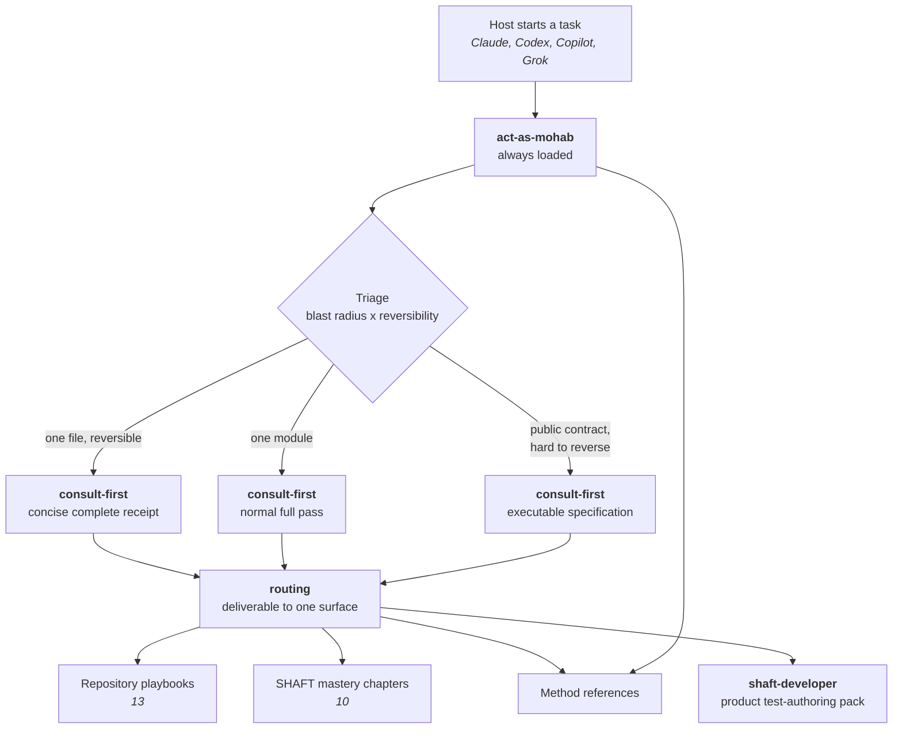
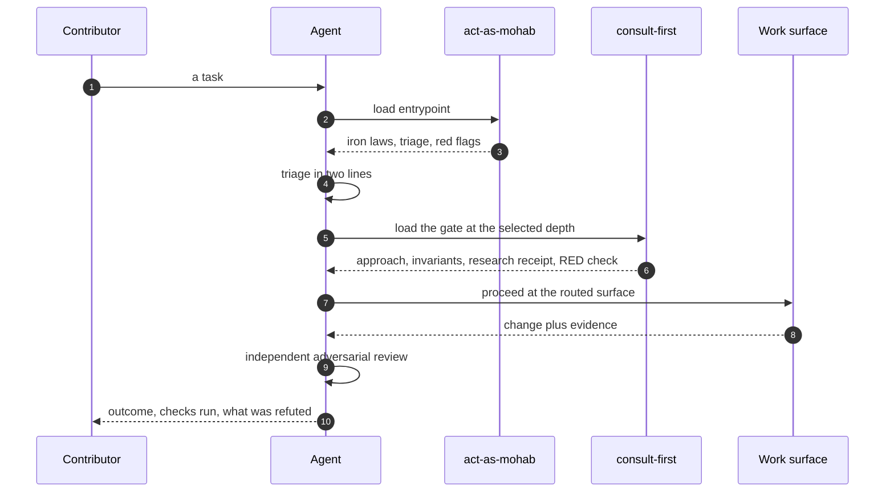
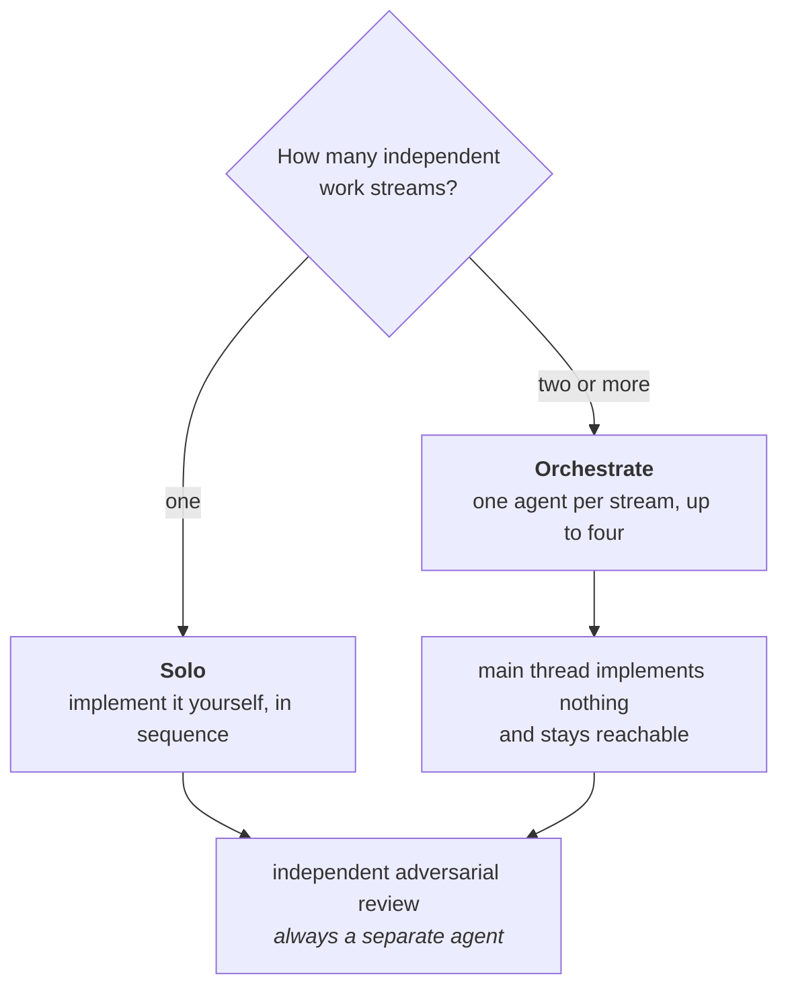
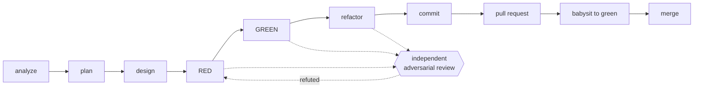

# Agent skills map

This directory holds the skills that teach a coding agent how work is done in
this repository. It is written to be read by both people and agents: a
contributor can skim it to understand the system, and an agent can be pointed
at it directly.

**If you are an agent:** do not work from this file. It is a map, not the
territory. Load [act-as-mohab](act-as-mohab/SKILL.md) and follow it.

**If you are a contributor:** tell your coding agent to read
`.agents/skills/act-as-mohab/SKILL.md` before it touches anything. Most agents
find it on their own — see [Importing these skills](#importing-these-skills).

## The shape of it

One always-loaded entrypoint decides everything else. Nothing below it loads
until the entrypoint sends you there, which is what keeps a small change cheap.



## Loading order

Read left to right; each step is cheap until the one before it says otherwise.



## Solo or orchestrate

One rule decides whether the main thread writes code, and it keys on how many
independent work streams the session owns — not on the host, and not on the
size of any one change.



Solo avoids two writers in one tree and the cost of specifying a handoff nobody
needed. Orchestrating keeps the main thread free to answer the owner and
re-spec a delegate. A reviewer is never counted as a work stream, so review does
not turn a solo session into an orchestrated one.

## Delivery loop

Every phase that changes behaviour ends with a review by an agent that did not
write it, prompted to refute rather than approve. Depth follows the same triage.



## The surfaces

This map describes a surface only where nothing it links to already describes
it. The two skills below are a contributor's first contact, so they are
described here. Every reference, playbook and chapter is described where it is
reached from — the entrypoint or the routing table — and both are linked from
this page, so repeating them here would only give a second copy to drift out of
step with the first.

### Skills

| Skill | What it does |
| --- | --- |
| [act-as-mohab](act-as-mohab/SKILL.md) | The single always-loaded entrypoint and global router. Carries the iron laws, the triage that sizes every task, the always-on working style, and the table that sends each deliverable to exactly one surface. |

The entrypoint reaches the internal [consultation](act-as-mohab/references/consult-first.md)
and [retrieval](act-as-mohab/references/retrieve-first.md) gates after every
triage; the triage result controls depth. They are references, not separately
discoverable skills.

### Method references

Never loaded by default. The first four are described by the entrypoint as it
sends you there; the rest by
[routing](act-as-mohab/references/routing.md).

- [routing](act-as-mohab/references/routing.md)
- [delegation](act-as-mohab/references/delegation.md)
- [roles](act-as-mohab/references/roles.md)
- [heuristics](act-as-mohab/references/heuristics.md)
- [orchestrator bootstrap](act-as-mohab/references/orchestrator-bootstrap.md)
- [verification-gap lens](act-as-mohab/references/verification-gap-lens.md)
- [work GitHub playbook](act-as-mohab/references/work-github-playbook.md)
- [work GitHub planning](act-as-mohab/references/work-github-planning.md)
- [graphify](act-as-mohab/references/graphify.md)
- [TDD failure modes](act-as-mohab/references/tdd-failure-modes.md)

Caveman, Ponytail and the TDD cycle are not references — they live in the
entrypoint body, because a rule that governs every task must not cost a second
read. How the cycle fails is a reference, because it is read while writing one
test rather than on every task. Only their MIT notices are files:
[Caveman](act-as-mohab/references/caveman.LICENSE),
[Ponytail](act-as-mohab/references/ponytail.LICENSE),
[TDD](act-as-mohab/references/test-driven-development.LICENSE).

### Repository playbooks

One per kind of work in this repository. Which deliverable sends you to which
playbook is stated once, in [routing](act-as-mohab/references/routing.md) — this
list is the inventory, not a second copy of the triggers.

- [agent guidance](act-as-mohab/references/playbooks/agent-guidance-boundary-guard.md)
- [PDCA](act-as-mohab/references/playbooks/agentic-pdca-loop.md)
- [framework source](act-as-mohab/references/playbooks/framework-source.md)
- [Java tests](act-as-mohab/references/playbooks/java-tests.md)
- [CI failures](act-as-mohab/references/playbooks/ci-failure-investigator.md)
- [flaky tests](act-as-mohab/references/playbooks/flaky-test-stabilizer.md)
- [release and dependencies](act-as-mohab/references/playbooks/release-dependency-guard.md)
- [MCP transport](act-as-mohab/references/playbooks/mcp-transport-contract-auditor.md)
- [module boundaries](act-as-mohab/references/playbooks/modular-boundary-auditor.md)
- [reports](act-as-mohab/references/playbooks/allure-extent-report-operator.md)
- [public docs](act-as-mohab/references/playbooks/public-behavior-docs-synchronizer.md)
- [UI design](act-as-mohab/references/playbooks/shaft-ui-design.md)
- [marketing](act-as-mohab/references/playbooks/shaft-marketing-ad-producer.md)

### SHAFT mastery chapters

Ten expert domains. Each encodes incident history that is expensive to
re-derive, so read the one the task touches and skip the rest — which one that
is, [routing](act-as-mohab/references/routing.md) says.

- [Selenium BiDi](act-as-mohab/references/shaft-mastery/selenium-bidi.md)
- [Allure internals](act-as-mohab/references/shaft-mastery/allure-internals.md)
- [Appium mobile](act-as-mohab/references/shaft-mastery/appium-mobile.md)
- [Maven release](act-as-mohab/references/shaft-mastery/maven-release.md)
- [TestNG lifecycle](act-as-mohab/references/shaft-mastery/testng-lifecycle.md)
- [IntelliJ plugin](act-as-mohab/references/shaft-mastery/intellij-plugin.md)
- [MCP protocol](act-as-mohab/references/shaft-mastery/mcp-protocol.md)
- [CI forensics](act-as-mohab/references/shaft-mastery/ci-forensics.md)
- [Wait strategies](act-as-mohab/references/shaft-mastery/wait-strategies.md)
- [Locator healing](act-as-mohab/references/shaft-mastery/locator-healing.md)

### The product pack

`shaft-skills/` is a separate, published pack that teaches an agent to *use*
SHAFT rather than to work on it. Its own router, `shaft-developer`, selects one
of exactly 30 lifecycle, implementation, and tool specialists. The routing
table hands off to it and does not duplicate its rows.

## Importing these skills

Each host discovers the entrypoint its own way. The policy is identical; only
the plumbing differs.

| Host | How it finds the entrypoint |
| --- | --- |
| Codex | Reads `AGENTS.md`, discovers only [act-as-mohab](act-as-mohab/SKILL.md) natively — with metadata in [openai.yaml](act-as-mohab/agents/openai.yaml) — and loads the role adapters in `.codex/agents/*.toml`. |
| Claude | Reads `CLAUDE.md`, which imports `AGENTS.md`; `.claude/skills/act-as-mohab/SKILL.md` redirects to the canonical body and `.claude/agents/*.md` carry the roles. |
| Copilot | Reads `.github/copilot-instructions.md`; `.github/skills/*` and `.github/instructions/*` redirect to the same playbooks. |
| Grok | Reads `AGENTS.md` plus the Claude-compatible adapter. |

Those four rows are the harness's only inbound edges: each points *into* the
entrypoint and carries no policy of its own, which is why the entrypoint links
this page rather than linking back to them one by one. They are listed here so
an agent on any host can see which surfaces exist and confirm they are thin.

### Every adapter file, one by one

Spelled out rather than globbed, deliberately. A wildcard matches whatever
happens to exist, so it re-derives itself from the tree it is supposed to be
describing and can never go wrong — a new role adapter or a renamed one would
leave `.claude/agents/*.md` looking perfectly correct. These names break when a
file is added, moved or deleted, which is the only way a map stays true.

| Host | Files |
| --- | --- |
| Codex | `AGENTS.md`; `.codex/config.toml`; `.codex/hooks.json`; roles `.codex/agents/chaos-engine.toml`, `.codex/agents/coder.toml`, `.codex/agents/helper.toml`, `.codex/agents/reviewer.toml`, `.codex/agents/tester.toml` |
| Claude | `CLAUDE.md`; `.claude/settings.json`; `.mcp.json`; redirect `.claude/skills/act-as-mohab/SKILL.md`; roles `.claude/agents/chaos-engine.md`, `.claude/agents/coder.md`, `.claude/agents/helper.md`, `.claude/agents/reviewer.md`, `.claude/agents/tester.md` |
| Copilot | `.github/copilot-instructions.md`; scope files `.github/instructions/framework-source.instructions.md`, `.github/instructions/java-tests.instructions.md`; the redirect pack indexed by `.github/skills/README.md` |
| Your own configuration | `.claude/user-harness/CLAUDE.md`, `.claude/user-harness/README.md`, `.claude/user-harness/settings.json` |

Copilot's redirect pack is one file per repository playbook. Each is a short
pointer at the canonical body, not a second copy of it:
`.github/skills/agent-guidance-boundary-guard/SKILL.md`,
`.github/skills/agentic-pdca-loop/SKILL.md`,
`.github/skills/allure-extent-report-operator/SKILL.md`,
`.github/skills/ci-failure-investigator/SKILL.md`,
`.github/skills/flaky-test-stabilizer/SKILL.md`,
`.github/skills/mcp-transport-contract-auditor/SKILL.md`,
`.github/skills/modular-boundary-auditor/SKILL.md`,
`.github/skills/public-behavior-docs-synchronizer/SKILL.md`,
`.github/skills/release-dependency-guard/SKILL.md`,
`.github/skills/shaft-marketing-ad-producer/SKILL.md`,
`.github/skills/shaft-ui-design/SKILL.md`.

If your agent does none of that automatically, say this to it:

> Read `.agents/skills/act-as-mohab/SKILL.md` and follow it for this task.

To deploy the harness to your own user-level agent configuration:

```bash
py -3 scripts/agents/sync_user_harness.py --check
```

## Supplemental agnix conformance

The repository-specific validators remain authoritative. Weekly acceptance also
runs agnix 0.48.0 as supplemental cross-client evidence through
`scripts/ci/agnix_conformance.py`. Its immutable source, image, three host
artifact checksums, pinned upstream evaluation archive, efficacy floors, staged
inputs, scan-width baseline, and two exact false-positive fingerprints live in
`scripts/ci/agnix_conformance.json`. The runner rejects symlinked inputs, copies
only declared harness inputs to a disposable directory, verifies the Linux
artifact and 61-case evaluation corpus, then executes both scans with no network,
a read-only root, dropped capabilities, no new privileges, UID/GID 65532, and
`DO_NOT_TRACK=1`. New errors, exact-path/count drift, scan-width drift, or an
efficacy-floor miss fails closed; warnings remain visible in the uploaded evidence.

Contract and boundary coverage lives in
`tests/scripts/test_agnix_conformance.py`. No agnix binary, source tree, report,
or cache is tracked or installed on the host.

Add `--apply` to write it, with backups. Secrets are never synced. It deploys
only generic user-level Claude host configuration, never repository skills,
role adapters, or policy.

## What runs alongside you

These are not documents to read. They are the moving parts, and an agent that
does not know they exist meets them as an interruption instead of a tool.

| Part | Where it lives | What it does to a session |
| --- | --- | --- |
| Lifecycle guard | `scripts/agents/guard.py`, registered by `.claude/settings.json` and `.codex/hooks.json` | Fires on PreToolUse, SessionStart and Stop. It denies a command that breaks a repository rule, injects the session preflight, and can hold the Stop event open. This is the part most likely to interrupt you. |
| Learning controller | `scripts/agents/learning_loop.py` | Stores redacted, evidence-consistent event receipts outside git; binds every actionable incident candidate to one distinct standalone `ShaftHQ/SHAFT_ENGINE` issue; records evaluation and exact-commit promotion intent; and records repair-once then frozen-revert recovery intent. Receipts are evidence, never the action queue. GitHub/git workflows separately create and verify issues and execute those intents. Hashes detect corruption; runtime state is not an authentication boundary against another process running as the same OS user. |
| Retrieval servers | `.mcp.json`, `.codex/config.toml`, `mempalace.yaml` | Declare the memory, MemPalace and Graphify servers the knowledge table sends you to, and gate memory writes behind a prompt. |
| Plugin manifest | `.claude-plugin/marketplace.json` | Publishes this repository's skills to a host that installs them as a plugin rather than reading them in place. |
| PR watcher | `scripts/ci/watch_pr_checks.py` | Polls one PR's checks under a hard poll cap. The PR-merger workflow says when to run it and what its exit codes mean. |
| Worktree survey | `scripts/ci/worktree_hygiene.py` | Reports which worktrees are safe to remove and which hold work nobody will come back for. |
| Local gate | `scripts/ci/local_gate.py` | Runs the pull-request gate's checks before you push, so a red run costs a minute instead of a round trip. |

The lifecycle guard's R26 check blocks static catastrophic command shapes: recursive deletes of
root, home, or system directories; destructive root-level `find`; raw-device writes and formats;
global mode 777 on system paths; process fork bombs; and piping fetched code into a shell. Its
weekly external evaluation fetches Compass's 61-row corpus at one immutable commit, verifies the
SHA-256 before parsing, scores 46 applicable rows, and records explicit reasons for the 15 Git
rows owned by ChaosEngine's separate stateful authorization rules. The upstream corpus is never
stored in the repository. Run `tests/scripts/test_guard_external_corpus.py` for the synthetic
contract, classifier mutations, direct entrypoint, and scheduled-workflow regression coverage.

## How this stays true

Guidance drifts unless something fails when it does. These are checked on every
pull request that touches the harness:

- Every routed skill name resolves to a real `SKILL.md`, so the router cannot
  point at something nobody ships.
- Every playbook and mastery chapter is linked directly from the routing table,
  and every reference is reachable from a skill.
- No substantive line is repeated across two guidance files, apart from the
  host pointers that have to be, and no reference is a redirect stub.
- Frontmatter parses as real YAML, and no skill name uses a reserved word.
- The always-loaded body and the skill listing each stay under a ceiling
  derived from a documented host limit.
- No guidance names a model or a product where it should name a capability
  level.

- Every harness element — this page, the entrypoint, every reference, adapter,
  hook, script and check — is reachable from the entrypoint, or carries a
  written reason why not.

Run them locally with:

```bash
py -3 scripts/ci/validate_agent_setup.py --skip-external
```

That command drives `scripts/ci/validate_agent_guidance.py` and
`scripts/ci/validate_skills.py`, while the Agent Plugin contract is checked by
`scripts/ci/validate_agent_plugins.py`; its ceilings come from
`scripts/ci/agent_guidance_budget.json` and the cross-host capability matrix
from `scripts/ci/agent_harness_parity.json`.

The assertions themselves are unit tests, and they are where a rule in this
tree actually fails. Read the one that guards what you are changing, before you
change it:

| Module | Guards |
| --- | --- |
| `tests/scripts/test_agent_router_contract.py` | The router: triage, the routing table, role adapters, budgets, the learning loop. |
| `tests/scripts/test_agent_harness_portability.py` | One policy body per rule, relative paths, hook parity, memory against guidance. |
| `tests/scripts/test_agent_harness_adherence.py` | Reviewed deterministic episodes, unknown evidence, and fail-closed adherence comparison. |
| `tests/scripts/test_agent_harness_reachability.py` | That every element on this page is reachable from the entrypoint, and that the duties below stay unqualified. |
| `tests/scripts/test_validate_agent_guidance.py` | The budget validator itself. |
| `tests/scripts/test_validate_agent_plugins.py` | Portable Agent Plugin manifests, Agent Skills, and containment. |
| `tests/scripts/test_validate_agent_setup.py` | The aggregate gate and the host-parity matrix. |
| `tests/scripts/test_validate_skills.py` | Skill frontmatter, names, and body limits. |
| `tests/scripts/test_guard_lifecycle.py`, `tests/scripts/test_guard_nul_corruption.py` | The lifecycle guard's decisions and its behaviour on a corrupt state file. |
| `tests/scripts/test_guard_memory_worktree.py` | That a memory write from a linked worktree is refused, and that each host actually invokes the guard for it. |
| `tests/scripts/test_sync_user_harness.py` | The user-level deployment. |
| `tests/scripts/test_worktree_hygiene.py` | The worktree survey. |
| `tests/scripts/test_shaft_skills_content.py`, `tests/scripts/test_shaft_skill_cli_examples.py` | The published product pack's content and its CLI examples. |

`.github/workflows/pr-gate.yml` is what runs them. It is a harness element in
its own right: the file deciding whether the gate runs at all cannot sit
outside the gate, or trimming one line from its run list would make every later
green run report a hundred percent of nothing.
