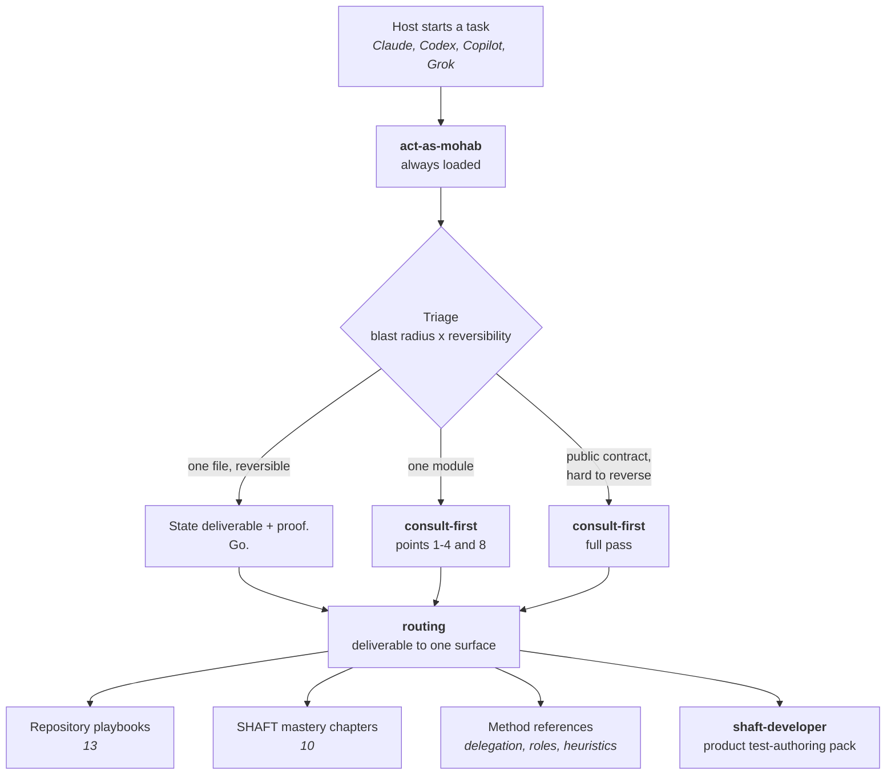
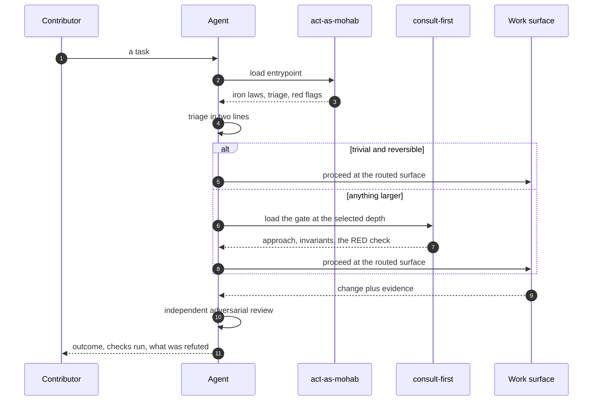
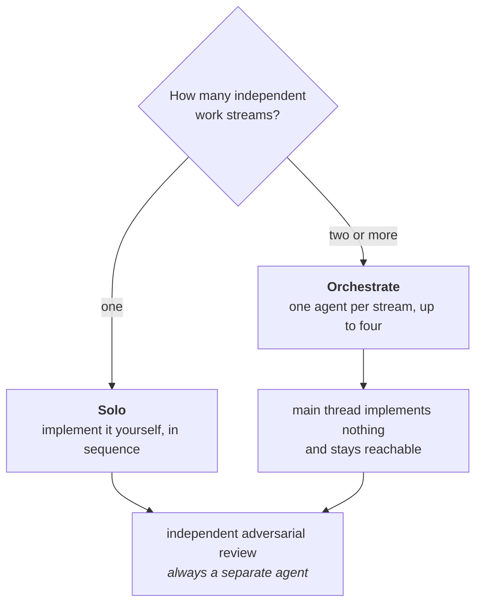
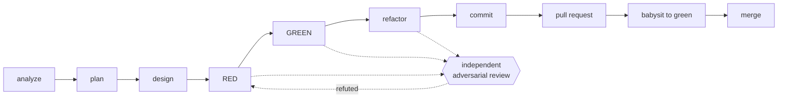

# Agent skills map

This directory holds the skills that teach a coding agent how work is done in
this repository. It is written to be read by both people and agents: a
contributor can skim it to understand the system, and an agent can be pointed
at it directly.

**If you are an agent:** do not work from this file. It is a map, not the
territory. Load [act-as-mohab](act-as-mohab/SKILL.md) and follow it.

**If you are a contributor:** tell your coding agent to read
`.agents/skills/act-as-mohab/SKILL.md` before it touches anything. Most agents
find it on their own — see [Importing these skills](#importing-these-skills).

## The shape of it

One always-loaded entrypoint decides everything else. Nothing below it loads
until the entrypoint sends you there, which is what keeps a small change cheap.



## Loading order

Read left to right; each step is cheap until the one before it says otherwise.



## Solo or orchestrate

One rule decides whether the main thread writes code, and it keys on how many
independent work streams the session owns — not on the host, and not on the
size of any one change.



Solo avoids two writers in one tree and the cost of specifying a handoff nobody
needed. Orchestrating keeps the main thread free to answer the owner and
re-spec a delegate. A reviewer is never counted as a work stream, so review does
not turn a solo session into an orchestrated one.

## Delivery loop

Every phase that changes behaviour ends with a review by an agent that did not
write it, prompted to refute rather than approve. Depth follows the same triage.



## The surfaces

This map describes a surface only where nothing it links to already describes
it. The two skills below are a contributor's first contact, so they are
described here. Every reference, playbook and chapter is described where it is
reached from — the entrypoint or the routing table — and both are linked from
this page, so repeating them here would only give a second copy to drift out of
step with the first.

### Skills

| Skill | What it does |
| --- | --- |
| [act-as-mohab](act-as-mohab/SKILL.md) | The single always-loaded entrypoint and global router. Carries the iron laws, the triage that sizes every task, the always-on working style, and the table that sends each deliverable to exactly one surface. |
| [consult-first](consult-first/SKILL.md) | The deliberation gate for anything past a trivial change. Forces a named proof of done, rival approaches with a steelman of the loser, the invariants at risk, and the check that fails today. |

### Method references

Never loaded by default. The first four are reached from the entrypoint, which
says what each is for as it sends you there; the rest are reached from
[routing](act-as-mohab/references/routing.md).

- [routing](act-as-mohab/references/routing.md)
- [delegation](act-as-mohab/references/delegation.md)
- [roles](act-as-mohab/references/roles.md)
- [heuristics](act-as-mohab/references/heuristics.md)
- [orchestrator bootstrap](act-as-mohab/references/orchestrator-bootstrap.md)
- [verification-gap lens](act-as-mohab/references/verification-gap-lens.md)
- [work GitHub playbook](act-as-mohab/references/work-github-playbook.md)
- [graphify](act-as-mohab/references/graphify.md)

### Repository playbooks

One per kind of work in this repository. Which deliverable sends you to which
playbook is stated once, in [routing](act-as-mohab/references/routing.md) — this
list is the inventory, not a second copy of the triggers.

- [agent guidance](act-as-mohab/references/playbooks/agent-guidance-boundary-guard.md)
- [PDCA](act-as-mohab/references/playbooks/agentic-pdca-loop.md)
- [framework source](act-as-mohab/references/playbooks/framework-source.md)
- [Java tests](act-as-mohab/references/playbooks/java-tests.md)
- [CI failures](act-as-mohab/references/playbooks/ci-failure-investigator.md)
- [flaky tests](act-as-mohab/references/playbooks/flaky-test-stabilizer.md)
- [release and dependencies](act-as-mohab/references/playbooks/release-dependency-guard.md)
- [MCP transport](act-as-mohab/references/playbooks/mcp-transport-contract-auditor.md)
- [module boundaries](act-as-mohab/references/playbooks/modular-boundary-auditor.md)
- [reports](act-as-mohab/references/playbooks/allure-extent-report-operator.md)
- [public docs](act-as-mohab/references/playbooks/public-behavior-docs-synchronizer.md)
- [UI design](act-as-mohab/references/playbooks/shaft-ui-design.md)
- [marketing](act-as-mohab/references/playbooks/shaft-marketing-ad-producer.md)

### SHAFT mastery chapters

Ten expert domains. Each encodes incident history that is expensive to
re-derive, so read the one the task touches and skip the rest — which one that
is, [routing](act-as-mohab/references/routing.md) says.

- [Selenium BiDi](act-as-mohab/references/shaft-mastery/selenium-bidi.md)
- [Allure internals](act-as-mohab/references/shaft-mastery/allure-internals.md)
- [Appium mobile](act-as-mohab/references/shaft-mastery/appium-mobile.md)
- [Maven release](act-as-mohab/references/shaft-mastery/maven-release.md)
- [TestNG lifecycle](act-as-mohab/references/shaft-mastery/testng-lifecycle.md)
- [IntelliJ plugin](act-as-mohab/references/shaft-mastery/intellij-plugin.md)
- [MCP protocol](act-as-mohab/references/shaft-mastery/mcp-protocol.md)
- [CI forensics](act-as-mohab/references/shaft-mastery/ci-forensics.md)
- [Wait strategies](act-as-mohab/references/shaft-mastery/wait-strategies.md)
- [Locator healing](act-as-mohab/references/shaft-mastery/locator-healing.md)

### The product pack

`shaft-skills/` is a separate, published pack that teaches an agent to *use*
SHAFT rather than to work on it. Its own router, `shaft-developer`, selects one
of roughly thirty lifecycle, implementation, and tool specialists. The routing
table hands off to it and does not duplicate its rows.

## Importing these skills

Each host discovers the entrypoint its own way. The policy is identical; only
the plumbing differs.

| Host | How it finds the entrypoint |
| --- | --- |
| Codex | Reads `AGENTS.md`, discovers `.agents/skills/*/SKILL.md` natively, and loads the role adapters in `.codex/agents/*.toml`. |
| Claude | Reads `CLAUDE.md`, which imports `AGENTS.md`; `.claude/skills/*` redirect to the canonical bodies and `.claude/agents/*.md` carry the roles. |
| Copilot | Reads `.github/copilot-instructions.md`; `.github/skills/*` and `.github/instructions/*` redirect to the same playbooks. |
| Grok | Reads `AGENTS.md` plus the Claude-compatible adapter. |

If your agent does none of that automatically, say this to it:

> Read `.agents/skills/act-as-mohab/SKILL.md` and follow it for this task.

To deploy the harness to your own user-level agent configuration:

```bash
py -3 scripts/agents/sync_user_harness.py --check
```

Add `--apply` to write it, with backups. Secrets are never synced.

## How this stays true

Guidance drifts unless something fails when it does. These are checked on every
pull request that touches the harness:

- Every routed skill name resolves to a real `SKILL.md`, so the router cannot
  point at something nobody ships.
- Every playbook and mastery chapter is linked directly from the routing table,
  and every reference is reachable from a skill.
- No substantive line is repeated across two guidance files, apart from the
  host pointers that have to be, and no reference is a redirect stub.
- Frontmatter parses as real YAML, and no skill name uses a reserved word.
- The always-loaded body and the skill listing each stay under a ceiling
  derived from a documented host limit.
- No guidance names a model or a product where it should name a capability
  level.

Run them locally with:

```bash
py -3 scripts/ci/validate_agent_setup.py --skip-external
```
