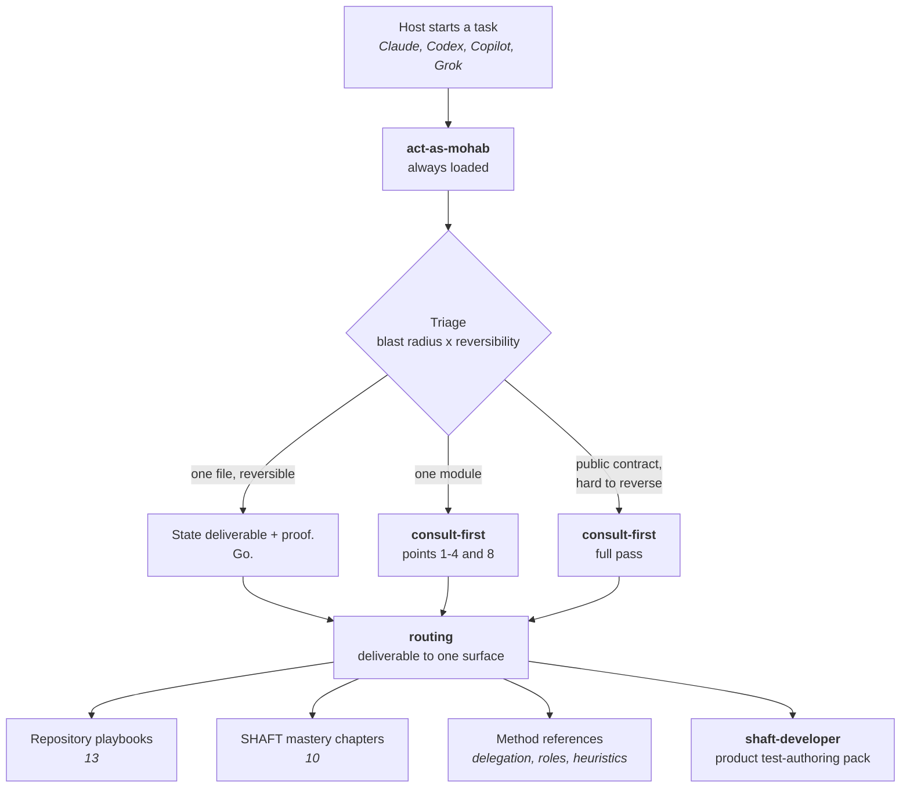
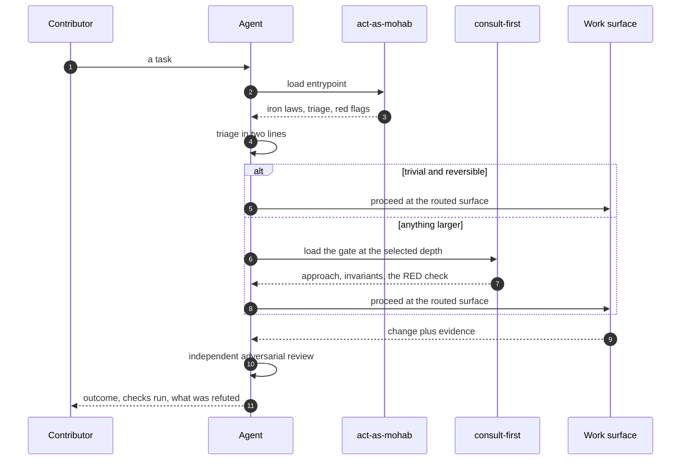
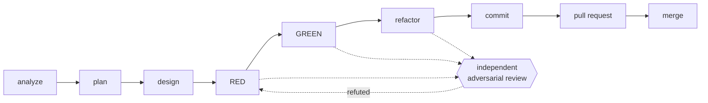

# Agent skills map

This directory holds the skills that teach a coding agent how work is done in
this repository. It is written to be read by both people and agents: a
contributor can skim it to understand the system, and an agent can be pointed
at it directly.

**If you are an agent:** do not work from this file. It is a map, not the
territory. Load [act-as-mohab](act-as-mohab/SKILL.md) and follow it.

**If you are a contributor:** tell your coding agent to read
`.agents/skills/act-as-mohab/SKILL.md` before it touches anything. Most agents
find it on their own — see [Importing these skills](#importing-these-skills).

## The shape of it

One always-loaded entrypoint decides everything else. Nothing below it loads
until the entrypoint sends you there, which is what keeps a small change cheap.



## Loading order

Read left to right; each step is cheap until the one before it says otherwise.



## Delivery loop

Every phase that changes behaviour ends with a review by an agent that did not
write it, prompted to refute rather than approve. Depth follows the same triage.



## What each surface does

### Skills

| Skill | What it does |
| --- | --- |
| [act-as-mohab](act-as-mohab/SKILL.md) | The single always-loaded entrypoint and global router. Carries the iron laws, the triage that sizes every task, the always-on working style, and the table that sends each deliverable to exactly one surface. |
| [consult-first](consult-first/SKILL.md) | The deliberation gate for anything past a trivial change. Forces a named proof of done, rival approaches with a steelman of the loser, the invariants at risk, and the check that fails today. |

### Method references

Reached from the entrypoint or the routing table, never loaded by default.

| Reference | What it does |
| --- | --- |
| [routing](act-as-mohab/references/routing.md) | The deterministic table: one deliverable, one surface. Also orders knowledge retrieval before manual discovery begins. |
| [delegation](act-as-mohab/references/delegation.md) | Defines the three capability levels, the four-agent concurrency cap, the delegate covenant, and the independent adversarial review gate. |
| [roles](act-as-mohab/references/roles.md) | The five portable roles and their boundaries. Each host exposes them with whatever primitive it has, so policy stays identical across hosts. |
| [heuristics](act-as-mohab/references/heuristics.md) | Field technique for harder work: how to investigate, how to plan under uncertainty, how to verify, and how to judge risk. |
| [orchestrator bootstrap](act-as-mohab/references/orchestrator-bootstrap.md) | The opening sequence when a session holds the main thread: gather live state, queue by priority, ticket, dispatch. |
| [verification-gap lens](act-as-mohab/references/verification-gap-lens.md) | A worked method for finding changed behaviour that would break without any check noticing. |
| [work GitHub playbook](act-as-mohab/references/work-github-playbook.md) | Taking one issue from filed to merged: scope grounding, tracking issues, grouped PRs, review, and close-out. |
| [graphify](act-as-mohab/references/graphify.md) | How to ask the structural index what calls what, and what to do when it is unavailable. |

### Repository playbooks

One per kind of work in this repository. The routing table links all thirteen
directly.

| Playbook | Covers |
| --- | --- |
| [agent guidance](act-as-mohab/references/playbooks/agent-guidance-boundary-guard.md) | Changing the harness itself: skills, host adapters, hooks, budgets, retrieval setup. |
| [PDCA](act-as-mohab/references/playbooks/agentic-pdca-loop.md) | The explicit plan-do-check-act loop, run as main-thread phases rather than persona agents. |
| [framework source](act-as-mohab/references/playbooks/framework-source.md) | Production Java: public API compatibility, the properties layer, logging, reporting, and thread-local state. |
| [Java tests](act-as-mohab/references/playbooks/java-tests.md) | Test Java: driver lifecycle, parallelism hazards, headless execution, and evidence reuse. |
| [CI failures](act-as-mohab/references/playbooks/ci-failure-investigator.md) | Diagnosing a red run, job, or scheduled suite from real logs and reports. |
| [flaky tests](act-as-mohab/references/playbooks/flaky-test-stabilizer.md) | Turning an inconsistent pass or fail into a deterministic reproduction and a real fix. |
| [release and dependencies](act-as-mohab/references/playbooks/release-dependency-guard.md) | Versioning, BOM wiring, dependency updates, and Maven Central safeguards. |
| [MCP transport](act-as-mohab/references/playbooks/mcp-transport-contract-auditor.md) | The MCP tool contract, its transport, and the clients that consume it. |
| [module boundaries](act-as-mohab/references/playbooks/modular-boundary-auditor.md) | Keeping the Maven reactor's module edges honest, including consumer fixtures. |
| [reports](act-as-mohab/references/playbooks/allure-extent-report-operator.md) | Generating and trusting Allure and Extent output, including the verdict rules. |
| [public docs](act-as-mohab/references/playbooks/public-behavior-docs-synchronizer.md) | Keeping externally documented behaviour in step with what the code actually does. |
| [UI design](act-as-mohab/references/playbooks/shaft-ui-design.md) | Any visible surface: design standards, visual QA, UX copy, accessibility, responsive behaviour. |
| [marketing](act-as-mohab/references/playbooks/shaft-marketing-ad-producer.md) | Promotional material that has to stay true to what the product does. |

### SHAFT mastery chapters

Ten expert domains. Each encodes incident history that is expensive to
re-derive, so read the one the task touches and skip the rest.

| Chapter | Read it when the task touches |
| --- | --- |
| [Selenium BiDi](act-as-mohab/references/shaft-mastery/selenium-bidi.md) | The recorder, preload scripts, network capture, browser lifecycle. |
| [Allure internals](act-as-mohab/references/shaft-mastery/allure-internals.md) | Report generation and patching, results JSON, verdict analysis. |
| [Appium mobile](act-as-mohab/references/shaft-mastery/appium-mobile.md) | Mobile recording and replay, emulators, mobile CI. |
| [Maven release](act-as-mohab/references/shaft-mastery/maven-release.md) | Versioning, Central publishing, BOM, dependency convergence. |
| [TestNG lifecycle](act-as-mohab/references/shaft-mastery/testng-lifecycle.md) | Listeners, forked JVMs, properties precedence, scoped runs. |
| [IntelliJ plugin](act-as-mohab/references/shaft-mastery/intellij-plugin.md) | The plugin's desktop UI, tool windows, Gradle and JDK setup. |
| [MCP protocol](act-as-mohab/references/shaft-mastery/mcp-protocol.md) | MCP tools, stdio transport, workspace roots, clients. |
| [CI forensics](act-as-mohab/references/shaft-mastery/ci-forensics.md) | Red runs, scheduled suites, workflow YAML, sharding. |
| [Wait strategies](act-as-mohab/references/shaft-mastery/wait-strategies.md) | Races, synchronization, deterministic reproduction. |
| [Locator healing](act-as-mohab/references/shaft-mastery/locator-healing.md) | Locator choice, semantic selectors, the healer and doctor. |

### The product pack

`shaft-skills/` is a separate, published pack that teaches an agent to *use*
SHAFT rather than to work on it. Its own router, `shaft-developer`, selects one
of roughly thirty lifecycle, implementation, and tool specialists. The routing
table hands off to it and does not duplicate its rows.

## Importing these skills

Each host discovers the entrypoint its own way. The policy is identical; only
the plumbing differs.

| Host | How it finds the entrypoint |
| --- | --- |
| Codex | Reads `AGENTS.md`, discovers `.agents/skills/*/SKILL.md` natively, and loads the role adapters in `.codex/agents/*.toml`. |
| Claude | Reads `CLAUDE.md`, which imports `AGENTS.md`; `.claude/skills/*` redirect to the canonical bodies and `.claude/agents/*.md` carry the roles. |
| Copilot | Reads `.github/copilot-instructions.md`; `.github/skills/*` and `.github/instructions/*` redirect to the same playbooks. |
| Grok | Reads `AGENTS.md` plus the Claude-compatible adapter. |

If your agent does none of that automatically, say this to it:

> Read `.agents/skills/act-as-mohab/SKILL.md` and follow it for this task.

To deploy the harness to your own user-level agent configuration:

```bash
py -3 scripts/agents/sync_user_harness.py --check
```

Add `--apply` to write it, with backups. Secrets are never synced.

## How this stays true

Guidance drifts unless something fails when it does. These are checked on every
pull request that touches the harness:

- Every routed skill name resolves to a real `SKILL.md`, so the router cannot
  point at something nobody ships.
- Every playbook and mastery chapter is linked directly from the routing table,
  and every reference is reachable from a skill.
- No identical line appears in two guidance files, and no reference is a
  redirect stub.
- Frontmatter parses as real YAML, and no skill name uses a reserved word.
- The always-loaded body and the skill listing each stay under a ceiling
  derived from a documented host limit.
- No guidance names a model or a product where it should name a capability
  level.

Run them locally with:

```bash
py -3 scripts/ci/validate_agent_setup.py --skip-external
```
