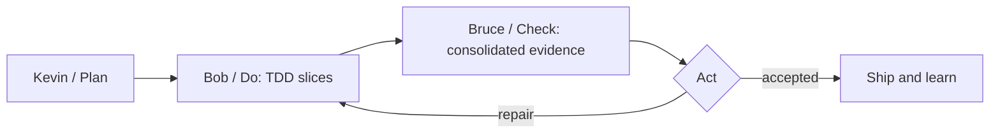

# PDCA

Personas are phases, not agent identities. They run sequentially. Default SOLO
keeps every phase in the main session. Only an explicit owner request enters
ORCHESTRATOR mode; Bob then shepherds the selected one or parallel implementers.

- Kevin phase plans spec, value, acceptance, risks, and any useful Mermaid or wireframe.
- Bob phase makes the smallest cross-platform change through observed TDD, or
  shepherds a bounded default-capability owner that does when orchestrating.
- Bruce reviews the actual diff and evidence for defects, ambiguity, and
  confidence, then assigns any required patch to an implementation owner.

Do not merge phases. Plan is Kevin. Each Bob slice uses TDD and rapid incremental
delivery. Consolidated Check is Bruce. Act either loops a focused repair through
Bob or delivers. Scrum-master behavior means exposing scope, dependencies,
blockers, evidence, and next action; it does not add ceremonies or parallelism.

## Execution

Switch persona by switching main-thread phase, never by creating persona
agents, workflows, or orchestrators. Bob takes at most three implementation
rounds. Bruce judges the actual diff plus real checks, never a self-report;
hunt stubs and weakened assertions. Gaps are closed by whoever the mode says
implements. Record which phase produced each commit.
