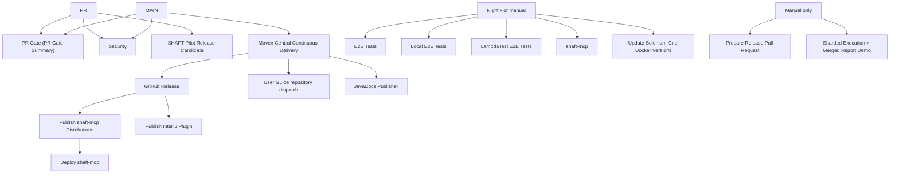

# GitHub Actions Workflows

This directory contains the repository workflows. Use this inventory when deciding
which workflows to keep, merge, rename, or delete.

## Relationship Map

`workflow_run` links use the workflow `name`, not the file name. Renaming
`Maven Central Continuous Delivery` or `Publish shaft-mcp Distributions` without
updating downstream workflows will break the release chain. `publish-intellij-plugin.yml`
and `publish-shaft-mcp.yml` intentionally listen for the `release: published` event instead
of `mavenCentral_cd.yml`'s `workflow_run` conclusion: that workflow's own run now concludes
`success` even when it skips a no-op delivery for an already-published version (see
`check_release_needed` in `mavenCentral_cd.yml`), so only the actual GitHub Release event
is a reliable "a new version was really delivered" signal for these two.

**The release must be created with a PAT (`BOT_TOKEN`), not the default `GITHUB_TOKEN`.**
GitHub does not fan a `release` event out to other workflows when the release was created
using the run's own `GITHUB_TOKEN` (anti-recursion protection); only `workflow_dispatch` and
`repository_dispatch` are exempt from that rule. `mavenCentral_cd.yml`'s `announce_release`
job therefore passes `token: ${{ secrets.BOT_TOKEN }}` to `ncipollo/release-action`. If that
step is ever reverted to `GITHUB_TOKEN`, `publish-intellij-plugin.yml`, `publish-shaft-mcp.yml`,
and (transitively) `deploy-shaft-mcp.yml` will silently never run again — there is no failure,
the event simply never fires.

## Workflow Inventory

| File | Workflow name | Trigger | What it does | Relationships and delete impact |
| --- | --- | --- | --- | --- |
| `pr-gate.yml` | PR Gate | Pull requests, and pushes to `main` (both path-conditioned per leg), no `workflow_dispatch` | The single required status check (`PR Gate Summary`) for this repository (issue #3814). One `changes` job runs `dorny/paths-filter` once, then path-conditioned legs replicate what used to be five standalone workflows: Documentation Boundary Gate, IntelliJ installer verification + plugin build, shaft-cli build/test (ubuntu/windows), SHAFT Capture Browser E2E, and the Template Coupling Gate, plus a `dependency-review` job (moved out of `security.yml`, see below) and a `unit-tests` matrix job (issue #3849) that gives shaft-engine, shaft-pilot-core, shaft-doctor, shaft-ai, shaft-heal, and shaft-mcp PR-time unit-test coverage — previously those modules' tests only ran in nightly E2E/Pilot-release workflows. Every leg also runs when the `infra` filter matches (`.github/workflows/pr-gate.yml` itself changed). | This workflow is now the ONLY trigger source for the folded legs' paths — see "Path-filter fidelity" below. `workflow_dispatch` is intentionally absent: `dorny/paths-filter` cannot resolve a diff base outside `push`/`pull_request` events. The `push` trigger covers `main`-branch coverage by relying on `dorny/paths-filter`'s documented "long-lived branch" behavior (`base: main` while the triggering branch is also `main` diffs against the most recent commit on `main` before the push, not a PR base). |
| `security.yml` | Security | Pushes to `main` and pull requests, except Markdown-only changes, plus manual | Runs CodeQL Java analysis only. `dependency-review` moved to `pr-gate.yml` in Phase 3 of issue #3814 (B1) — CodeQL stayed here rather than folding in because no org-wide CodeQL default setup is configured for this repository. | Independent security gate. Removing it drops CodeQL coverage; dependency-review coverage now lives in `pr-gate.yml` instead. |
| `shaft-pilot-release.yml` | SHAFT Pilot Release Candidate | Pull requests touching release-relevant paths, plus manual | Validates release contracts, verifies the IntelliJ IDEA plugin candidate, runs deterministic Pilot module tests, capture browser release tests, packaging checks, clean consumer fixtures, MCP transport checks, and container smoke tests. | PR-side release gate that mirrors large parts of `mavenCentral_cd.yml` before a real release. Its own browser E2E step only runs when the reactor version actually changes (see `detect-shaft-version-change`), so ordinary `shaft-capture` PRs rely on `pr-gate.yml`'s `capture-e2e` leg instead. Out of scope for Phase 3 deletions and composite-action extraction (S1/B2 deferred) — its `-pl` module lists still match the release-contract validators verbatim. |
| `mavenCentral_cd.yml` | Maven Central Continuous Delivery | Pushes to `main` that touch release-relevant paths, plus manual | Checks whether this reactor version is already on Maven Central and skips delivery cleanly if so; otherwise verifies the IntelliJ IDEA plugin candidate, runs Pilot tests, validates Maven publication outputs, deploys artifacts to Maven Central, verifies public coordinates, verifies the public MCP installer, creates the GitHub release, dispatches the user-guide repo, and optionally announces to Slack. | Root of the release chain. Feeds `publishJavaDocs.yml` via `workflow_run`, the GitHub `release` event consumed by `publish-intellij-plugin.yml` and `publish-shaft-mcp.yml`, and a `shaft-engine-release` dispatch to `ShaftHQ/shafthq.github.io`. Not touched by Phase 3. |
| `publish-intellij-plugin.yml` | Publish IntelliJ Plugin | Published GitHub release, plus manual | Checks out the exact release tag, validates plugin version/channel metadata, then builds, verifies, signs, and publishes the IntelliJ IDEA plugin to the JetBrains Marketplace Stable channel using repository secrets. | Downstream of the GitHub release created by `mavenCentral_cd.yml`. Keep it while JetBrains Marketplace remains the public IDE plugin distribution path. Distinct from the deleted `intellij-plugin.yml` (PR-side build/verify, now folded into `pr-gate.yml`) — this is the release-side publisher and stays untouched. |
| `publishJavaDocs.yml` | JavaDocs Publisher | Successful `Maven Central Continuous Delivery` run on `main`, plus manual | Builds aggregated JavaDocs and publishes them to the `javadoc` branch. | Downstream of Maven Central release. Keep only if the `javadoc` branch remains the public JavaDocs publishing path. Idempotent re-runs on a no-op delivery skip are low-risk (a no-diff push to the `javadoc` branch). |
| `publish-shaft-mcp.yml` | Publish shaft-mcp Distributions | Published GitHub release, plus manual | Builds and pushes `shaft-mcp` OCI images to GHCR and publishes MCP registry metadata. | Downstream of the GitHub release created by `mavenCentral_cd.yml`, and upstream of `deploy-shaft-mcp.yml`. Deleting it also prevents the automatic deploy workflow from running. |
| `deploy-shaft-mcp.yml` | Deploy shaft-mcp | Successful `Publish shaft-mcp Distributions` run on `main`, plus manual | Triggers Render deployment, deploys to Fly.io when configured, and records the Smithery handoff note. | Final MCP deployment step. It is skipped safely when deployment secrets are absent. |
| `shaft-mcp.yml` | shaft-mcp | Nightly at 01:00 UTC, plus manual | Tests the public installer script across Ubuntu, macOS, and Windows, then validates, packages, coverage-checks, and container-smokes the `shaft-mcp` module. | Independent nightly MCP health check. It does not feed publish/deploy, but it overlaps release validation for MCP packaging and installer behavior. Its cron must stay `'00 1 * * *'` in lockstep with the local E2E workflows below - `scripts/ci/validate_shaft_mcp_configuration.py` enforces this literally. |
| `e2eTests.yml` | E2E Tests | Nightly at 01:00 UTC, plus manual | Runs broad hosted E2E coverage: database/API/visual/video tests, Selenium Grid browsers, Playwright browsers/devices, BrowserStack mobile/desktop, Cucumber, and JUnit/Moon tests. | Uses shared test-report actions and produces a consolidated workflow summary. Largest end-to-end regression workflow. |
| `e2eLocalTests.yml` | Local E2E Tests | Nightly at 01:00 UTC, plus manual | Runs local browser E2E coverage on Windows Edge/Chrome and macOS Safari/Chrome, including a local Edge Cucumber path. | Companion to `e2eTests.yml` for local runner/browser coverage. Uses the same report and summary actions. |
| `lambdatestTests.yml` | LambdaTest E2E Tests | Nightly at 01:00 UTC, plus manual | Uploads LambdaTest mobile apps, verifies LambdaTest credentials, and runs native Android, native iOS, web app, and desktop web suites. | Serial cloud-provider workflow: later jobs depend on earlier mobile upload jobs. Delete only if LambdaTest coverage is intentionally retired. |
| `update-selenium-grid-versions.yml` | Update Selenium Grid Docker Versions | Weekly Monday 08:00 UTC, plus manual | Reads SeleniumHQ Docker Compose references, updates SHAFT's Selenium Grid image versions, validates Docker Compose syntax, and opens an automated PR. | Maintenance bot for `shaft-engine/src/main/resources/docker-compose/selenium4.yml`, which is used by Selenium Grid E2E jobs. |
| `prepare-release-pr.yml` | Prepare Release Pull Request | Manual only, with release date input | Computes the dated SHAFT release version, updates release metadata and `Internal.java` tool versions, validates static release contracts, and opens an automated PR. | Creates the release PR that later feeds `Maven Central Continuous Delivery` after merge. Its `scripts/ci/prepare_release_pr.py` already rewrites `shaft.version` in every pom.xml under the repo (including the sample example projects), which is why the old post-release `sync-sample-projects-version.yml` workflow was deleted as redundant. |
| `sharded-merged-report.yml` | Sharded Execution + Merged Report Demo | Manual only, with an optional `-Dtest=` filter input | Dispatch-only demo of the `-Dshaft.shard=N/M` sharding + merged-report pipeline (issue #3347): shards a TestNG run across a matrix, then assembles and merges the per-shard report. | Deliberately **not** deleted in Phase 3 (B5): blocked on a user-guide docs update that must land first to document the sharding recipe for consumers. Does not replace or touch `e2eTests.yml`'s existing manual class-filter partitioning. No downstream dependents. |
| `copilot-setup-steps.yml` *(deleted, Phase 3)* | Copilot Setup Steps | was: Manual only | was: Prepared the GitHub Copilot coding-agent environment. | Deleted in Phase 3 of issue #3814 (clean, no dependents, B-verdict GO). |
| `refresh-agent-instructions.yml` *(deleted, Phase 3)* | Refresh Agent Instructions | was: Manual only, with reason and optional `force_ai` input | was: Audited agent guidance, optionally ran Codex to refresh guidance surfaces. | Deleted in Phase 3 of issue #3814 (B3), with same-PR cleanup: the `refresh_workflow` key and its references were removed from `scripts/ci/agent_guidance_budget.json` (its consuming check, `validate_refresh_workflow`, is a no-op when that key is absent), the `.memory` constraint that gated it was marked stale via `memory remember`, and the orphaned `.github/codex/prompts/refresh-agent-instructions.md` prompt was deleted alongside it. |
| `docs-boundary-gate.yml` *(deleted, Phase 3)* | Documentation Boundary Gate | was: Pull requests touching Markdown or the boundary validator | Folded into `pr-gate.yml`'s `docs-boundary` leg. |
| `intellij-plugin.yml` *(deleted, Phase 3)* | IntelliJ Plugin | was: Pull requests and pushes touching `shaft-intellij`, plus manual | Folded into `pr-gate.yml`'s `intellij-verify` and `intellij-build` legs. Not to be confused with `publish-intellij-plugin.yml` (release-side, kept). |
| `shaft-capture-e2e.yml` *(deleted, Phase 3)* | SHAFT Capture Browser E2E | was: Pull requests touching `shaft-capture/**`, plus manual | Folded into `pr-gate.yml`'s `capture-e2e` leg. |
| `shaft-cli.yml` *(deleted, Phase 3)* | shaft-cli | was: Pull requests and pushes touching `shaft-cli/**` or `pom.xml`, plus manual | Folded into `pr-gate.yml`'s `cli` leg. |
| `template-coupling.yml` *(deleted, Phase 3)* | Template Coupling Gate | was: Pull requests touching example templates or `shaft-skills/**` | Folded into `pr-gate.yml`'s `template-coupling` leg. |

## Path-filter fidelity

`pr-gate.yml`'s `changes` job is now the only trigger source for the folded
legs above — there is no standalone workflow left with its own `paths:` block
for docs, IntelliJ, shaft-cli, capture, or templates. Every path the deleted
workflows used to list (other than each workflow's own now-nonexistent
self-path) must stay present in the matching `dorny/paths-filter` filter,
including `.github/workflows/publish-intellij-plugin.yml` in the `intellij`
filter and root `pom.xml` in the `cli` filter. When adding a new path that
should gate one of these legs, add it to `pr-gate.yml`'s filter directly —
there is no other file to update.

## Shared Composite Actions

| Action | Used by | Purpose |
| --- | --- | --- |
| `.github/actions/setup-test-env` | `e2eTests.yml`, `e2eLocalTests.yml`, `lambdatestTests.yml` | Shared Java/Maven/optional Node setup for E2E jobs. |
| `.github/actions/post-test-report` | `e2eTests.yml`, `e2eLocalTests.yml`, `lambdatestTests.yml` | Uploads JaCoCo coverage, creates Allure artifacts, writes summaries, and fails jobs from Allure/Surefire results. |
| `.github/actions/consolidate-test-results` | `e2eTests.yml`, `e2eLocalTests.yml`, `lambdatestTests.yml` | Aggregates individual job results into one workflow summary table. |
| `.github/actions/upload-jacoco-coverage` | `post-test-report`, `mavenCentral_cd.yml`, `shaft-pilot-release.yml`, `shaft-mcp.yml` | Generates required JaCoCo XML reports when needed and uploads coverage to Codecov. |
| `.github/actions/reclaim-disk-space` | `mavenCentral_cd.yml`, `shaft-pilot-release.yml`, `shaft-mcp.yml` | Frees unused preinstalled runner toolchains and Docker images (optionally also build outputs) so the release container build doesn't run out of disk. |
| `.github/actions/mcp-container-smoke` | `mavenCentral_cd.yml`, `shaft-pilot-release.yml`, `shaft-mcp.yml` | Builds the shaft-mcp Docker image and verifies it answers the MCP `initialize` handshake before the container is trusted. |

`pr-gate.yml` does not use any shared composite action yet — extracting one
for its legs (S1/B2) was deliberately deferred out of Phase 3 so the
release-contract validators keep matching a deletion-only diff.

## Generated PR Workflows

These workflows write branches and PRs instead of only reporting results:

| Workflow | Branch | Typical PR purpose |
| --- | --- | --- |
| `Update Selenium Grid Docker Versions` | `auto-update-selenium-grid-versions` | Update Selenium Docker image tags in the bundled Grid compose file. |
| `Prepare Release Pull Request` | `release/<version>` | Prepare dated SHAFT release metadata. |

## Deletion Checklist

Before deleting or renaming a workflow:

1. Check whether another workflow references its `name` under `workflow_run`.
2. Check whether it creates a GitHub release, repository dispatch, branch, PR, package, deployment, issue, or artifact consumed elsewhere.
3. Check whether it is the only caller of a shared composite action or external service.
4. Remove or update stale path filters in other workflows when deleting release, docs, agent, or CI files.
5. Grep `scripts/ci/*.py` for the workflow's filename or literal content - `validate_modular_documentation.py`
   used to hard-require `sync-sample-projects-version.yml` to exist with specific text, which would have broken
   every future release-candidate/CD run the moment the workflow was deleted without updating the validator.
6. When adding a new reactor module, add it to `mavenCentral_cd.yml`'s `paths:` filter, the
   CodeQL `-pl` list in `security.yml`, and — once its tests have run green in CI at least
   once — the Pilot test `-pl` lists in `shaft-pilot-release.yml` and `mavenCentral_cd.yml`.
7. If the workflow is referenced from `.memory/` (constraints, gotchas, facts) or a `.github/skills/**`
   playbook, update or retire that reference in the same PR — see Phase 3 of issue #3814, which marked
   `constraint.paid-agent-work-audit-gated` stale via `memory remember` rather than leaving it pointing at
   a deleted file.

### Phase 3 of issue #3814 (this deletion pass)

Deleted, folded into `pr-gate.yml`: `docs-boundary-gate.yml`, `intellij-plugin.yml`,
`shaft-capture-e2e.yml`, `shaft-cli.yml`, `template-coupling.yml`. Deleted, no fold
(no longer needed): `copilot-setup-steps.yml` (B-verdict GO), `refresh-agent-instructions.yml`
(B3, with same-PR cleanup of everything that referenced it). Narrowed, not deleted:
`security.yml` lost only its `dependency-review` job (B1; CodeQL stays — no org-wide CodeQL
default setup exists). Explicitly **not** touched: `sharded-merged-report.yml` (B5, blocked on
user-guide docs), `shaft-pilot-release.yml`, and the release chain
(`mavenCentral_cd.yml` → `publish-intellij-plugin.yml` / `publish-shaft-mcp.yml` → `deploy-shaft-mcp.yml`
→ `publishJavaDocs.yml`). Composite-action extraction for `pr-gate.yml`'s legs (S1/B2) is deferred to a
future phase; this pass is deletion-only so it doesn't require rewriting the release-contract validators.
