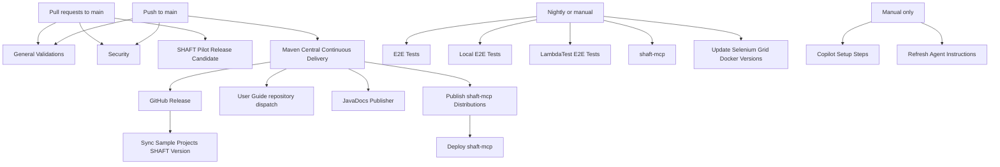

# GitHub Actions Workflows

This directory contains the repository workflows. Use this inventory when deciding
which workflows to keep, merge, rename, or delete.

## Relationship Map

`workflow_run` links use the workflow `name`, not the file name. Renaming
`Maven Central Continuous Delivery` or `Publish shaft-mcp Distributions` without
updating downstream workflows will break the release chain.

## Workflow Inventory

| File | Workflow name | Trigger | What it does | Relationships and delete impact |
| --- | --- | --- | --- | --- |
| `general-validations.yml` | General Validations | Scheduled daily, manual, pull requests to `main`, pushes to `main` | Detects changed areas, runs agent guidance checks, reactor/config validators, CI script tests, docs link audit, and scheduled quality scans for dependency/sample drift. | Main PR validation layer. This README change triggers its docs path. Scheduled jobs can open issues for link, dependency, or sample-version drift. |
| `security.yml` | Security | Pull requests and pushes to `main` except Markdown-only changes, plus manual | Runs dependency review on PRs and CodeQL Java analysis. | Independent security gate. Removing it drops dependency-review and CodeQL coverage. |
| `shaft-pilot-release.yml` | SHAFT Pilot Release Candidate | Pull requests touching release-relevant paths, plus manual | Validates release contracts, runs deterministic Pilot module tests, capture browser release tests, packaging checks, clean consumer fixtures, MCP transport checks, and container smoke tests. | PR-side release gate that mirrors large parts of `mavenCentral_cd.yml` before a real release. |
| `mavenCentral_cd.yml` | Maven Central Continuous Delivery | Pushes to `main` that touch release-relevant paths, plus manual | Validates release state, runs Pilot tests, validates Maven publication outputs, deploys artifacts to Maven Central, verifies public coordinates, verifies the public MCP installer, creates the GitHub release, dispatches the user-guide repo, and optionally announces to Slack. | Root of the release chain. Feeds `publishJavaDocs.yml`, `publish-shaft-mcp.yml`, the GitHub `release` event consumed by `sync-sample-projects-version.yml`, and a `shaft-engine-release` dispatch to `ShaftHQ/shafthq.github.io`. |
| `publishJavaDocs.yml` | JavaDocs Publisher | Successful `Maven Central Continuous Delivery` run on `main`, plus manual | Builds aggregated JavaDocs and publishes them to the `javadoc` branch. | Downstream of Maven Central release. Keep only if the `javadoc` branch remains the public JavaDocs publishing path. |
| `publish-shaft-mcp.yml` | Publish shaft-mcp Distributions | Successful `Maven Central Continuous Delivery` run on `main`, plus manual | Builds and pushes `shaft-mcp` OCI images to GHCR and publishes MCP registry metadata. | Downstream of Maven Central release and upstream of `deploy-shaft-mcp.yml`. Deleting it also prevents the automatic deploy workflow from running. |
| `deploy-shaft-mcp.yml` | Deploy shaft-mcp | Successful `Publish shaft-mcp Distributions` run on `main`, plus manual | Triggers Render deployment, deploys to Fly.io when configured, and records the Smithery handoff note. | Final MCP deployment step. It is skipped safely when deployment secrets are absent. |
| `shaft-mcp.yml` | shaft-mcp | Nightly at 01:00 UTC, plus manual | Tests the public installer script across Ubuntu, macOS, and Windows, then validates, packages, coverage-checks, and container-smokes the `shaft-mcp` module. | Independent nightly MCP health check. It does not feed publish/deploy, but it overlaps release validation for MCP packaging and installer behavior. |
| `e2eTests.yml` | E2E Tests | Nightly at 01:00 UTC, plus manual | Runs broad hosted E2E coverage: database/API/visual/video tests, Selenium Grid browsers, Playwright browsers/devices, BrowserStack mobile/desktop, Cucumber, and JUnit/Moon tests. | Uses shared test-report actions and produces a consolidated workflow summary. Largest end-to-end regression workflow. |
| `e2eLocalTests.yml` | Local E2E Tests | Nightly at 01:00 UTC, plus manual | Runs local browser E2E coverage on Windows Edge/Chrome and macOS Safari/Chrome, including a local Edge Cucumber path. | Companion to `e2eTests.yml` for local runner/browser coverage. Uses the same report and summary actions. |
| `lambdatestTests.yml` | LambdaTest E2E Tests | Nightly at 01:00 UTC, plus manual | Uploads LambdaTest mobile apps, verifies LambdaTest credentials, and runs native Android, native iOS, web app, and desktop web suites. | Serial cloud-provider workflow: later jobs depend on earlier mobile upload jobs. Delete only if LambdaTest coverage is intentionally retired. |
| `update-selenium-grid-versions.yml` | Update Selenium Grid Docker Versions | Weekly Monday 08:00 UTC, plus manual | Reads SeleniumHQ Docker Compose references, updates SHAFT's Selenium Grid image versions, validates Docker Compose syntax, and opens an automated PR. | Maintenance bot for `shaft-engine/src/main/resources/docker-compose/selenium4.yml`, which is used by Selenium Grid E2E jobs. |
| `sync-sample-projects-version.yml` | Sync Sample Projects SHAFT Version | Published GitHub releases, plus manual version input | Syncs sample project POM versions and plugin/dependency versions to the released SHAFT version, then opens an automated PR. | Consumes the GitHub release created by `mavenCentral_cd.yml`. `general-validations.yml` can later report sample-version drift if this is not run or merged. |
| `refresh-agent-instructions.yml` | Refresh Agent Instructions | Manual only, with reason and optional `force_ai` input | Audits agent guidance, optionally runs Codex to refresh guidance surfaces, validates the final guidance, enforces an allowlist, and opens an automated PR. | Manual maintenance bot for `AGENTS.md`, `CLAUDE.md`, `.agents`, `.github/instructions`, and related guidance files. |
| `copilot-setup-steps.yml` | Copilot Setup Steps | Manual only | Prepares the GitHub Copilot coding-agent environment by checking out the repo, installing Java 25 and Maven, and pre-resolving Maven dependencies. | Only affects Copilot coding-agent setup. No downstream workflows depend on it. |

## Shared Composite Actions

| Action | Used by | Purpose |
| --- | --- | --- |
| `.github/actions/setup-test-env` | `e2eTests.yml`, `e2eLocalTests.yml`, `lambdatestTests.yml` | Shared Java/Maven/optional Node setup for E2E jobs. |
| `.github/actions/post-test-report` | `e2eTests.yml`, `e2eLocalTests.yml`, `lambdatestTests.yml` | Uploads JaCoCo coverage, creates Allure artifacts, writes summaries, and fails jobs from Allure/Surefire results. |
| `.github/actions/consolidate-test-results` | `e2eTests.yml`, `e2eLocalTests.yml`, `lambdatestTests.yml` | Aggregates individual job results into one workflow summary table. |
| `.github/actions/upload-jacoco-coverage` | `post-test-report`, `mavenCentral_cd.yml`, `shaft-pilot-release.yml`, `shaft-mcp.yml` | Generates required JaCoCo XML reports when needed and uploads coverage to Codecov. |

## Generated PR Workflows

These workflows write branches and PRs instead of only reporting results:

| Workflow | Branch | Typical PR purpose |
| --- | --- | --- |
| `Update Selenium Grid Docker Versions` | `auto-update-selenium-grid-versions` | Update Selenium Docker image tags in the bundled Grid compose file. |
| `Sync Sample Projects SHAFT Version` | `auto-update-sample-projects-version` | Sync sample projects to the latest or requested SHAFT version. |
| `Refresh Agent Instructions` | `automation/refresh-agent-instructions` | Refresh agent guidance after a deterministic audit and optional AI review. |

## Deletion Checklist

Before deleting or renaming a workflow:

1. Check whether another workflow references its `name` under `workflow_run`.
2. Check whether it creates a GitHub release, repository dispatch, branch, PR, package, deployment, issue, or artifact consumed elsewhere.
3. Check whether it is the only caller of a shared composite action or external service.
4. Remove or update stale path filters in other workflows when deleting release, docs, agent, or CI files.
