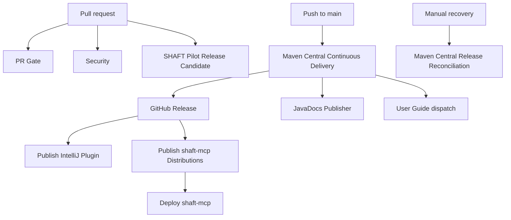

# GitHub Actions workflow map

This is the repository-local operating inventory for `.github/workflows/`.
Public release and architecture guidance belongs in the
[maintainer guide](https://shafthq.github.io/docs/maintainers/overview); this
page records volatile trigger and dependency details that must change beside
the workflow files themselves.

## Delivery relationships

```mermaid
flowchart TD
  PR[Pull request] --> GATE[PR Gate]
  PR --> SEC[Security]
  PR --> CANDIDATE[SHAFT Pilot Release Candidate]
  MAIN[Push to main] --> CD[Maven Central Continuous Delivery]
  CD --> RELEASE[GitHub Release]
  CD --> JAVADOCS[JavaDocs Publisher]
  CD --> GUIDE[User Guide dispatch]
  RELEASE --> IDEA[Publish IntelliJ Plugin]
  RELEASE --> MCP[Publish shaft-mcp Distributions]
  MCP --> DEPLOY[Deploy shaft-mcp]
  MANUAL[Manual recovery] --> RECONCILE[Maven Central Release Reconciliation]
```

`workflow_run` consumers match the upstream workflow `name`, not its filename.
Renaming **Maven Central Continuous Delivery** or **Publish shaft-mcp
Distributions** requires updating downstream listeners in the same change.

The release workflow creates GitHub Releases with `BOT_TOKEN`. GitHub does not
fan out a `release` event created by a workflow's default `GITHUB_TOKEN`, so
changing that token silently breaks both distribution publishers.

## Active inventory

| File | Trigger | Responsibility |
|---|---|---|
| `pr-gate.yml` | pull request, push to `main` | Required path-aware gate: documentation boundaries, agent guidance, unit tests, installer/plugin checks, CLI, Capture E2E, dependency review, and template coupling. |
| `security.yml` | pull request, push to `main`, manual | CodeQL Java analysis. |
| `shaft-pilot-release.yml` | release-relevant pull request, manual | Rehearses the release contract, consumers, IntelliJ candidate, Capture, MCP transports, and container. |
| `mavenCentral_cd.yml` | release-relevant push to `main`, manual | Validates, signs, publishes, verifies, releases, dispatches the guide, and announces. |
| `maven-central-reconcile.yml` | manual only | Safely completes a partially published immutable Maven Central version; dry-run defaults on. |
| `prepare-release-pr.yml` | manual only | Updates the dated reactor and tool versions and opens the release PR. |
| `publishJavaDocs.yml` | successful Maven Central workflow, manual | Publishes aggregate JavaDocs to the `javadoc` branch. |
| `publish-intellij-plugin.yml` | published GitHub release, manual | Checks out the release tag, verifies, signs, and publishes the IntelliJ plugin. |
| `publish-shaft-mcp.yml` | published GitHub release, manual | Publishes MCP images and registry metadata. |
| `deploy-shaft-mcp.yml` | successful MCP distribution workflow, manual | Deploys configured MCP services and records optional-provider handoffs. |
| `e2eTests.yml` | nightly, manual | Broad hosted database, API, browser, mobile, visual, video, Cucumber, and JUnit coverage. |
| `e2eLocalTests.yml` | nightly, manual | Windows and macOS local browser and desktop coverage. |
| `lambdatestTests.yml` | manual | Serial LambdaTest app upload plus native and desktop suites. |
| `shaft-mcp.yml` | nightly, manual | Public installer matrix, MCP packaging, coverage, and container smoke. |
| `guided-workflows-live.yml` | nightly, manual | Live IntelliJ guided Web, mobile-emulation, and Doctor flows through real MCP. |
| `live-tools-nightly.yml` | nightly, manual | Live SHAFT CLI and IntelliJ assistant tool calls that cannot run in the PR gate. |
| `agent-plugin-acceptance.yml` | weekly, manual | Native client routing evidence and immutable external guardrail-corpus scoring. |
| `update-selenium-grid-versions.yml` | weekly, manual | Updates Selenium Grid image references and opens a validated PR. |

The quality validator fails when an active `*.yml` file is missing from this
table. Remove a row only in the same change that deletes its workflow.

## Scheduling and trigger contracts

- `e2eTests.yml`, `e2eLocalTests.yml`, and `shaft-mcp.yml` intentionally share
  the `01:00 UTC` nightly slot; configuration validators enforce the literal
  MCP schedule.
- `guided-workflows-live.yml` runs at `02:30 UTC`, followed by
  `live-tools-nightly.yml` at `03:30 UTC` so resource-heavy live lanes do not
  collide.
- `pr-gate.yml` intentionally has no `workflow_dispatch`: its path filter needs
  a pull-request or push diff and a manual run could pass vacuously.
- `publish-intellij-plugin.yml` and `publish-shaft-mcp.yml` listen for an actual
  published release rather than the Maven workflow conclusion, because an
  already-published version is a successful no-op delivery.
- External credentials and infrastructure can make cloud/live lanes report an
  explicit external blocker. Unknown client exits, contract drift, and
  ordinary test failures remain failures.

## Safe editing checklist

1. Search `workflow_run`, `release`, `repository_dispatch`, and workflow-name
   references before renaming or deleting a file.
2. Keep `pr-gate.yml` path filters aligned with every input read by each leg;
   a green job that never triggers is not coverage.
3. Mirror release-critical Maven module lists and checks between
   `shaft-pilot-release.yml` and `mavenCentral_cd.yml`.
4. Run the focused workflow-contract unit tests, then
   `py -3 scripts/ci/validate_quality_configuration.py` and
   `py -3 scripts/ci/validate_agent_setup.py --skip-external`.
5. Never test a real publish, deploy, reconciliation, or cloud lane without
   explicit authorization and the required infrastructure.
