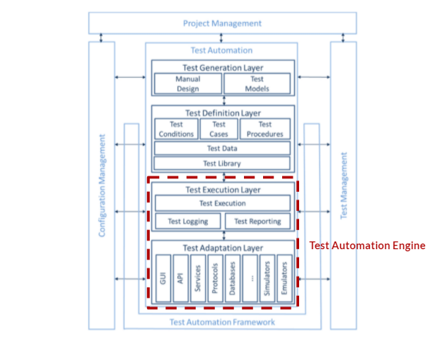
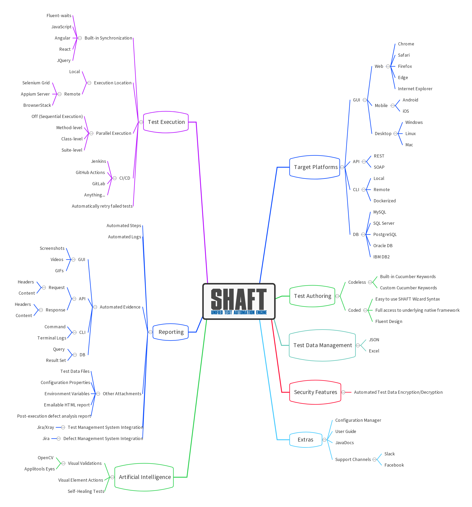
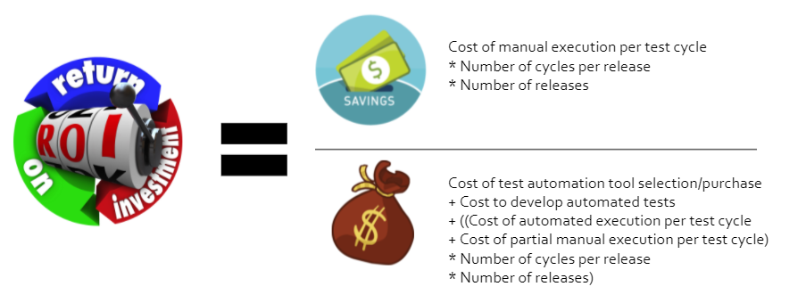

# SHAFT: Unified Test Automation Engine

### Badges:<!-- Badges provided by https://shields.io/ -->

  

 
 

### Important Links:
- ⚙️  [Configuration Manager](https://mohabmohie.github.io/SHAFT_ENGINE/)
- 👤  [User Guide](https://mohabmohie.github.io/SHAFT_Engine_Docusaurus/)
- 📚  [Javadocs](https://mohabmohie.github.io/SHAFT_ENGINE/apidocs/index.html)
- 📊  Latest Test Execution Reports:
  - [Windows/Edge](https://mohabmohie.github.io/SHAFT_ENGINE/allure/Windows/Web/index.html) - [Mac/Safari](https://mohabmohie.github.io/SHAFT_ENGINE/allure/macOS/Web/index.html) - [Linux/Firefox](https://mohabmohie.github.io/SHAFT_ENGINE/allure/Linux/Web/index.html) - [Native/Android](https://mohabmohie.github.io/SHAFT_ENGINE/allure/MobileNative/Android/index.html)
- ✈️  Related Projects:
  - [using SHAFT_Engine](https://github.com/MohabMohie/using_SHAFT_ENGINE)
  - [User Guide](https://github.com/MohabMohie/SHAFT_Engine_Docusaurus)

### What is SHAFT?
- A Unified Test Automation Engine. 
- A source controlled Java Maven project that is easily and regularly extended and enhanced with new features.
- Provides an easily understandable and user-friendly syntax for writing simple, robust, reliable, maintainable, and scalable tests.
- Fully documented with standard JavaDocs.
- Provides an online Configuration Manager to effortlessly set up your tests.
- Regularly updated with the latest stable versions from all included dependencies.
- Provides a ton of built-in features in the Test Execution and Test Adaptation layers of the Generic Test Automation Architecture, and allows you to focus on the Test Generation and Test Definition Layers. 

### Why should I use SHAFT?
- MIT Licensed Open-Source project that's free to use and easy to customize.
- Frequent updates full of new features and bug fixes.
- Helps you focus on writing simple tests without wasting time on any of the underlying complex wrapper code and error handling.
- Maximize your Return On Investment by eliminating framework creation time, tool selection and training costs, and minimizing ramp up time. 
- Start being productive immediately without having to reinvent the wheel!

### When should I use SHAFT?
- If you're getting started with a new test automation project that focuses on any of the supported platforms.
- If you already have an existing test automation project that uses Selenium/Appium/RestAssured/TestNG/Java then using SHAFT will be a direct upgrade with <u>ZERO refactoring required</u>.

### How can I use SHAFT?
- Simply copy-paste the related configuration from the sample using_SHAFT_Engine project as shown in this 10-minute <b>Getting Started</b> video ▶️: 
- If you wish to use SHAFT with <b>IntelliJ</b> please apply these settings: Run/Debug Configurations > Edit Configurations... > Templates > TestNG > Configuration > Listeners > Add all SHAFT_Engine Listeners [AlterSuite, InvokedMethod, Suite]

### To contribute to SHAFT join our Slack Channel, for support using SHAFT join our Facebook group:
  

#### Stop Reinventing the wheel! Start using SHAFT!
