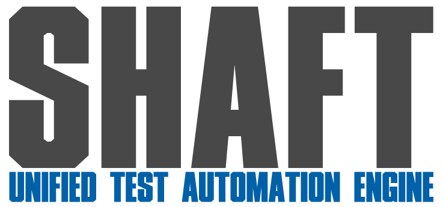

<!-- Badges provided by https://shields.io/ -->
# SHAFT: Unified Test Automation Engine
 
<table border="0" align="center">
 <tr>
  <td colspan="3" align="center">
   <a href="https://ShaftHQ.github.io/" target="_blank"></a>
  </td>
 </tr>
 <tr>
  <td align="center">
   Fully documented
<br/><br/><a href="https://ShaftHQ.github.io/"><a/>
  <br/></td>
   <td align="center">
   Award Winning
<br/><br/><a href="https://opensource.googleblog.com/2023/05/google-open-source-peer-bonus-program-announces-first-group-of-winners-2023.html"></a>
  <br/></td>
  <td align="center">
   Selenium Ecosystem
<br/><br/><a href="https://www.selenium.dev/ecosystem/#frameworks"><a/>
  <br/></td>
 </tr>
  <tr>
  <td colspan="3" align="center">
   <br/>
   <a href="https://techforpalestine.org/learn-more" target="_blank"></a>
   <br/>
   <a href="https://github.com/ShaftHQ/SHAFT_ENGINE/blob/master/LICENSE" target="_blank"></a>
   <a href="https://github.com/ShaftHQ/SHAFT_ENGINE/graphs/contributors" target="_blank"></a>
   <a href="https://central.sonatype.com/artifact/io.github.shafthq/SHAFT_ENGINE" target="_blank"></a>
   <br/>
   <a href="https://github.com/ShaftHQ/SHAFT_ENGINE/actions/workflows/e2eTests.yml" target="_blank"></a>
   <a href="https://github.com/ShaftHQ/SHAFT_ENGINE/actions/workflows/codeql-analysis.yml" target="_blank"></a>
   <br/>
   <a href="https://www.codacy.com/gh/ShaftHQ/SHAFT_ENGINE/dashboard" target="_blank"></a>
   <a href="https://app.codecov.io/gh/ShaftHQ/SHAFT_ENGINE" target="_blank"></a>
   <br/><br/>
  </td>
 </tr>
</table>
<br/>

## 🌍 Our success partners:

### Sponsors:
<a href="https://www.browserstack.com/" target="_blank"></a>
&nbsp;&nbsp;&nbsp;&nbsp;&nbsp;&nbsp;<a href="https://applitools.com/" target="_blank"></a>
&nbsp;&nbsp;&nbsp;&nbsp;&nbsp;&nbsp;<a href="https://jb.gg/OpenSourceSupport" target="_blank"></a>
<br/><br/>

### Trusted solution of choice for: [^4]

&nbsp;&nbsp;&nbsp;&nbsp;&nbsp;&nbsp;&nbsp;&nbsp;&nbsp;&nbsp;&nbsp;&nbsp;&nbsp;&nbsp;&nbsp;&nbsp;&nbsp;&nbsp;&nbsp;&nbsp;&nbsp;&nbsp;&nbsp;&nbsp;&nbsp;&nbsp;&nbsp;&nbsp;&nbsp;&nbsp;&nbsp;&nbsp;&nbsp;&nbsp;&nbsp;&nbsp;&nbsp;&nbsp;&nbsp;&nbsp;&nbsp;&nbsp;&nbsp;&nbsp;&nbsp;&nbsp;&nbsp;&nbsp;&nbsp;&nbsp;&nbsp;&nbsp;&nbsp;&nbsp;&nbsp;&nbsp;&nbsp;&nbsp;&nbsp;&nbsp;&nbsp;&nbsp;&nbsp;&nbsp;&nbsp;&nbsp;&nbsp;&nbsp;&nbsp;&nbsp;&nbsp;&nbsp;&nbsp;&nbsp;&nbsp;&nbsp;&nbsp;&nbsp;&nbsp;&nbsp;&nbsp;&nbsp;&nbsp;&nbsp;&nbsp;&nbsp;&nbsp;&nbsp;&nbsp;&nbsp;&nbsp;&nbsp;&nbsp;&nbsp;&nbsp;&nbsp;&nbsp;&nbsp;&nbsp;&nbsp;&nbsp;&nbsp;&nbsp;&nbsp;&nbsp;&nbsp;&nbsp;&nbsp;&nbsp;&nbsp;&nbsp;&nbsp;&nbsp;&nbsp;

[^4]: Company names are collected via anonymous surveys and provided freely by engineers who claimed to be using SHAFT_Engine within these companies.

<br/><br/>

<a id="user-guide"></a>

## 📚 [User Guide](https://shafthq.github.io/):
- Check out our comprehensive and friendly [user guide](https://shafthq.github.io/) to learn why <b>SHAFT</b> should be your solution of choice if you're aiming for successful test automation.
- SHAFT is a unified test automation engine for web, mobile, API, CLI, database, and desktop e2e testing. Powered by best-in-class frameworks, SHAFT provides a wizard-like syntax to drive your automation efficiently, maximize your ROI, and minimize your learning curve with no limitations! Stop reinventing the wheel! Upgrade now!

### Supported Platforms:

#### Web:

|          | Linux | macOS | Windows | Android | iOS |
|   :---   | :---: | :---: | :---:   | :---: | :---:   |
| Google Chrome  | :white_check_mark: | :white_check_mark: | :white_check_mark: |:white_check_mark: | :white_check_mark: |
| Microsoft Edge  | :white_check_mark: | :white_check_mark: | :white_check_mark: |_ | _ |
| Mozilla Firefox  | :white_check_mark: | :white_check_mark: | :white_check_mark: |_ | _ |
| Apple Safari  | _ | :white_check_mark: | _ | _ | :white_check_mark: |

#### Apps:

|          | Android | iOS | Windows | 
|   :---   | :---: | :---: | :---:   |
| Native  |:white_check_mark: | :white_check_mark: | N/A | 
| Hybrid  | :white_check_mark: | :white_check_mark: | N/A | 
| Flutter | :white_check_mark: | :white_check_mark: | N/A | 
| WPF  |  N/A | N/A |:white_check_mark: |

#### Other:

| API | Database | CLI | PDF | JSON | YAML | Excel | Property |
| :---: | :---: | :---:|:---:|:---:|:---:|:---:|:---:|
| :white_check_mark: |:white_check_mark: | :white_check_mark: |:white_check_mark: |:white_check_mark: |:white_check_mark: |:white_check_mark: |:white_check_mark: |

### Built-in features:

- SHAFT also provides a lot of out-of-the-box convenience features to facilitate your testing process:

#### Test orchestration:

| TestNG | JUnit5 | Cucumber |
| :---: |:---: |:---: |
| :white_check_mark: |:white_check_mark: |:white_check_mark: |

#### Test authoring (Maintainability):

| Fluent design | Locator builder | Native `WebDriver` access | Element/Browser validations builder| AI-powered visual validations
| :---: |:---: |:---: |:---: |:---: |
| :white_check_mark: |:white_check_mark: |:white_check_mark: |:white_check_mark: |:white_check_mark: |

#### Reliability:

| Auto synchronization | Logging | Reporting | Screenshots/Attachments| Video recording|
| :---: |:---: |:---: |:---: |:---: |
| :white_check_mark: |:white_check_mark: |:white_check_mark: |:white_check_mark: |:white_check_mark: |

#### Scalability:

| CI/CD integration |Cloud device farm integration  |Headless testing  |Parallel execution  |Containerized execution  |
| :---: |:---: |:---: |:---: |:---: |
| :white_check_mark: |:white_check_mark: |:white_check_mark: |:white_check_mark: |:white_check_mark: |

<br/>

## 👨‍💻 Tech Stack:

### Developed using:
<a href="https://www.oracle.com/eg/java/technologies/downloads/" target="_blank"></a>
<a href="https://maven.apache.org/" target="_blank"></a>
&nbsp;&nbsp;&nbsp;&nbsp;&nbsp;&nbsp;<a href="https://www.jetbrains.com/idea/" target="_blank"></a>
<br/><br/>

### Powered by:
<a href="https://www.selenium.dev/" target="_blank"></a>
&nbsp;&nbsp;&nbsp;&nbsp;&nbsp;&nbsp;<a href="https://appium.github.io/appium/docs/en/2.0/" target="_blank"></a>
&nbsp;&nbsp;&nbsp;&nbsp;&nbsp;&nbsp;<a href="https://rest-assured.io/" target="_blank"></a>
&nbsp;&nbsp;&nbsp;&nbsp;&nbsp;&nbsp;<a href="https://testng.org/doc/" target="_blank"></a>
&nbsp;&nbsp;&nbsp;&nbsp;&nbsp;&nbsp;<a href="https://docs.qameta.io/allure/" target="_blank"></a>
&nbsp;&nbsp;&nbsp;&nbsp;&nbsp;&nbsp;<a href="https://cucumber.io/tools/cucumber-open/" target="_blank"></a>
&nbsp;&nbsp;&nbsp;&nbsp;&nbsp;&nbsp;<a href="https://opencv.org/" target="_blank"></a>
&nbsp;&nbsp;&nbsp;&nbsp;&nbsp;&nbsp;<a href="https://www.selenium.dev/documentation/grid/" target="_blank"></a>
&nbsp;&nbsp;&nbsp;&nbsp;&nbsp;&nbsp;<a href="https://github.com/features/actions" target="_blank"></a>
&nbsp;&nbsp;&nbsp;&nbsp;&nbsp;&nbsp;<a href="https://github.com/dependabot" target="_blank"></a>
&nbsp;&nbsp;&nbsp;&nbsp;&nbsp;&nbsp;<a href="https://codeql.github.com/" target="_blank"></a>
&nbsp;&nbsp;&nbsp;&nbsp;&nbsp;&nbsp;<a href="https://app.codacy.com/gh/ShaftHQ/SHAFT_ENGINE/dashboard" target="_blank"></a>
&nbsp;&nbsp;&nbsp;&nbsp;&nbsp;&nbsp;<a href="https://www.eclemma.org/jacoco/" target="_blank"></a>
&nbsp;&nbsp;&nbsp;&nbsp;&nbsp;&nbsp;<a href="https://app.codecov.io/gh/ShaftHQ/SHAFT_ENGINE" target="_blank"></a>
&nbsp;&nbsp;&nbsp;&nbsp;&nbsp;&nbsp;<a href="https://central.sonatype.com/" target="_blank"></a>
<br/><br/>
<a id="support-and-contributions"></a>

## 🤝 Support & Contributions:
- Join us via Slack & Facebook
<br/><a href="https://join.slack.com/t/shaft-engine/shared_invite/zt-oii5i2gg-0ZGnih_Y34NjK7QqDn01Dw" target="_blank"></a>  <a href="https://www.facebook.com/groups/Automatest" target="_blank"></a>
- And feel free to create PRs directly. [This lovely tutorial](https://dev.to/genicsblog/how-to-create-a-pull-request-in-github-correctly-20np) will help.
<br/><br/>
<a id="quick-start-guide"></a>

## 🏃 Quick Start Guide:

### Option 1: Maven Archetype
(Recommended for new local sandbox projects)

- The easiest and most straightforward way to create a new project that uses SHAFT.
- Just [follow the simple steps here](https://github.com/ShaftHQ/testng-archetype) to generate your new project with one command (all configurations included).

### Option 2: Template Project
(Recommended for new source controlled projects)

- Use our [Template Project](https://github.com/ShaftHQ/using_SHAFT_Engine) to create a new project with one click.
- Follow the steps in the ReadMe to handle project configuration.

### Option 3: Start from scratch
(Recommended if you're upgrading an existing project from Native Selenium WebDriver to SHAFT)

#### Step 1: Initial Setup

- Create a new Java/Maven project using Eclipse, IntelliJ or your favourite IDE.
- Copy the highlighted contents of
  this [pom.xml](https://github.com/ShaftHQ/using_SHAFT_Engine/blob/main/GUI_Web/pom.xml#L11-L200) file into yours
  inside the ```<project>``` tag.
- Follow the steps in this footnote in case you are using IntelliJ[^1].

#### Step 2: Creating Tests
- Create a new Package ```TestPackage``` under ```src/test/java``` and create a new Java Class ```TestClass``` under that package.
- Copy the below imports into your newly created java class.
```java
import com.shaft.driver.SHAFT;
import org.openqa.selenium.By;
import org.openqa.selenium.Keys;
import org.testng.annotations.AfterClass;
import org.testng.annotations.BeforeClass;
import org.testng.annotations.Test;
```
- Copy the below code snippet into your newly created java class.
```java
SHAFT.GUI.WebDriver driver;
SHAFT.TestData.JSON testData;

By searchBox = By.name("q");
By resultStats = By.id("result-stats");

@Test
public void test() {
    driver.browser().navigateToURL("https://www.google.com/");
    driver.verifyThat().browser().title().isEqualTo("Google").perform();
    driver.element().type(searchBox, testData.getTestData("searchQuery"))
            .keyPress(searchBox, Keys.ENTER);
    driver.assertThat().element(resultStats).text().doesNotEqual("")
            .withCustomReportMessage("Check that result stats is not empty").perform();
}

@BeforeClass
public void beforeClass() {
    driver = new SHAFT.GUI.WebDriver();
    testData = new SHAFT.TestData.JSON("simpleJSON.json");
    }

@AfterClass(alwaysRun = true)
public void afterClass(){
        driver.quit();
    }
```

#### Step 3: Managing Test Data
- Create the following file ```src/test/resources/testDataFiles/simpleJSON.json```.
- Copy the below code snippet into your newly created json file.
```json
{
  "searchQuery": "SHAFT_Engine"
}
```

#### Step 4: Running Tests
- Run your ```TestClass.java``` as a TestNG Test Class.
- The execution report will open automatically in your default web browser after the test run is completed.
- <b>Join</b> our  to get notified by email when a new release is pushed out.
- After upgrading your Engine to a new major release it is sometimes recommended to delete the properties
  folder ```src\main\resources\properties``` and allow SHAFT to regenerate the defaults by running any test method.
  [^1]: If you're using Cucumber due to a known issue with IntelliJ you need to edit your run configuration template before running your tests by following these steps:
  <br/>- Open 'Edit Run/Debug Configurations' dialog > Edit Configurations... > Edit configuration templates...
  <br/>- Select <b>Cucumber Java</b> > Program Arguments > and add this argument:
  <br/>`--plugin com.shaft.listeners.CucumberFeatureListener`
  <br/>- After saving the changes, remember to delete any old runs you may have triggered by mistake before adding the needed config.

<br/><br/>

#### Stop Reinventing the wheel! Start using SHAFT!
