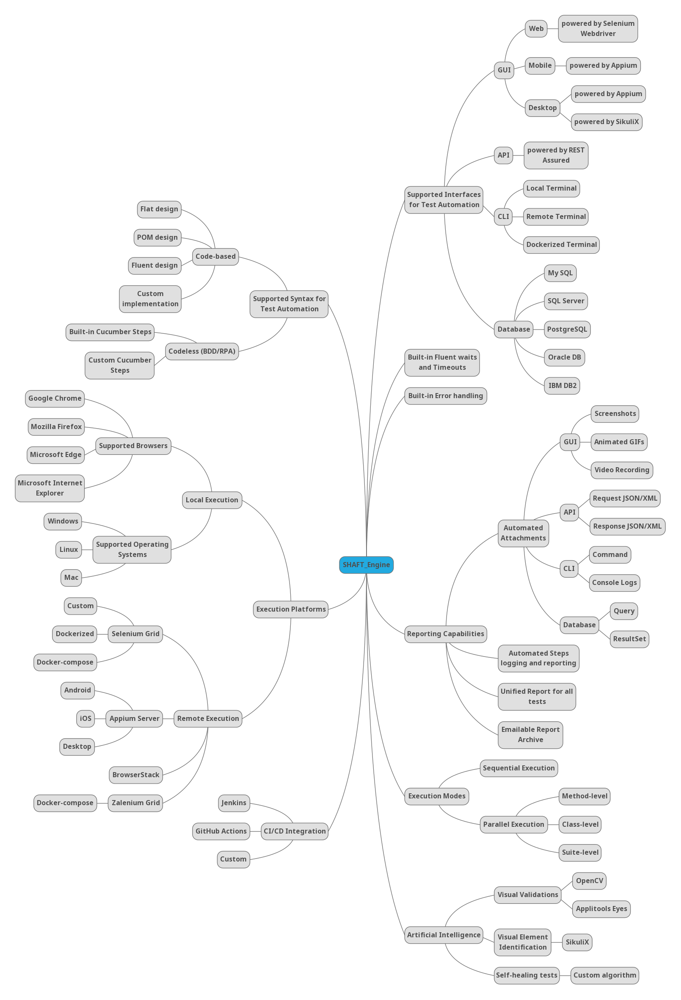

# SHAFT_ENGINE

### Badges:<!-- Badges provided by https://shields.io/ -->

 
 

 
 

#### If you want to contribute to this project, or you need any help/support getting started feel free to join our online Facebook group Automatest:

### Getting Started:
- How to do cross-browser test automation in 10 minutes using SHAFT_Engine ▶️: https://www.youtube.com/watch?v=3TYGteD843M
- If you wish to use SHAFT_Engine with IntelliJ please apply these settings:
 Run/Debug Configurations > Edit Configurations... > Templates > TestNG > Configuration > Listeners > Add all SHAFT_Engine Listeners [AlterSuite, InvokedMethod, Suite]

### Important Links:
- Configuration Manager ⚙️: https://mohabmohie.github.io/SHAFT_ENGINE/
- Javadocs 📚: https://mohabmohie.github.io/SHAFT_ENGINE/apidocs/index.html
- Latest Test Execution Report 📊: https://mohabmohie.github.io/SHAFT_ENGINE/allure/index.html

### SHAFT_ENGINE is:
- A Test Automation Engine.
- A source controlled Java 14 Maven project that is easily and regularly extended and enhanced with new features.
- Provides an easily understandable and user-friendly syntax for writing simple, robust, maintainable, and extendable tests.
- Provides support for Fluent, Data-Driven, Keyword-Driven, and Modular test design powered by TestNG.
- Provides support for RPA, UAT, and BDD using Cucumber.
- Provides and extensive, yet user-friendly unified report for test execution using Allure Reporting.
- Fully documented with standard JavaDocs.
- Supports web apps on Chrome, Firefox, Edge, IE, and Safari using Selenium WebDriver and WebDriver Manager.
- Supports mobile apps (Native/Hybrid/Web) using Appium.
- Supports desktop apps using Appium and SikuliX.
- Supports testing APIs using REST Assured.
- Supports testing CLIs.
- Supports testing Databases.
- Supports test data externalization by using Microsoft Excel, JSON, and property files.
- Supports Visual Element Identification using SikuliX.
- Supports AI powered Visual Testing using OpenCV and Applitools Eyes.
- Supports AI powered Self-healing GUI tests using OpenCV and custom algorithms.
- Supports test execution on Linux, Windows, Mac, Android, and iOS.
- Supports remote, unattended, parallel, cloud, and dockerized test execution using a native selenium grid or Zalenium.
- Can be easily integrated with all Continuous Integration, and DevOps solutions like Jenkins, GitHub Actions, or BitBucket.

### SHAFT_ENGINE Capabilities Map:

