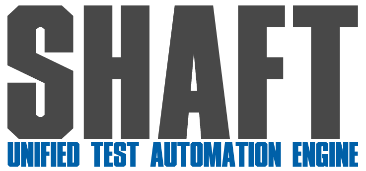

<!-- SHAFT Engine - Java Test Automation Framework | Selenium | Appium | REST Assured | Cross-Browser Testing -->
<a id="top"></a>
<div align="center">

<h1>
<picture>
  <source srcset="https://github.com/user-attachments/assets/b2e8454d-97ed-4dd8-91f2-1c09c53ba94e" media="(prefers-color-scheme: light)" width="40"/>
  <source srcset="https://github.com/user-attachments/assets/9cb4a7a8-2de7-486c-adb1-ad254af8c58b"  media="(prefers-color-scheme: dark)" width="40"/>
  
</picture> SHAFT : Unified Test Automation Engine
</h1>

**Stop reinventing the wheel.** Write your tests once and run them everywhere — across browsers, devices, and APIs — with a single, fluent Java framework.

SHAFT Engine is an open-source **Java test automation framework** built on top of [Selenium](https://www.selenium.dev/), [Appium](https://appium.io/), and [REST Assured](https://rest-assured.io/). It provides a unified, fluent API for **cross-browser testing**, **mobile app testing**, **API testing**, **CLI testing**, and **database testing** — so you can automate anything, from any platform, with zero boilerplate.

[](https://github.com/ShaftHQ/SHAFT_ENGINE/stargazers)
[](https://central.sonatype.com/artifact/io.github.shafthq/SHAFT_ENGINE)
[](https://github.com/ShaftHQ/SHAFT_ENGINE/blob/master/LICENSE)
[](https://github.com/ShaftHQ/SHAFT_ENGINE/actions/workflows/e2eTests.yml)
[](https://github.com/ShaftHQ/SHAFT_ENGINE/actions/workflows/codeql-analysis.yml)
[](https://www.codacy.com/gh/ShaftHQ/SHAFT_ENGINE/dashboard)
[](https://app.codecov.io/gh/ShaftHQ/SHAFT_ENGINE)
[](https://github.com/ShaftHQ/SHAFT_ENGINE/graphs/contributors)

<a href="https://techforpalestine.org/learn-more" target="_blank"></a>

---

### 🏆 Recognition & Trust

<table border="0" align="center">
 <tr>
  <td align="center" valign="top">
   <b>Fully Documented</b><br/><br/>
   <a href="https://ShaftHQ.github.io/"></a>
  </td>
  <td align="center" valign="top">
   <b>Award Winning</b><br/><br/>
   <a href="https://opensource.googleblog.com/2023/05/google-open-source-peer-bonus-program-announces-first-group-of-winners-2023.html"></a>
  </td>
  <td align="center" valign="top">
   <b>Selenium Ecosystem</b><br/><br/>
   <a href="https://www.selenium.dev/ecosystem/#frameworks"></a>
  </td>
 </tr>
</table>

</div>

---

## 📖 Table of Contents

- [🚀 Why SHAFT?](#-why-shaft)
- [💡 See the Difference](#-see-the-difference)
- [⚡ Quick Start](#-quick-start)
- [✨ Key Features](#-key-features)
- [🌍 Success Partners](#-success-partners)
- [📚 Documentation](#-documentation)
- [🤝 Community & Support](#-community--support)
- [💖 Sponsor](#-sponsor)
- [📜 License](#-license)

---

## 🚀 Why SHAFT?

If you're tired of managing a fragile patchwork of Selenium helpers, custom wrappers, and retry logic — you're not alone. **SHAFT Engine** replaces all of that with a single, battle-tested framework trusted by **41,000+ engineers** across **10+ countries**.

Built on industry-standard technologies — [Selenium](https://www.selenium.dev/), [Appium](https://appium.io/), and [REST Assured](https://rest-assured.io/) — SHAFT gives you a fluent, chainable API that works across **web browsers**, **mobile apps**, **REST APIs**, **databases**, and **CLIs**. No more boilerplate. No more flaky tests. Just results.

### What Makes SHAFT Different?

| Feature | What You Get |
|---|---|
| 🎯 **Unified API** | One fluent syntax for Web, Mobile, API, CLI, and Database testing |
| 🔧 **Zero Boilerplate** | Smart auto-configuration — no WebDriverManager, no manual waits, no setup code |
| 📊 **Rich Reporting** | Built-in [Allure](https://allurereport.org/) integration with screenshots, videos, and detailed logs |
| 🤖 **AI-Powered Validation** | Visual testing with [OpenCV](https://opencv.org/) and intelligent element detection |
| 🌐 **Cloud-Ready** | Native support for [BrowserStack](https://www.browserstack.com/), [LambdaTest](https://www.lambdatest.com/), and [Selenium Grid](https://www.selenium.dev/documentation/grid/) |
| ⚙️ **Any Test Runner** | Works with [TestNG](https://testng.org/), [JUnit 5](https://junit.org/junit5/), and [Cucumber](https://cucumber.io/) out of the box |
| 🐳 **Containerized** | Ready-to-use Docker support for CI/CD pipelines |
| 📱 **Full Mobile** | Native, Hybrid, and [Flutter](https://flutter.dev/) apps on Android & iOS via [Appium](https://appium.io/) |

### Global Adoption

**41,511 active users** across **10+ countries** trust SHAFT for their test automation needs — from startups to Fortune 500 companies.

[View detailed analytics →](docs/USER_ANALYTICS.md)

---

## 💡 See the Difference

Stop writing dozens of lines of brittle Selenium boilerplate. Here's what SHAFT looks like compared to raw Selenium:

<table>
<tr>
<td>

**❌ Raw Selenium (verbose & fragile)**

</td>
<td>

**✅ SHAFT Engine (clean & reliable)**

</td>
</tr>
<tr>
<td>

```java
WebDriver driver = new ChromeDriver();
driver.get("https://example.com");
WebDriverWait wait =
    new WebDriverWait(driver, Duration.ofSeconds(10));
WebElement el = wait.until(
    ExpectedConditions.visibilityOfElementLocated(
        By.name("q")));
el.sendKeys("SHAFT");
el.sendKeys(Keys.ENTER);
String title = driver.getTitle();
Assert.assertTrue(title.contains("SHAFT"));
driver.quit();
```

</td>
<td>

```java
SHAFT.GUI.WebDriver driver =
    new SHAFT.GUI.WebDriver();
driver.browser().navigateToURL("https://example.com")
  .and().element().type(By.name("q"),
      "SHAFT" + Keys.ENTER)
  .and().assertThat().browser().title()
      .contains("SHAFT");
driver.quit();
```

</td>
</tr>
</table>

> **Fewer lines. Automatic synchronization. Built-in assertions. Beautiful reports.** That's SHAFT.

---

## ⚡ Quick Start

Get up and running in under 5 minutes!

### Option 1: Interactive Project Generator 🎉 *(Recommended)*
The fastest way to create a new SHAFT project with a user-friendly web UI:

👉 **[Launch Project Generator](https://shaftengine.netlify.app/docs/Getting_Started/first_steps_5#option-1-interactive-project-generator-recommended)**

Choose your test runner (TestNG / JUnit 5 / Cucumber), select your platform (Web / Mobile / API), and download a ready-to-use project — complete with CI/CD configuration.

### Option 2: Maven Archetype
Create a new project from the command line:

```bash
mvn archetype:generate \
  -DarchetypeGroupId=io.github.shafthq \
  -DarchetypeArtifactId=shaft-archetype
```

### Option 3: Add to an Existing Project

<details>
<summary><b>Maven</b> — add to your <code>pom.xml</code></summary>

```xml
<dependency>
    <groupId>io.github.shafthq</groupId>
    <artifactId>SHAFT_ENGINE</artifactId>
    <!-- Get the latest version from Maven Central ↓ -->
    <version><!-- SEE BADGE BELOW --></version>
</dependency>
```
</details>

<details>
<summary><b>Gradle (Kotlin DSL)</b> — add to your <code>build.gradle.kts</code></summary>

```kotlin
dependencies {
    // Get the latest version from Maven Central ↓
    testImplementation("io.github.shafthq:SHAFT_ENGINE:<version>")
}
```
</details>

> 💡 Check the latest version: [](https://central.sonatype.com/artifact/io.github.shafthq/SHAFT_ENGINE)

### Your First Test

```java
import com.shaft.driver.SHAFT;
import org.openqa.selenium.By;
import org.testng.annotations.*;

public class QuickStartTest {
    SHAFT.GUI.WebDriver driver;

    @BeforeMethod
    public void setup() {
        driver = new SHAFT.GUI.WebDriver();
    }

    @Test
    public void searchTest() {
        driver.browser().navigateToURL("https://duckduckgo.com/")
              .and().element().type(By.name("q"), "SHAFT_Engine")
              .and().element().click(By.cssSelector("button[type='submit']"))
              .and().assertThat().browser().title().contains("SHAFT_Engine");
    }

    @AfterMethod(alwaysRun = true)
    public void teardown() {
        driver.quit();
    }
}
```

📖 **[Complete Quick Start Guide →](docs/QUICK_START.md)** — includes TestNG, JUnit 5, and Cucumber examples.

---

## ✨ Key Features

<div align="center">

### The 3 Pillars of Successful Test Automation

| 📈 **Scalability** | 🎯 **Reliability** | 🔧 **Maintainability** |
|:---:|:---:|:---:|
| CI/CD Integration | Auto-Synchronization | Fluent Design |
| Cloud Execution | Rich Reporting | Smart Locators |
| Parallel Testing | Video Recording | AI Validations |
| Containerization | Screenshot Capture | Zero Boilerplate |

</div>

### Platform Support

| Category | Supported |
|---|---|
| **Browsers** | Chrome, Edge, Firefox, Safari (Desktop & Mobile) |
| **Mobile Apps** | Native, Hybrid, Flutter (Android & iOS) |
| **APIs** | REST (GET, POST, PUT, PATCH, DELETE) with full response validation |
| **Databases** | MySQL, SQL Server, PostgreSQL, Oracle, IBM DB2, H2, MongoDB |
| **Other** | CLI / Terminal, File Assertions (JSON, YAML, Excel, PDF, CSV) |
| **Test Runners** | TestNG, JUnit 5, Cucumber BDD |

📖 **[Complete Feature List →](docs/FEATURES.md)** · **[Tech Stack →](docs/TECH_STACK.md)** · **[Architecture →](docs/ARCHITECTURE.md)**

---

## 🌍 Success Partners

<div align="center">

### 💎 Sponsors

<a href="https://www.browserstack.com/" target="_blank"></a>
&nbsp;&nbsp;&nbsp;&nbsp;
<a href="https://www.lambdatest.com" target="_blank"></a>
&nbsp;&nbsp;&nbsp;&nbsp;
<a href="https://applitools.com/" target="_blank"></a>

### 🏢 Trusted By Leading Organizations

<a href="https://www.vodafone.com/careers/professional-career-areas/shared-services"></a>
&nbsp;&nbsp;
<a href="https://dxc.com/us/en"></a>
&nbsp;&nbsp;
<a href="https://www.euronetworldwide.com/"></a>
&nbsp;&nbsp;
<a href="https://www.idemia.com/"></a>
&nbsp;&nbsp;
<a href="https://www.getgroup.com/"></a>

**[View all partners →](docs/SUCCESS_PARTNERS.md)**

</div>

---

## 📚 Documentation

<div align="center">

| Resource | Description |
|----------|-------------|
| 📖 **[User Guide](https://shaftengine.netlify.app/)** | Comprehensive documentation, tutorials, and configuration reference |
| 🏗️ **[Architecture](docs/ARCHITECTURE.md)** | Framework design, module overview, and Mermaid diagrams |
| 🛠️ **[Tech Stack](docs/TECH_STACK.md)** | Technologies and libraries powering SHAFT |
| ✨ **[Features](docs/FEATURES.md)** | Full feature list with platform compatibility matrix |
| 📊 **[User Analytics](docs/USER_ANALYTICS.md)** | Global adoption, geographic breakdown, and growth metrics |

### 🤖 AI-Powered Code Exploration

<a href="https://codewiki.google/github.com/shafthq/shaft_engine" target="_blank"></a>

**[Explore SHAFT Engine on Google Code Wiki →](https://codewiki.google/github.com/shafthq/shaft_engine)**

Browse, search, and understand the SHAFT Engine codebase using [**Google Code Wiki**](https://codewiki.google/github.com/shafthq/shaft_engine) — Google's AI-powered code exploration tool. Ask questions about the code, navigate complex implementations, and get intelligent explanations of framework internals.

</div>

---

## 🤝 Community & Support

<div align="center">

### Join Our Community

<a href="https://join.slack.com/t/shaft-engine/shared_invite/zt-oii5i2gg-0ZGnih_Y34NjK7QqDn01Dw" target="_blank"></a>
&nbsp;&nbsp;&nbsp;&nbsp;
<a href="https://www.facebook.com/groups/Automatest" target="_blank"></a>

### Contributing

We love contributions from the community! Here's how you can get involved:

- 🐛 [Report a bug](https://github.com/ShaftHQ/SHAFT_ENGINE/issues/new?template=bug_report.md) — found something broken? Let us know
- 💡 [Request a feature](https://github.com/ShaftHQ/SHAFT_ENGINE/issues/new?template=feature_request.md) — have an idea? We'd love to hear it
- 🔀 [Submit a pull request](https://github.com/ShaftHQ/SHAFT_ENGINE/pulls) — jump right in and help build SHAFT

Read our [Contributing Guidelines](CONTRIBUTING.md) and [Code of Conduct](CODE_OF_CONDUCT.md) to get started.

### ⭐ Show Your Support

If SHAFT has saved you time or helped your team ship faster, **please consider giving us a star.** It helps others discover the project and motivates the team to keep improving it.

[](https://github.com/ShaftHQ/SHAFT_ENGINE/stargazers)

</div>

---

## 💖 Sponsor

SHAFT Engine is free and open source, built with love by a dedicated community. If you or your organization benefit from SHAFT, consider [sponsoring the project](https://github.com/sponsors/MohabMohie) to help ensure its long-term sustainability.

<div align="center">

[](https://github.com/sponsors/MohabMohie)

</div>

---

## 📜 License

SHAFT Engine is released under the [MIT License](LICENSE) — free to use, modify, and distribute in personal and commercial projects.

---

<div align="center">

<a href="https://ShaftHQ.github.io/" target="_blank">
<picture>
  <source srcset="src/main/resources/images/shaft.png" media="(prefers-color-scheme: light)" width="300"/>
  <source srcset="src/main/resources/images/shaft_white.png" media="(prefers-color-scheme: dark)" width="300"/>
  
</picture>
</a>

**Stop Reinventing the Wheel. Start Using SHAFT.**

Made with ❤️ by the [SHAFT community](https://github.com/ShaftHQ/SHAFT_ENGINE/graphs/contributors)

[⬆ Back to Top](#top)

</div>

