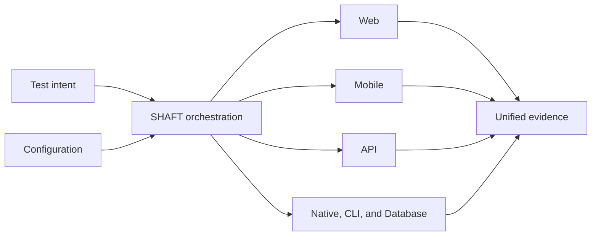

<div align="center">

<picture>
  <source media="(prefers-color-scheme: dark)" srcset="shaft-engine/src/main/resources/images/shaft_white.png">
  
</picture>

# SHAFT

**Reliable Java test automation, from first intent to production-grade evidence.**

One strong, maintainable framework for Web, Mobile, API, CLI, Database, and
native testing—with synchronized actions, configuration-first execution,
readable assertions, and unified reports.

[](https://central.sonatype.com/artifact/io.github.shafthq/shaft-engine)
[](https://github.com/ShaftHQ/SHAFT_ENGINE/actions/workflows/pr-gate.yml)
[](https://github.com/ShaftHQ/SHAFT_ENGINE)
[](https://shafthq.github.io/)

**[Generate your first project](https://shafthq.github.io/)** ·
**[Explore the user guide](https://shafthq.github.io/)** ·
**[Star SHAFT on GitHub ⭐](https://github.com/ShaftHQ/SHAFT_ENGINE)**

</div>

SHAFT removes the repeated plumbing around drivers, waits, assertions,
configuration, test data, screenshots, logs, and Allure evidence. Its modular
Maven reactor keeps the core lean and lets teams add advanced tooling only when
they need it.

## From zero to useful evidence

1. [Open the SHAFT landing page](https://shafthq.github.io/) and generate a
   ready-to-run Maven project.
2. Extract it and run:

   ```shell
   mvn test
   ```

3. Inspect the sample result, screenshots, logs, and Allure evidence.

The generated project uses the canonical Maven coordinate
**io.github.shafthq:shaft-engine** and gives you a repeatable baseline
for local runs and CI.

## One orchestration layer, every execution surface

Test intent and configuration enter SHAFT's orchestration layer, fan out across
the required execution surfaces, and return through one unified evidence flow.


```mermaid
flowchart LR
    accTitle: SHAFT execution and evidence workflow
    accDescr: Test intent and configuration enter SHAFT orchestration, run across Web, Mobile, API, and Native execution surfaces, and produce unified evidence.
    I[Test intent] --> S[SHAFT orchestration]
    C[Configuration] --> S
    S --> W[Web]
    S --> M[Mobile]
    S --> A[API]
    S --> N[Native, CLI, and Database]
    W --> E[Unified evidence]
    M --> E
    A --> E
    N --> E
```

| Engineering need | What SHAFT provides |
|---|---|
| Stable UI automation | Managed Selenium and Appium drivers, synchronized actions, locator builders, screenshots, and accessibility evidence. |
| End-to-end coverage | REST, GraphQL, Database, CLI, and native desktop actions in the same test flow. |
| Trustworthy verdicts | Hard and soft assertions, structured logs, attachments, failure context, and Allure reports. |
| Scalable execution | Configuration-first local, Grid, BrowserStack, LambdaTest, TestNG, JUnit, and Cucumber runs. |
| Maintainable architecture | A focused engine, BOM-aligned optional modules, public extension points, and reusable test assets. |
| Assisted workflows | Capture, Doctor, deterministic Heal, MCP/CLI tools, provider adapters, and an IntelliJ IDEA plugin. |

## Built for long-lived automation suites

- **Strong defaults, explicit control.** Sensible behavior gets teams moving;
  configuration keeps environments and CI reproducible.
- **Modular by design.** Start with `shaft-engine`, then adopt visual, video,
  cloud, native, or agentic modules without rebuilding the test architecture.
- **Evidence is part of execution.** Logs, screenshots, attachments, and
  reports share one lifecycle instead of becoming after-the-fact glue.
- **Open and inspectable.** SHAFT is MIT licensed, built in public, and guarded
  by its [pull-request gate](.github/workflows/pr-gate.yml),
  [security policy](SECURITY.md), and published
  [release history](https://github.com/ShaftHQ/SHAFT_ENGINE/releases).

## Agent-ready, source-grounded

SHAFT ships 30 first-party skills for planning, authoring, running, diagnosing,
and reporting tests. Start with `$shaft-developer`; it routes the immediate job
to one focused specialist. Exact MCP names and CLI syntax are generated from
source in [`shaft-mcp-tools.md`](shaft-skills/references/shaft-mcp-tools.md) and
[`shaft-cli-commands.md`](shaft-skills/references/shaft-cli-commands.md).

## Join the project

- Found a bug or have an idea? [Open an issue](https://github.com/ShaftHQ/SHAFT_ENGINE/issues).
- Want to contribute? Read [CONTRIBUTING.md](CONTRIBUTING.md) and our
  [Code of Conduct](CODE_OF_CONDUCT.md).
- Found a vulnerability? Follow [SECURITY.md](SECURITY.md) and report it
  privately.
- Does SHAFT help your team? [Star the repository](https://github.com/ShaftHQ/SHAFT_ENGINE)
  so more automation engineers can find it.

BrowserStack, LambdaTest, Applitools, and JetBrains have provided tooling or
open-source program support. This is support for the project, not a claim of
financial sponsorship, customer status, or endorsement.

SHAFT is free and MIT licensed. You can support ongoing maintenance,
documentation, and public infrastructure through
[GitHub Sponsors](https://github.com/sponsors/MohabMohie).

MIT licensed — see [LICENSE](LICENSE).
