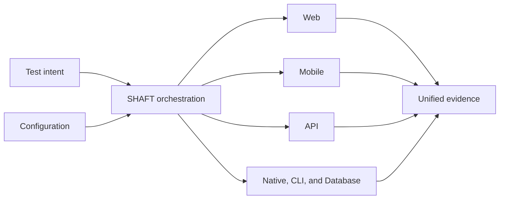

<div align="center">

<picture>
  <source media="(prefers-color-scheme: dark)" srcset="shaft-engine/src/main/resources/images/shaft_white.png">
  
</picture>

# SHAFT

**Reliable Java test automation, from first intent to production-grade evidence.**

SHAFT is a Java test-automation framework for teams who want one maintainable
engine across web, mobile, API, CLI, database, and desktop. Configuration
drives the run. The verdict comes back with logs, screenshots, and a report.

[](https://central.sonatype.com/artifact/io.github.shafthq/shaft-engine)
[](https://github.com/ShaftHQ/SHAFT_ENGINE/actions/workflows/pr-gate.yml)
[](LICENSE)
[](https://github.com/ShaftHQ/SHAFT_ENGINE)
[](https://shafthq.github.io/)

**[Generate your first project](https://shafthq.github.io/)** ·
**[Read the user guide](https://shafthq.github.io/)** ·
**[Watch the 100-second overview](https://github.com/ShaftHQ/SHAFT_ENGINE/releases/download/shaft-feature-video-20261009/SHAFT-business-16x9.mp4)** ·
**[Star SHAFT on GitHub](https://github.com/ShaftHQ/SHAFT_ENGINE)**

</div>

## On this page

- [Start here](#start-here)
- [Why teams use it](#why-teams-use-it)
- [One orchestration layer](#one-orchestration-layer-every-execution-surface)
- [Where to go next](#where-to-go-next)
- [Questions](#questions)
- [For agents](#for-agents)
- [Join the project](#join-the-project)

## Start here

SHAFT is for Java teams who are about to rebuild drivers, waits, assertions,
configuration, test data, and Allure plumbing again. The shortest path from
zero to a run is the published user guide at
[https://shafthq.github.io/](https://shafthq.github.io/): generate a project,
then run `mvn test`.

New to SHAFT? Watch the
[100-second overview video](https://github.com/ShaftHQ/SHAFT_ENGINE/releases/download/shaft-feature-video-20261009/SHAFT-business-16x9.mp4).
The [SHAFT feature video release](https://github.com/ShaftHQ/SHAFT_ENGINE/releases/tag/shaft-feature-video-20261009)
also has the technical walkthrough and captions, and the user guide plays both.
The current release is whatever version the Maven Central badge shows. History
lives on the [releases page](https://github.com/ShaftHQ/SHAFT_ENGINE/releases).

**Humans:** use this page to orient, then [CONTRIBUTING.md](CONTRIBUTING.md)
when you change the engine. Report vulnerabilities through
[SECURITY.md](SECURITY.md).

**Agents:** jump to [For agents](#for-agents). This README is orientation.
Do not treat it, or any module README, as agent policy.

### Add it to a project you already have

Use coordinate `io.github.shafthq:shaft-engine`. Set the version from the
Maven Central badge above. The generated project is still the supported
first run.

```xml
<dependency>
    <groupId>io.github.shafthq</groupId>
    <artifactId>shaft-engine</artifactId>
    <version>${shaft.version}</version>
</dependency>
```

```kotlin
implementation("io.github.shafthq:shaft-engine:${shaftVersion}")
```

Then:

```shell
mvn test
```

Inspect the sample result, screenshots, logs, and Allure evidence.

Each Maven reactor module and [shaft-intellij](shaft-intellij/README.md) has a
short README with a purpose line and a use-or-skip note.

## Why teams use it

SHAFT removes the repeated plumbing around drivers, waits, assertions,
configuration, test data, screenshots, logs, and Allure evidence. Its modular
Maven reactor keeps the core lean and lets teams add advanced tooling only when
they need it.

- **Strong defaults, explicit control.** Sensible behavior gets teams moving;
  configuration keeps environments and CI reproducible.
- **Modular by design.** Start with `shaft-engine`, then adopt visual, video,
  cloud, native, or agentic modules without rebuilding the test architecture.
- **Evidence is part of execution.** Logs, screenshots, attachments, and
  reports share one lifecycle instead of becoming after-the-fact glue.
- **Open and inspectable.** SHAFT is MIT licensed, built in public, and guarded
  by its [pull-request gate](.github/workflows/pr-gate.yml),
  [security policy](SECURITY.md), and published
  [release history](https://github.com/ShaftHQ/SHAFT_ENGINE/releases).

## One orchestration layer, every execution surface

Test intent and configuration enter SHAFT's orchestration layer, fan out across
the required execution surfaces, and return through one unified evidence flow.


```mermaid
flowchart LR
    accTitle: SHAFT execution and evidence workflow
    accDescr: Test intent and configuration enter SHAFT orchestration, run across Web, Mobile, API, and Native execution surfaces, and produce unified evidence.
    I[Test intent] --> S[SHAFT orchestration]
    C[Configuration] --> S
    S --> W[Web]
    S --> M[Mobile]
    S --> A[API]
    S --> N[Native, CLI, and Database]
    W --> E[Unified evidence]
    M --> E
    A --> E
    N --> E
```

| Engineering need | What SHAFT provides |
|---|---|
| Stable UI automation | Managed Selenium and Appium drivers, synchronized actions, locator builders, screenshots, and accessibility evidence. |
| End-to-end coverage | REST, GraphQL, Database, CLI, and native desktop actions in the same test flow. |
| Trustworthy verdicts | Hard and soft assertions, structured logs, attachments, failure context, and Allure reports. |
| Scalable execution | Configuration-first local, Grid, BrowserStack, LambdaTest, TestNG, JUnit, and Cucumber runs. |
| Maintainable architecture | A focused engine, BOM-aligned optional modules, public extension points, and reusable test assets. |
| Assisted workflows | Capture, Doctor, deterministic Heal, MCP/CLI tools, provider adapters, and an IntelliJ IDEA plugin. |

## Where to go next

| You want to | Open |
|---|---|
| Learn the product | [User guide](https://shafthq.github.io/) |
| Work inside IntelliJ | [shaft-intellij](shaft-intellij/README.md) |
| Call a tool from an agent | [MCP tool names](shaft-skills/references/shaft-mcp-tools.md) |
| Call a tool from the shell | [CLI commands](shaft-skills/references/shaft-cli-commands.md) |
| Follow the working policy | [AGENTS.md](AGENTS.md) |

<details>
<summary>Maintainer notes for local model runs</summary>

- FreeToken / llama.cpp on ROG: resolve with `chaos-engine/skills/local-agency` (`dispatch.py --prefer freetoken` or OpenAI-compat on `:8080`).
- Colibri is optional only when `http://127.0.0.1:8000` is READY; not the default on 6GB VRAM laptops.
- Proof runner note (#6045): preferred dense coder is Qwen2.5-Coder-7B Q4_K_M via llama-server when FreeToken KV is ~8k.

</details>

## Questions

**What is SHAFT?**
A Java framework for web, mobile, API, CLI, database, and desktop end-to-end
testing, with one evidence trail.

**How do I get a passing run today?**
Generate a project from the [user guide](https://shafthq.github.io/), then run
`mvn test`.

**Which runners does it speak?**
TestNG, JUnit, and Cucumber. Execution can stay local or go through Grid,
BrowserStack, or LambdaTest. The feature table above is the full list.

**Where does an agent start?**
[AGENTS.md](AGENTS.md). Not this file.

**What license is it?**
MIT. See [LICENSE](LICENSE).

## For agents

This page is a map. It is not the working policy.

- Start at [AGENTS.md](AGENTS.md). That file names the only policy owner.
- SHAFT ships 30 first-party skills for planning, authoring, running,
  diagnosing, and reporting tests. Start with `$shaft-developer`; it routes
  the immediate job to one focused specialist.
- Exact MCP names and CLI syntax are generated from source in
  [`shaft-mcp-tools.md`](shaft-skills/references/shaft-mcp-tools.md) and
  [`shaft-cli-commands.md`](shaft-skills/references/shaft-cli-commands.md).
- Do not treat this README, or any module README, as agent policy.

## Join the project

- Found a bug or have an idea? [Open an issue](https://github.com/ShaftHQ/SHAFT_ENGINE/issues).
- Want to contribute? Read [CONTRIBUTING.md](CONTRIBUTING.md) and our
  [Code of Conduct](CODE_OF_CONDUCT.md).
- Found a vulnerability? Follow [SECURITY.md](SECURITY.md) and report it
  privately.
- Does SHAFT help your team? [Star the repository](https://github.com/ShaftHQ/SHAFT_ENGINE)
  so more automation engineers can find it.

BrowserStack, LambdaTest, Applitools, and JetBrains have provided tooling or
open-source program support. This is support for the project, not a claim of
financial sponsorship, customer status, or endorsement.

SHAFT is free and MIT licensed. You can support ongoing maintenance,
documentation, and public infrastructure through
[GitHub Sponsors](https://github.com/sponsors/MohabMohie).

MIT licensed — see [LICENSE](LICENSE).
