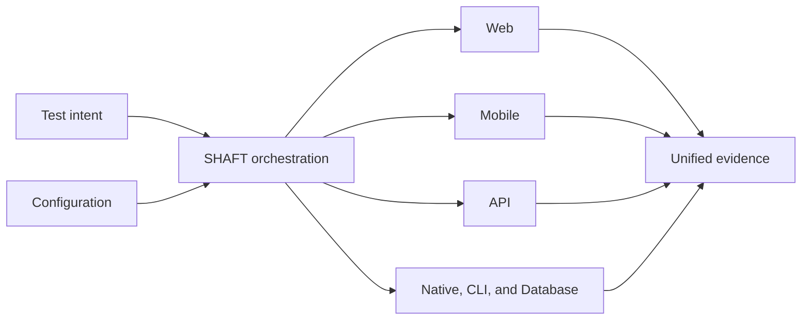

<div align="center">

<picture>
  <source media="(prefers-color-scheme: dark)" srcset="shaft-engine/src/main/resources/images/shaft_white.png">
  
</picture>

# SHAFT

**Reliable Java test automation, from first intent to production-grade evidence.**

SHAFT is a Java test-automation framework for teams who want one maintainable
engine across web, mobile, API, CLI, database, and desktop. Configuration
drives the run. The verdict comes back with logs, screenshots, and a report.

[](https://central.sonatype.com/artifact/io.github.shafthq/shaft-engine)
[](https://github.com/ShaftHQ/SHAFT_ENGINE/actions/workflows/pr-gate.yml)
[](LICENSE)
[](https://github.com/ShaftHQ/SHAFT_ENGINE)
[](https://shafthq.github.io/)

**[Generate your first project](https://shafthq.github.io/)** ·
**[Read the user guide](https://shafthq.github.io/)** ·
**[Watch the 100-second overview](https://github.com/ShaftHQ/SHAFT_ENGINE/releases/download/shaft-feature-video-v2-20261009/SHAFT-business-16x9-v2-1080p.mp4)** ·
**[Star SHAFT on GitHub](https://github.com/ShaftHQ/SHAFT_ENGINE)**

</div>

## Start here

SHAFT is for Java teams who are about to rebuild drivers, waits, assertions,
configuration, test data, and Allure plumbing again. Generate a project from
the [user guide](https://shafthq.github.io/), then run `mvn test`. The
[100-second overview](https://github.com/ShaftHQ/SHAFT_ENGINE/releases/download/shaft-feature-video-v2-20261009/SHAFT-business-16x9-v2-1080p.mp4)
and the [feature video release](https://github.com/ShaftHQ/SHAFT_ENGINE/releases/tag/shaft-feature-video-v2-20261009)
are the short tour; the badge above is the current version, and
[releases](https://github.com/ShaftHQ/SHAFT_ENGINE/releases) hold history.

**Humans:** orient here, then [CONTRIBUTING.md](CONTRIBUTING.md). Report vulnerabilities through [SECURITY.md](SECURITY.md).

**Agents:** jump to [For agents](#for-agents). This README is orientation, not agent policy.

### Add it to a project you already have

Use coordinate `io.github.shafthq:shaft-engine`. Set the version from the Maven Central badge. The generated project is still the supported first run. Kotlin uses the same coordinate.

```xml
<dependency>
    <groupId>io.github.shafthq</groupId>
    <artifactId>shaft-engine</artifactId>
    <version>${shaft.version}</version>
</dependency>
```

Each reactor module and [shaft-intellij](shaft-intellij/README.md) has a short README with a purpose line and a use-or-skip note.

## Why teams use it

SHAFT removes the repeated plumbing around drivers, waits, assertions, configuration, test data, screenshots, logs, and Allure evidence. The modular reactor keeps the core lean.

- **Strong defaults, explicit control.** Configuration keeps environments and CI reproducible.
- **Modular by design.** Start with `shaft-engine`, then add visual, video, cloud, native, or agentic modules.
- **Evidence is part of execution.** Logs, screenshots, attachments, and reports share one lifecycle.
- **Open and inspectable.** MIT licensed, guarded by the [pull-request gate](.github/workflows/pr-gate.yml), [security policy](SECURITY.md), and [release history](https://github.com/ShaftHQ/SHAFT_ENGINE/releases).

## One orchestration layer, every execution surface

Test intent and configuration enter SHAFT's orchestration layer, fan out across the required execution surfaces, and return through one unified evidence flow.


```mermaid
flowchart LR
    accTitle: SHAFT execution and evidence workflow
    accDescr: Test intent and configuration enter SHAFT orchestration, run across Web, Mobile, API, and Native execution surfaces, and produce unified evidence.
    I[Test intent] --> S[SHAFT orchestration]
    C[Configuration] --> S
    S --> W[Web]
    S --> M[Mobile]
    S --> A[API]
    S --> N[Native, CLI, and Database]
    W --> E[Unified evidence]
    M --> E
    A --> E
    N --> E
```

| Engineering need | What SHAFT provides |
|---|---|
| Stable UI automation | Managed Selenium and Appium drivers, synchronized actions, locator builders, screenshots, and accessibility evidence. |
| End-to-end coverage | REST, GraphQL, Database, CLI, and native desktop actions in the same test flow. |
| Trustworthy verdicts | Hard and soft assertions, structured logs, attachments, failure context, and Allure reports. |
| Scalable execution | Configuration-first local, Grid, BrowserStack, LambdaTest, TestNG, JUnit, and Cucumber runs. |
| Maintainable architecture | A focused engine, BOM-aligned optional modules, public extension points, and reusable test assets. |
| Assisted workflows | Capture, Doctor, deterministic Heal, MCP/CLI tools, provider adapters, and an IntelliJ IDEA plugin. |

## Where to go next

| You want to | Open |
|---|---|
| Learn the product | [User guide](https://shafthq.github.io/) |
| Work inside IntelliJ | [shaft-intellij](shaft-intellij/README.md) |
| Call a tool from an agent | [MCP tool names](shaft-skills/references/shaft-mcp-tools.md) |
| Call a tool from the shell | [CLI commands](shaft-skills/references/shaft-cli-commands.md) |
| Follow the working policy | [AGENTS.md](AGENTS.md) |

<details>
<summary>Maintainer notes for local model runs</summary>

- FreeToken / llama.cpp on ROG: resolve with `chaos-engine/skills/local-agency` (`dispatch.py --prefer freetoken` or OpenAI-compat on `:8080`).
- Colibri is optional only when `http://127.0.0.1:8000` is READY; not the default on 6GB VRAM laptops.
- Proof runner note (#6045): preferred dense coder is Qwen2.5-Coder-7B Q4_K_M via llama-server when FreeToken KV is ~8k.

</details>

## Questions

**What is SHAFT?** A Java framework for web, mobile, API, CLI, database, and desktop end-to-end testing, with one evidence trail.

**How do I get a passing run today?** Generate a project from the [user guide](https://shafthq.github.io/), then run `mvn test`. Runners are TestNG, JUnit, and Cucumber, local or through Grid, BrowserStack, or LambdaTest.

**Where does an agent start?** [AGENTS.md](AGENTS.md). Not this file. License: MIT ([LICENSE](LICENSE)).

## For agents

This page is a map. It is not the working policy.

- Start at [AGENTS.md](AGENTS.md). That file names the only policy owner.
- SHAFT ships 30 first-party skills. Start with `$shaft-developer`; it routes the job to one specialist.
- Exact MCP names and CLI syntax are generated in [`shaft-mcp-tools.md`](shaft-skills/references/shaft-mcp-tools.md) and [`shaft-cli-commands.md`](shaft-skills/references/shaft-cli-commands.md).

## Join the project

[Open an issue](https://github.com/ShaftHQ/SHAFT_ENGINE/issues), read [CONTRIBUTING.md](CONTRIBUTING.md) and the [Code of Conduct](CODE_OF_CONDUCT.md), and report vulnerabilities privately through [SECURITY.md](SECURITY.md). [Star the repository](https://github.com/ShaftHQ/SHAFT_ENGINE) if SHAFT helps your team.

BrowserStack, LambdaTest, Applitools, and JetBrains have provided tooling or open-source program support. This is support for the project, not a claim of financial sponsorship, customer status, or endorsement.

SHAFT is free and MIT licensed. Support maintenance through [GitHub Sponsors](https://github.com/sponsors/MohabMohie).
