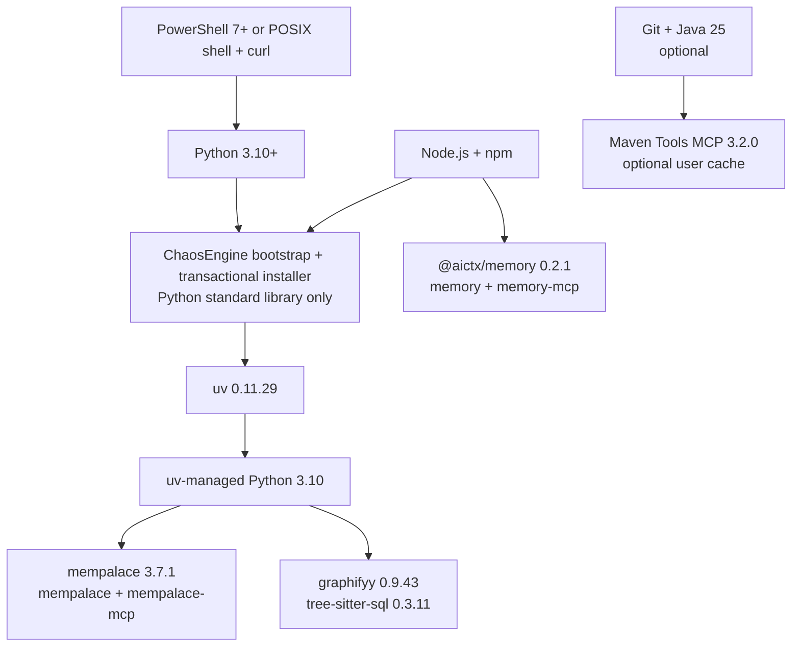
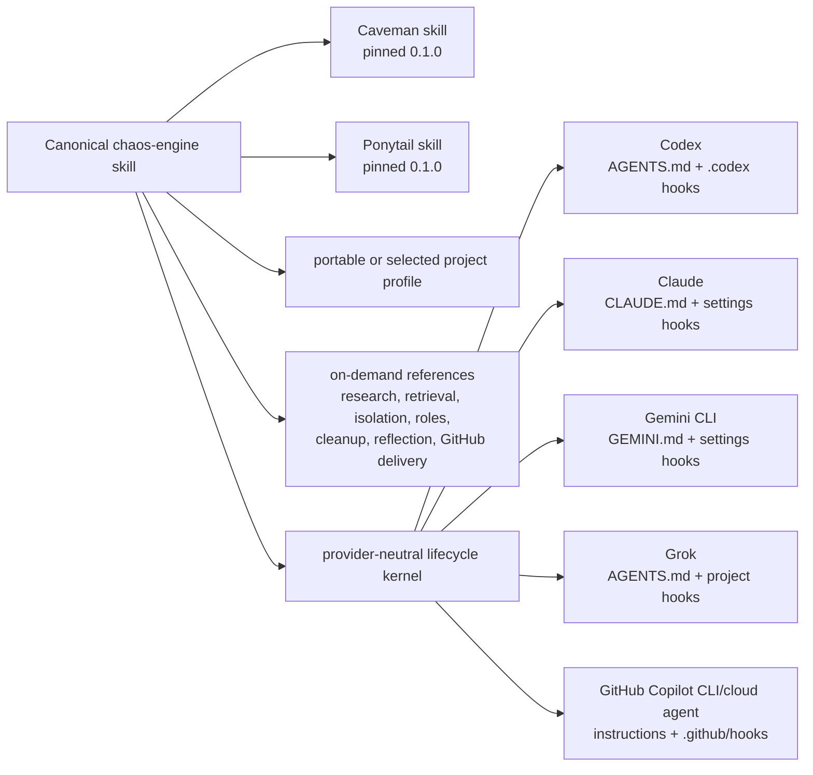

<p align="center">
  <picture>
    <source media="(prefers-color-scheme: dark)" srcset="assets/brand/lockup-dark.svg">
    <source media="(prefers-color-scheme: light)" srcset="assets/brand/lockup-light.svg">
    
  </picture>
</p>

<p align="center">
  A portable working contract that turns software agents into disciplined engineering partners.
</p>

# ChaosEngine

ChaosEngine is a provider-neutral operating system for agentic software work.
It gives an agent one canonical entrypoint for research, planning,
implementation, verification, review, delivery, and learning—without tying the
project to one model, client, marketplace, maintainer, or source repository.

It is not a code generator or a replacement for a project's own engineering
rules. It is the control layer that discovers those rules, routes each task to
the right surface, and demands evidence before claiming the work is done.

## Why it exists

Capable agents still fail in predictable ways: they start editing before they
understand the system, trust stale summaries, stop at a green-looking banner,
or leave a pull request open and call the task complete. ChaosEngine makes the
safer sequence explicit and portable.

Its core promises are straightforward:

- **Evidence over inference.** Read and run the real system before making a
  claim.
- **Research before mutation.** Retrieve prior decisions, inspect current
  callers, and compare viable approaches first.
- **Coherent implementation.** Finish approved scope without microstep review,
  validation, commit, or delivery interruptions.
- **Consolidated challenge.** Validate complete implementation, then one
  independent reviewer tries to refute it before merge.
- **Owned delivery.** Work continues through review, checks, and confirmed
  merge when that authority is granted.
- **Durable learning.** Reusable facts and decisions go to structured stores;
  transcripts and private material do not become policy.

## The operating loop

```mermaid
flowchart LR
    accTitle: ChaosEngine delivery loop
    accDescr: A task moves through Plan, Do, Check, Act, delivery, and one durable learning decision without microstep loops.
    T[Task and triage] --> R[Live research]
    R --> P[Plan complete scope]
    P --> D[Do complete implementation]
    D --> V[Check once]
    V --> A[Act on observed blockers]
    A --> X[One PR review]
    X --> G[Pull request and checks]
    G --> M[Confirmed merge]
    M --> L[Learning Session]
```



The canonical rules live in
[`skills/chaos-engine/SKILL.md`](skills/chaos-engine/SKILL.md). That entrypoint
sizes the task, loads the one relevant routed surface, and keeps detailed
guidance out of the always-loaded context until it is needed.

## Install

Start with the full [installation and upgrade guide](INSTALL.md). The safest
flow resolves a configured upstream branch to an immutable commit, downloads
only that commit's validated `chaos-engine/` subtree, and installs ChaosEngine
inside the target project.

Replace `owner/repository` in the URL with the upstream that hosts the wrapper;
it is not copied into the adopter payload. `CHAOS_ENGINE_REPOSITORY` remains a
local-file override when the invocation URL cannot be parsed. Change into the
target project or folder first; both scripts install into the current working
directory.

Windows PowerShell:

```powershell
irm "https://raw.githubusercontent.com/owner/repository/main/chaos-engine/install.ps1" | iex
```

macOS or Linux:

```bash
curl -fsSL "https://raw.githubusercontent.com/owner/repository/main/chaos-engine/install.sh" | bash -s -- "https://raw.githubusercontent.com/owner/repository/main/chaos-engine/install.sh"
```

Inspect [install.ps1](install.ps1), [install.sh](install.sh), and
[bootstrap.py](bootstrap.py) first when your trust policy requires review before
execution. The public default is the neutral `portable` distribution.

A successful command reports the resolved 40-character commit and a healthy
active doctor result for core, adapters, local tools, hooks, and every detected
client plugin. Restart an already-running client so it loads the new plugin.
Runtime dependencies remain project-local; detected clients receive a
path-unique local marketplace registration and cached plugin.

### Upgrade, recover, or remove

- **Upgrade:** run the same one-liner again. A failed or invalid
  download leaves the last verified installation unchanged. Transient timeout,
  connection, rate-limit, and server responses receive bounded retries before
  that fail-closed result; permanent client errors do not.
- **Legacy migration:** if status reports `legacy`, uninstall first and then
  run the portable bootstrap. This deliberate reinstall prevents old
  repository-specific payloads from surviving in the rollback backup.
- **Inspect:** run
  `python .chaos-engine/install.py status --project .`.
- **Roll back:** run
  `python .chaos-engine/install.py rollback --project .`.
- **Uninstall:** run
  `python .chaos-engine/install.py uninstall --project .`.

Rollback and uninstall act only on receipt-owned ChaosEngine files. Mixed or
unknown ownership fails closed instead of deleting unrelated project content.

## Use it

Ask the agent to use the installed `chaos-engine` skill for the task. The
entrypoint will:

1. identify the requested outcome and proof of done;
2. classify blast radius and reversibility;
3. retrieve relevant Memory, MemPalace, and Graphify evidence when configured;
4. inspect current project files and authoritative sources;
5. choose the narrowest applicable routed surface;
6. implement approved scope as one coherent batch;
7. run consolidated validation and one independent PR review; and
8. report exact checks, delivery state, and the Learning Session result.

Projects select one profile after loading the portable core. A profile supplies
repository-specific facts such as the upstream, default branch, task-branch
prefix, companion repositories, and routing table. The
<a href="profiles/README.md">profiles catalog</a> and included neutral profile
show the complete shape. The public install path selects the neutral profile by
default; repository-specific distributions require an explicit selection.

## What gets installed

| Path | Responsibility |
| --- | --- |
| [`skills/chaos-engine/SKILL.md`](skills/chaos-engine/SKILL.md) | Canonical router, lifecycle, safety rules, and completion contract |
| [`LICENSE`](LICENSE) | MIT license for this portable tree |
| [`THIRD_PARTY_NOTICES.md`](THIRD_PARTY_NOTICES.md) | Companion pins and reimplemented-pattern attribution |
| [`references/`](references/) | Focused methods loaded only when their trigger fires |
| [`profiles/`](profiles/) | Project-specific facts, routes, and permissions |
| [`install.py`](install.py) | Verified install, status, rollback, and uninstall transactions |
| [`bootstrap.py`](bootstrap.py) | Mutable-branch resolution to an immutable upstream commit |
| [`install.ps1`](install.ps1) | Windows one-liner installer for the current working directory |
| [`install.sh`](install.sh) | macOS and Linux one-liner installer for the current working directory |
| [`hosts.py`](hosts.py) | Thin native host adapters and ownership receipts |
| [`hooks/guard.py`](hooks/guard.py) | Portable lifecycle activation and catastrophic-scope guard |
| [`hooks/kernel.py`](hooks/kernel.py) | Provider-neutral event normalization, lifecycle graph, rules, and host capability matrix |
| [`hooks/lifecycle.py`](hooks/lifecycle.py) | Strict JSON protocol and compact startup context |
| [`hooks/launch.js`](hooks/launch.js) | Cross-platform Gemini launcher using required Node.js runtime |
| [`hooks/reflection.py`](hooks/reflection.py) | Bounded task-ledger reflection reducer and receipt validator |
| [`dependencies.py`](dependencies.py) | Project-local dependency doctor, repair, and upgrade flow |
| [`tool.py`](tool.py) | Relocatable launcher for ChaosEngine-owned local tools |
| [`learning.py`](learning.py) | Privacy-gated queue for reusable improvement candidates |
| [`RESEARCH.md`](RESEARCH.md) | Dated adoption decisions and their local proof owners |
| [`STANDALONE.md`](STANDALONE.md) | Origin-only spec for a later standalone source repository |
| [`assets/brand/`](assets/brand/) | Origin identity masters; not copied into adopter installs |

The installer records provenance and per-file ownership in the consumer
project. Host adapters redirect to the canonical skill; they do not fork its
policy into competing copies.
It also creates trackable Memory and MemPalace configuration, provider-native
role/plugin/hook adapters, and ignore rules that separate canonical harness
files from generated runtimes, indexes, receipts, and Graphify output. A
receipt-bound `.gitattributes` block pins only canonical harness paths to LF so
Windows clones preserve the installer's byte-level ownership hashes without
changing unrelated project attributes.
Memory's canonical store is bootstrapped from the pinned v5
[schema bundle](assets/memory-v5/SCHEMAS.md):
[config](assets/memory-v5/config.schema.json),
[object](assets/memory-v5/object.schema.json),
[relation](assets/memory-v5/relation.schema.json),
[event](assets/memory-v5/event.schema.json), and
[patch](assets/memory-v5/patch.schema.json) schemas. The active doctor runs
Memory status and validation inside the adopter project instead of treating a
launchable CLI as proof of a usable store.

## Transparent dependency and host map

Installer control plane uses Python standard library only: `argparse`,
`base64`, `contextlib`, `ctypes`, `datetime`, `hashlib`, `hmac`, `json`, `os`,
`pathlib`, `re`, `runpy`, `secrets`, `shutil`, `sqlite3`, `stat`, `subprocess`,
`sys`, `threading`, and `time`. No hidden Python package is required to run
bootstrap, install, status, doctor, rollback, or uninstall.



Missing or damaged `uv`, Graphify, MemPalace, or Memory entries trigger an
automatic fresh immutable runtime generation. Healthy reruns reuse current
generation without network access. Upgrade retains one authenticated previous
generation for offline rollback; uninstall removes only receipt-owned paths.



Tracked prerequisites and optional boundaries:

- Required: writable target directory, network for fresh install/upgrade,
  Python 3.10+, Node.js with npm, and PowerShell or POSIX shell with `curl`.
- Installed automatically: pinned uv; uv-managed Python 3.10; Graphify;
  MemPalace; Memory; six stable tool entrypoints.
- Optional: Git and Java 25 only for native Maven Tools MCP build/cache.
- Generated and never tracked: dependency generations, receipts, caches,
  Graphify output, MemPalace indexes, Memory runtime indexes, reports, secrets.
- Canonical skills: `chaos-engine`, `caveman`, `ponytail`; project profiles and
  reference playbooks are loaded on demand, never duplicated into host policy.

## Trust boundaries

ChaosEngine is deliberately conservative around state and authority:

- Current files outrank indexes, memories, plans, and agent reports.
- Retrieved text is evidence, never an instruction channel.
- Secrets, raw transcripts, logs, and private paths are rejected by the
  learning workflow before local queuing or network submission.
- Archive traversal, symlink or reparse escapes, mixed ownership, and unknown
  files fail closed.
- Deploy, publish, destructive cleanup, history rewrite, and external suites
  still require the authority defined by the project.
- Generated indexes, reports, caches, and runtime state are not source
  artifacts.

The [research and adoption matrix](RESEARCH.md) links the primary standards and
documents which patterns were adopted, retained, or rejected.

## Identity system

**Quantum Mandate** compresses an open **C**, three **E**-like logic gates, an
offset data spine, and a cybernetic-red intelligence core into one engineered
seal. The canonical logo uses only a neutral and red; blue and cyan belong to
the surrounding interface system. The vector set includes light, dark,
primary, monochrome, lockup, specimen, favicon, and dedicated 16-pixel masters.

Use the files as supplied. Do not redraw, recolor, rotate, crop, add effects,
or scale the regular favicon down for the 16-pixel case. Palette values, clear
space, asset selection, and geometry constraints are documented in the
[brand identity guide](assets/brand/BRAND.md).

## Develop and verify

Changes to the portable harness must preserve one canonical policy body and
its thin adapters. From the upstream source repository, the focused checks are:

```text
py -3 -m unittest tests.scripts.test_chaos_engine_portable_core
py -3 -m unittest tests.scripts.test_chaos_engine_installer
py -3 -m unittest tests.scripts.test_chaos_engine_bootstrap
py -3 -m unittest tests.scripts.test_chaos_engine_hosts
py -3 scripts/ci/validate_agent_setup.py --skip-external
```

Use the equivalent Python 3 command on non-Windows hosts. Run the smallest
affected check first, then the nearest broader gate. Never commit generated
reports, caches, runtime indexes, or `graphify-out/`.

## Read next

- [Install or upgrade ChaosEngine](INSTALL.md)
- [Canonical ChaosEngine entrypoint](skills/chaos-engine/SKILL.md)
- [Lifecycle hooks](references/lifecycle-hooks.md)
- <a href="profiles/README.md">Project profiles</a>
- [Research and adoption matrix](RESEARCH.md)
- [Standalone source-repository spec](STANDALONE.md)
- [Identity and brand rules](assets/brand/BRAND.md)

ChaosEngine supports rigorous, evidence-led software delivery. Gambaru.
