<p align="center">
  <picture>
    <source media="(prefers-color-scheme: dark)" srcset="assets/brand/lockup-dark.svg">
    <source media="(prefers-color-scheme: light)" srcset="assets/brand/lockup-light.svg">
    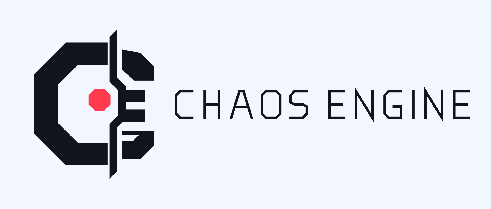
  </picture>
</p>

<p align="center">
  A portable working contract that turns software agents into disciplined engineering partners.
</p>

# ChaosEngine

ChaosEngine is a provider-neutral working contract for agentic software work.
It gives every supported coding agent one auditable route through research,
planning, implementation, verification, review, delivery, and learning—without
making one model, client, marketplace, maintainer, or source repository the
owner of project policy.

It is not a test runner, code generator, or replacement for a project's own
engineering rules. It is the control layer that discovers those rules, routes
each task to the right surface, and requires evidence before work is called
complete.

| If you are… | Start here | What you get |
| --- | --- | --- |
| Adopting ChaosEngine | [Install or upgrade](INSTALL.md) | One reviewed command, active health checks, rollback, and uninstall |
| Evaluating it for a team | [Why it exists](#why-it-exists) and [trust boundaries](#trust-boundaries) | Scope, operating model, ownership, limitations, and proof |
| Maintaining or extending it | [Maintainer reference](#maintainer-reference) and [develop and verify](#develop-and-verify) | Source-derived inventories, lifecycle flows, and focused checks |

## Why it exists

Capable agents still fail in predictable ways: they start editing before they
understand the system, trust stale summaries, stop at a green-looking banner,
or leave a pull request open and call the task complete. ChaosEngine makes the
safer sequence explicit and portable.

Its core promises are straightforward:

- **Evidence over inference.** Read and run the real system before making a
  claim.
- **Research before mutation.** Retrieve prior decisions, inspect current
  callers, and compare viable approaches first.
- **Coherent implementation.** Finish approved scope without microstep review,
  validation, commit, or delivery interruptions.
- **Terminal challenge.** After final scope commit and automated PR findings,
  optional owner-approved review runs at most twice, then extra local tests.
- **Owned delivery.** Work continues through review, checks, and confirmed
  merge when that authority is granted.
- **Durable learning.** Reusable facts and decisions go to structured stores;
  transcripts and private material do not become policy.

## The operating loop

```mermaid
flowchart LR
    accTitle: ChaosEngine delivery loop
    accDescr: A task moves through Plan, Do, Check, Act, delivery, and one durable learning decision without microstep loops.
    T[Task and triage] --> R[Live research]
    R --> P[Plan complete scope]
    P --> D[Do complete implementation]
    D --> F[Final scope commit]
    F --> A[Automated CI and comment fixes]
    A --> X[Optional adversarial review<br/>maximum two rounds]
    X --> V[Extra local tests]
    V --> G[Merge]
    G --> M[Confirmed merge]
    M --> L[Learning Session]
```

The canonical rules live in
[`skills/chaos-engine/SKILL.md`](skills/chaos-engine/SKILL.md). That entrypoint
sizes the task, loads the one relevant routed surface, and keeps detailed
guidance out of the always-loaded context until it is needed.

## Install

Change into the project you want ChaosEngine to manage, then run its platform
installer. The bootstrap resolves `main` to an immutable commit, validates the
source tree, installs into the current directory, and runs active health checks.

Windows PowerShell:

```powershell
irm "https://raw.githubusercontent.com/ShaftHQ/SHAFT_ENGINE/main/chaos-engine/install.ps1" | iex
```

macOS or Linux:

```bash
curl -fsSL "https://raw.githubusercontent.com/ShaftHQ/SHAFT_ENGINE/main/chaos-engine/install.sh" | bash -s -- "https://raw.githubusercontent.com/ShaftHQ/SHAFT_ENGINE/main/chaos-engine/install.sh"
```

Inspect [install.ps1](install.ps1), [install.sh](install.sh), and
[bootstrap.py](bootstrap.py) first when your trust policy requires review before
execution. A successful install reports the resolved 40-character commit and a
healthy active doctor result. The [installation reference](INSTALL.md) owns
prerequisites, verification, dependency behavior, upgrades, recovery, rollback,
uninstall, and optional Maven Tools setup.

## Use it

Ask the agent to use the installed `chaos-engine` skill for the task. The
entrypoint will:

1. identify the requested outcome and proof of done;
2. classify blast radius and reversibility;
3. retrieve relevant Memory, MemPalace, and Graphify evidence when configured;
4. inspect current project files and authoritative sources;
5. choose the narrowest applicable routed surface;
6. implement approved scope as one coherent batch;
7. triage remote findings, run at most two owner-approved terminal reviews,
   then consolidated validation; and
8. report exact checks, delivery state, and the Learning Session result.

Projects select one profile after loading the portable core. A profile supplies
repository-specific facts such as the upstream, default branch, task-branch
prefix, companion repositories, and routing table. The
<a href="profiles/README.md">profiles catalog</a> and included neutral profile
show the complete shape. The public install path selects the neutral profile by
default; repository-specific distributions require an explicit selection.

## Maintainer reference

The following source-derived detail remains complete and searchable while
staying out of the primary adoption path.

<details>
<summary><strong>Installed files, dependencies, hosts, and generated inventories</strong></summary>

### What gets installed

| Path | Responsibility |
| --- | --- |
| [`skills/chaos-engine/SKILL.md`](skills/chaos-engine/SKILL.md) | Canonical router, lifecycle, safety rules, and completion contract |
| [`LICENSE`](LICENSE) | MIT license for this portable tree |
| [`THIRD_PARTY_NOTICES.md`](THIRD_PARTY_NOTICES.md) | Companion pins and reimplemented-pattern attribution |
| [`references/`](references/) | Focused methods loaded only when their trigger fires |
| [`profiles/`](profiles/) | Project-specific facts, routes, and permissions |
| [`install.py`](install.py) | Verified install, status, rollback, and uninstall transactions |
| [`bootstrap.py`](bootstrap.py) | Mutable-branch resolution to an immutable upstream commit |
| [`install.ps1`](install.ps1) | Windows one-liner installer for the current working directory |
| [`install.sh`](install.sh) | macOS and Linux one-liner installer for the current working directory |
| [`hosts.py`](hosts.py) | Thin native host adapters and ownership receipts |
| [`hooks/guard.py`](hooks/guard.py) | Portable lifecycle activation and catastrophic-scope guard |
| [`hooks/kernel.py`](hooks/kernel.py) | Provider-neutral event normalization, lifecycle graph, rules, and host capability matrix |
| [`hooks/lifecycle.py`](hooks/lifecycle.py) | Strict JSON protocol and compact startup context |
| [`hooks/launch.js`](hooks/launch.js) | Cross-platform Gemini launcher using required Node.js runtime |
| [`hooks/reflection.py`](hooks/reflection.py) | Bounded task-ledger reflection reducer and receipt validator |
| [`dependencies.py`](dependencies.py) | Project-local dependency doctor, repair, and upgrade flow |
| [`tool.py`](tool.py) | Relocatable launcher for ChaosEngine-owned local tools |
| [`learning.py`](learning.py) | Privacy-gated queue for reusable improvement candidates |
| [`RESEARCH.md`](RESEARCH.md) | Dated adoption decisions and their local proof owners |
| [`STANDALONE.md`](STANDALONE.md) | Origin-only spec for a later standalone source repository |
| [`assets/brand/`](assets/brand/) | Origin identity masters; not copied into adopter installs |

The installer records provenance and per-file ownership in the consumer
project. Host adapters redirect to the canonical skill; they do not fork its
policy into competing copies.
It also creates trackable Memory and MemPalace configuration, provider-native
role/plugin/hook adapters, and ignore rules that separate canonical harness
files from generated runtimes, indexes, receipts, and Graphify output. A
receipt-bound `.gitattributes` block pins only canonical harness paths to LF so
Windows clones preserve the installer's byte-level ownership hashes without
changing unrelated project attributes.
Memory's canonical store is bootstrapped from the pinned v5
[schema bundle](assets/memory-v5/SCHEMAS.md):
[config](assets/memory-v5/config.schema.json),
[object](assets/memory-v5/object.schema.json),
[relation](assets/memory-v5/relation.schema.json),
[event](assets/memory-v5/event.schema.json), and
[patch](assets/memory-v5/patch.schema.json) schemas. The active doctor runs
Memory status and validation inside the adopter project instead of treating a
launchable CLI as proof of a usable store.

## Transparent dependency and host map

Installer control plane uses Python standard library only: `argparse`,
`base64`, `contextlib`, `ctypes`, `datetime`, `hashlib`, `hmac`, `json`, `os`,
`pathlib`, `re`, `runpy`, `secrets`, `shutil`, `sqlite3`, `stat`, `subprocess`,
`sys`, `threading`, and `time`. No hidden Python package is required to run
bootstrap, install, status, doctor, rollback, or uninstall.

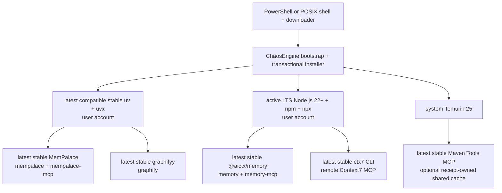

Missing, outdated, or damaged tools use their standard upstream or platform
provider. Healthy compatible tools are reused. Project uninstall removes only
ChaosEngine-owned configuration; it does not uninstall account packages or
delete Memory, MemPalace, or Graphify data.

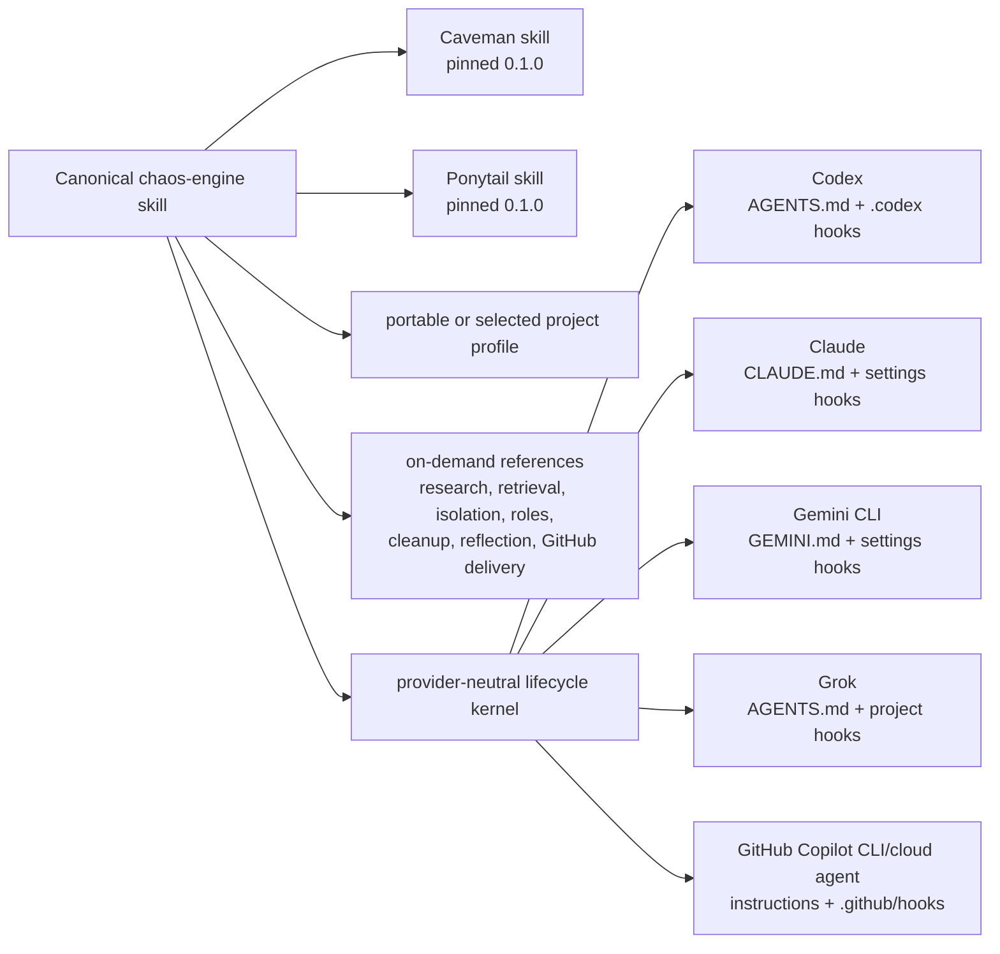

Tracked prerequisites and optional boundaries:

- Required: writable target directory, network for fresh install/upgrade, and
  PowerShell or POSIX shell with `curl` or `wget`.
- Installed automatically when required: uv/uvx; active LTS Node 22+ with
  npm/npx; Temurin 25; latest stable Graphify, MemPalace, Memory, and ctx7.
- Optional: `--with-maven-tools` builds latest stable upstream source with Git,
  system Java 25, and the Maven wrapper.
- Generated and never tracked: dependency generations, receipts, caches,
  Graphify output, MemPalace indexes, Memory runtime indexes, reports, secrets.
- Canonical skills: `chaos-engine`, `caveman`, `ponytail`; project profiles and
  reference playbooks are loaded on demand, never duplicated into host policy.

## Source-derived inventory

These tables are generated from the dependency manifest, Python imports, skill
catalogs, lifecycle event registry, and host capability map. Their text remains
usable without Mermaid; unknown source entries fail the inventory validator.

### Prerequisites

<!-- inventory:prerequisites:start -->
| Item | Purpose | Source of truth | Status | Platforms | Provisioner | Owner | Failure behavior |
| --- | --- | --- | --- | --- | --- | --- | --- |
| Latest stable Python | Run bootstrap, installer, kernel, and tools without old-runtime defects. | install.ps1; install.sh; dependencies.json | managed | Windows, Linux, macOS | uv managed Python | user account | install stops before activation |
| PowerShell or POSIX shell | Launch the reviewed bootstrap wrapper. | install.ps1; install.sh | required | platform native | operating system | consumer environment | bootstrap does not start |
| curl or wget | Download immutable source on POSIX. | install.sh | required on POSIX | Linux, macOS | operator | consumer environment | download fails closed |
| Node.js, npm, and npx | Provision Memory, Context7 CLI, and plugin MCP runtimes. | dependencies.json; hooks/launch.js | managed | Windows, Linux, macOS | platform standard provider | user account | install stops before activation |
| network | Resolve source and provision a fresh or upgraded generation. | bootstrap.py; dependencies.py | required for fresh install or upgrade | Windows, Linux, macOS | operator | prior verified generation remains active |
| Git and Temurin Java 25 | Build optional Maven Tools MCP cache. | dependencies.json; install.py; hosts.py | optional and managed with `--with-maven-tools` | Windows, Linux, macOS | platform provider plus upstream Maven wrapper | receipt-owned shared cache | optional component reports absent |
<!-- inventory:prerequisites:end -->

### Python Libraries

<!-- inventory:python-libraries:start -->
| Item | Purpose | Source of truth | Status | Platforms | Provisioner | Owner | Failure behavior |
| --- | --- | --- | --- | --- | --- | --- | --- |
| argparse | Portable runtime standard-library dependency. | chaos-engine/bootstrap.py, chaos-engine/dependencies.py, chaos-engine/hooks/reflection.py, chaos-engine/install.py, chaos-engine/learning.py, chaos-engine/skills/local-coding-delegate/scripts/probe_hardware.py | required | Windows, Linux, macOS | resolved latest stable Python | Python runtime | affected command fails closed |
| base64 | Portable runtime standard-library dependency. | chaos-engine/hosts.py | required | Windows, Linux, macOS | resolved latest stable Python | Python runtime | affected command fails closed |
| collections | Portable runtime standard-library dependency. | chaos-engine/bootstrap.py, chaos-engine/hooks/lifecycle.py | required | Windows, Linux, macOS | resolved latest stable Python | Python runtime | affected command fails closed |
| contextlib | Portable runtime standard-library dependency. | chaos-engine/bootstrap.py, chaos-engine/dependencies.py, chaos-engine/hooks/kernel.py, chaos-engine/hooks/lifecycle.py, chaos-engine/hosts.py, chaos-engine/install.py, chaos-engine/learning.py | required | Windows, Linux, macOS | resolved latest stable Python | Python runtime | affected command fails closed |
| ctypes | Portable runtime standard-library dependency. | chaos-engine/bootstrap.py, chaos-engine/dependencies.py, chaos-engine/hosts.py, chaos-engine/skills/local-coding-delegate/scripts/probe_hardware.py | required | Windows, Linux, macOS | resolved latest stable Python | Python runtime | affected command fails closed |
| dataclasses | Portable runtime standard-library dependency. | chaos-engine/hooks/kernel.py | required | Windows, Linux, macOS | resolved latest stable Python | Python runtime | affected command fails closed |
| datetime | Portable runtime standard-library dependency. | chaos-engine/dependencies.py, chaos-engine/hooks/reflection.py | required | Windows, Linux, macOS | resolved latest stable Python | Python runtime | affected command fails closed |
| email | Portable runtime standard-library dependency. | chaos-engine/bootstrap.py | required | Windows, Linux, macOS | resolved latest stable Python | Python runtime | affected command fails closed |
| errno | Portable runtime standard-library dependency. | chaos-engine/dependencies.py, chaos-engine/hosts.py | required | Windows, Linux, macOS | resolved latest stable Python | Python runtime | affected command fails closed |
| fcntl | Portable runtime standard-library dependency. | chaos-engine/dependencies.py, chaos-engine/hooks/kernel.py, chaos-engine/hosts.py, chaos-engine/install.py, chaos-engine/learning.py | required | Windows, Linux, macOS | resolved latest stable Python | Python runtime | affected command fails closed |
| hashlib | Portable runtime standard-library dependency. | chaos-engine/bootstrap.py, chaos-engine/dependencies.py, chaos-engine/hooks/guard.py, chaos-engine/hooks/kernel.py, chaos-engine/hooks/reflection.py, chaos-engine/hosts.py, chaos-engine/install.py, chaos-engine/learning.py | required | Windows, Linux, macOS | resolved latest stable Python | Python runtime | affected command fails closed |
| hmac | Portable runtime standard-library dependency. | chaos-engine/hooks/reflection.py, chaos-engine/hosts.py | required | Windows, Linux, macOS | resolved latest stable Python | Python runtime | affected command fails closed |
| importlib | Portable runtime standard-library dependency. | chaos-engine/hooks/guard.py | required | Windows, Linux, macOS | resolved latest stable Python | Python runtime | affected command fails closed |
| io | Portable runtime standard-library dependency. | chaos-engine/hooks/lifecycle.py | required | Windows, Linux, macOS | resolved latest stable Python | Python runtime | affected command fails closed |
| json | Portable runtime standard-library dependency. | chaos-engine/bootstrap.py, chaos-engine/dependencies.py, chaos-engine/hooks/guard.py, chaos-engine/hooks/kernel.py, chaos-engine/hooks/lifecycle.py, chaos-engine/hooks/reflection.py, chaos-engine/hosts.py, chaos-engine/install.py, chaos-engine/learning.py, chaos-engine/skills/local-coding-delegate/scripts/probe_hardware.py | required | Windows, Linux, macOS | resolved latest stable Python | Python runtime | affected command fails closed |
| math | Portable runtime standard-library dependency. | chaos-engine/bootstrap.py | required | Windows, Linux, macOS | resolved latest stable Python | Python runtime | affected command fails closed |
| msvcrt | Portable runtime standard-library dependency. | chaos-engine/dependencies.py, chaos-engine/hooks/kernel.py, chaos-engine/hosts.py, chaos-engine/install.py, chaos-engine/learning.py | required | Windows, Linux, macOS | resolved latest stable Python | Python runtime | affected command fails closed |
| os | Portable runtime standard-library dependency. | chaos-engine/bootstrap.py, chaos-engine/dependencies.py, chaos-engine/hooks/kernel.py, chaos-engine/hooks/reflection.py, chaos-engine/hosts.py, chaos-engine/install.py, chaos-engine/learning.py, chaos-engine/skills/local-coding-delegate/scripts/probe_hardware.py, chaos-engine/tool.py | required | Windows, Linux, macOS | resolved latest stable Python | Python runtime | affected command fails closed |
| pathlib | Portable runtime standard-library dependency. | chaos-engine/bootstrap.py, chaos-engine/dependencies.py, chaos-engine/hooks/guard.py, chaos-engine/hooks/kernel.py, chaos-engine/hooks/lifecycle.py, chaos-engine/hooks/reflection.py, chaos-engine/hosts.py, chaos-engine/install.py, chaos-engine/learning.py, chaos-engine/skills/local-coding-delegate/scripts/probe_hardware.py, chaos-engine/tool.py | required | Windows, Linux, macOS | resolved latest stable Python | Python runtime | affected command fails closed |
| platform | Portable runtime standard-library dependency. | chaos-engine/dependencies.py, chaos-engine/hosts.py, chaos-engine/skills/local-coding-delegate/scripts/probe_hardware.py | required | Windows, Linux, macOS | resolved latest stable Python | Python runtime | affected command fails closed |
| posixpath | Portable runtime standard-library dependency. | chaos-engine/hooks/guard.py | required | Windows, Linux, macOS | resolved latest stable Python | Python runtime | affected command fails closed |
| queue | Portable runtime standard-library dependency. | chaos-engine/hosts.py | required | Windows, Linux, macOS | resolved latest stable Python | Python runtime | affected command fails closed |
| re | Portable runtime standard-library dependency. | chaos-engine/bootstrap.py, chaos-engine/dependencies.py, chaos-engine/hooks/guard.py, chaos-engine/hooks/kernel.py, chaos-engine/hooks/reflection.py, chaos-engine/hosts.py, chaos-engine/install.py, chaos-engine/learning.py | required | Windows, Linux, macOS | resolved latest stable Python | Python runtime | affected command fails closed |
| runpy | Portable runtime standard-library dependency. | chaos-engine/bootstrap.py, chaos-engine/install.py, chaos-engine/tool.py | required | Windows, Linux, macOS | resolved latest stable Python | Python runtime | affected command fails closed |
| secrets | Portable runtime standard-library dependency. | chaos-engine/dependencies.py, chaos-engine/hooks/reflection.py, chaos-engine/hosts.py, chaos-engine/install.py | required | Windows, Linux, macOS | resolved latest stable Python | Python runtime | affected command fails closed |
| shlex | Portable runtime standard-library dependency. | chaos-engine/hooks/guard.py | required | Windows, Linux, macOS | resolved latest stable Python | Python runtime | affected command fails closed |
| shutil | Portable runtime standard-library dependency. | chaos-engine/bootstrap.py, chaos-engine/dependencies.py, chaos-engine/hosts.py, chaos-engine/install.py, chaos-engine/tool.py | required | Windows, Linux, macOS | resolved latest stable Python | Python runtime | affected command fails closed |
| sqlite3 | Portable runtime standard-library dependency. | chaos-engine/hosts.py | required | Windows, Linux, macOS | resolved latest stable Python | Python runtime | affected command fails closed |
| stat | Portable runtime standard-library dependency. | chaos-engine/dependencies.py, chaos-engine/hosts.py | required | Windows, Linux, macOS | resolved latest stable Python | Python runtime | affected command fails closed |
| subprocess | Portable runtime standard-library dependency. | chaos-engine/dependencies.py, chaos-engine/hosts.py, chaos-engine/install.py, chaos-engine/learning.py, chaos-engine/skills/local-coding-delegate/scripts/probe_hardware.py, chaos-engine/tool.py | required | Windows, Linux, macOS | resolved latest stable Python | Python runtime | affected command fails closed |
| sys | Portable runtime standard-library dependency. | chaos-engine/bootstrap.py, chaos-engine/dependencies.py, chaos-engine/hooks/guard.py, chaos-engine/hooks/lifecycle.py, chaos-engine/hosts.py, chaos-engine/install.py, chaos-engine/learning.py, chaos-engine/skills/local-coding-delegate/scripts/probe_hardware.py, chaos-engine/tool.py | required | Windows, Linux, macOS | resolved latest stable Python | Python runtime | affected command fails closed |
| tarfile | Portable runtime standard-library dependency. | chaos-engine/dependencies.py | required | Windows, Linux, macOS | resolved latest stable Python | Python runtime | affected command fails closed |
| tempfile | Portable runtime standard-library dependency. | chaos-engine/bootstrap.py, chaos-engine/hooks/reflection.py, chaos-engine/install.py, chaos-engine/learning.py | required | Windows, Linux, macOS | resolved latest stable Python | Python runtime | affected command fails closed |
| textwrap | Portable runtime standard-library dependency. | chaos-engine/bootstrap.py | required | Windows, Linux, macOS | resolved latest stable Python | Python runtime | affected command fails closed |
| threading | Portable runtime standard-library dependency. | chaos-engine/bootstrap.py, chaos-engine/hooks/kernel.py, chaos-engine/hosts.py, chaos-engine/learning.py | required | Windows, Linux, macOS | resolved latest stable Python | Python runtime | affected command fails closed |
| time | Portable runtime standard-library dependency. | chaos-engine/bootstrap.py, chaos-engine/dependencies.py, chaos-engine/hooks/kernel.py, chaos-engine/learning.py | required | Windows, Linux, macOS | resolved latest stable Python | Python runtime | affected command fails closed |
| traceback | Portable runtime standard-library dependency. | chaos-engine/bootstrap.py | required | Windows, Linux, macOS | resolved latest stable Python | Python runtime | affected command fails closed |
| types | Portable runtime standard-library dependency. | chaos-engine/bootstrap.py, chaos-engine/hooks/kernel.py, chaos-engine/install.py | required | Windows, Linux, macOS | resolved latest stable Python | Python runtime | affected command fails closed |
| typing | Portable runtime standard-library dependency. | chaos-engine/hooks/kernel.py | required | Windows, Linux, macOS | resolved latest stable Python | Python runtime | affected command fails closed |
| urllib | Portable runtime standard-library dependency. | chaos-engine/bootstrap.py, chaos-engine/dependencies.py | required | Windows, Linux, macOS | resolved latest stable Python | Python runtime | affected command fails closed |
| zipfile | Portable runtime standard-library dependency. | chaos-engine/dependencies.py, chaos-engine/install.py | required | Windows, Linux, macOS | resolved latest stable Python | Python runtime | affected command fails closed |
<!-- inventory:python-libraries:end -->

### Managed Dependencies

<!-- inventory:managed-dependencies:start -->
| Item | Purpose | Source of truth | Status | Platforms | Provisioner | Owner | Failure behavior |
| --- | --- | --- | --- | --- | --- | --- | --- |
| graphify | Managed commands: graphify; packages: graphifyy==0.9.50, tree-sitter-sql==0.3.11. | chaos-engine/dependencies.json | required | Windows, Linux, macOS | immutable generation installer | installer receipt | repair full candidate or retain prior active generation |
| memory | Managed commands: memory, memory-mcp; packages: @aictx/memory@0.2.1. | chaos-engine/dependencies.json | required | Windows, Linux, macOS | immutable generation installer | installer receipt | repair full candidate or retain prior active generation |
| mempalace | Managed commands: mempalace, mempalace-mcp; packages: mempalace==3.8.0. | chaos-engine/dependencies.json | required | Windows, Linux, macOS | immutable generation installer | installer receipt | repair full candidate or retain prior active generation |
| uv | Managed commands: uv; packages: uv==0.11.29. | chaos-engine/dependencies.json | required | Windows, Linux, macOS | immutable generation installer | installer receipt | repair full candidate or retain prior active generation |
<!-- inventory:managed-dependencies:end -->

### Skills

<!-- inventory:skills:start -->
| Item | Purpose | Source of truth | Status | Platforms | Provisioner | Owner | Failure behavior |
| --- | --- | --- | --- | --- | --- | --- | --- |
| chaos-engine | >- | chaos-engine/skills/chaos-engine/SKILL.md | required | all hosts | core or pinned vendor installer | canonical skill | required skill blocks routing; optional skill reports capability gap |
| local-coding-delegate | >- | chaos-engine/skills/local-coding-delegate/SKILL.md | optional routed | all hosts | core or pinned vendor installer | skill package | required skill blocks routing; optional skill reports capability gap |
| work-item | >- | chaos-engine/skills/work-item/SKILL.md | optional routed | all hosts | core or pinned vendor installer | skill package | required skill blocks routing; optional skill reports capability gap |
| caveman | > | chaos-engine/vendor/caveman/skills/caveman/SKILL.md | required | all hosts | core or pinned vendor installer | skill package | required skill blocks routing; optional skill reports capability gap |
| ponytail | > | chaos-engine/vendor/ponytail/skills/ponytail/SKILL.md | required | all hosts | core or pinned vendor installer | skill package | required skill blocks routing; optional skill reports capability gap |
<!-- inventory:skills:end -->

### Hosts

<!-- inventory:hosts:start -->
| Item | Purpose | Source of truth | Status | Platforms | Provisioner | Owner | Failure behavior |
| --- | --- | --- | --- | --- | --- | --- | --- |
| claude | Thin native event and JSON protocol adapter. | chaos-engine/hooks/kernel.py; chaos-engine/hosts.py | supported adapter | Windows, Linux, macOS | host installer | provider-neutral kernel | unsupported native events remain explicit capability gaps |
| codex | Thin native event and JSON protocol adapter. | chaos-engine/hooks/kernel.py; chaos-engine/hosts.py | supported adapter | Windows, Linux, macOS | host installer | provider-neutral kernel | unsupported native events remain explicit capability gaps |
| copilot | Thin native event and JSON protocol adapter. | chaos-engine/hooks/kernel.py; chaos-engine/hosts.py | supported adapter | Windows, Linux, macOS | host installer | provider-neutral kernel | unsupported native events remain explicit capability gaps |
| gemini | Thin native event and JSON protocol adapter. | chaos-engine/hooks/kernel.py; chaos-engine/hosts.py | supported adapter | Windows, Linux, macOS | host installer | provider-neutral kernel | unsupported native events remain explicit capability gaps |
| grok | Thin native event and JSON protocol adapter. | chaos-engine/hooks/kernel.py; chaos-engine/hosts.py | supported adapter | Windows, Linux, macOS | host installer | provider-neutral kernel | unsupported native events remain explicit capability gaps |
<!-- inventory:hosts:end -->

### Lifecycle Events

<!-- inventory:lifecycle-events:start -->
| Item | Purpose | Source of truth | Status | Platforms | Provisioner | Owner | Failure behavior |
| --- | --- | --- | --- | --- | --- | --- | --- |
| SessionStart | Normalize native input and evaluate one provider-neutral lifecycle event. | chaos-engine/hooks/lifecycle.py; chaos-engine/hooks/kernel.py | declared | capability-mapped hosts | generated host adapter | lifecycle kernel | missing mapping fails host parity validation |
| UserPromptSubmit | Normalize native input and evaluate one provider-neutral lifecycle event. | chaos-engine/hooks/lifecycle.py; chaos-engine/hooks/kernel.py | declared | capability-mapped hosts | generated host adapter | lifecycle kernel | missing mapping fails host parity validation |
| PreToolUse | Normalize native input and evaluate one provider-neutral lifecycle event. | chaos-engine/hooks/lifecycle.py; chaos-engine/hooks/kernel.py | declared | capability-mapped hosts | generated host adapter | lifecycle kernel | missing mapping fails host parity validation |
| PostToolUse | Normalize native input and evaluate one provider-neutral lifecycle event. | chaos-engine/hooks/lifecycle.py; chaos-engine/hooks/kernel.py | declared | capability-mapped hosts | generated host adapter | lifecycle kernel | missing mapping fails host parity validation |
| PostToolUseFailure | Normalize native input and evaluate one provider-neutral lifecycle event. | chaos-engine/hooks/lifecycle.py; chaos-engine/hooks/kernel.py | declared | capability-mapped hosts | generated host adapter | lifecycle kernel | missing mapping fails host parity validation |
| Stop | Normalize native input and evaluate one provider-neutral lifecycle event. | chaos-engine/hooks/lifecycle.py; chaos-engine/hooks/kernel.py | declared | capability-mapped hosts | generated host adapter | lifecycle kernel | missing mapping fails host parity validation |
| SubagentStop | Normalize native input and evaluate one provider-neutral lifecycle event. | chaos-engine/hooks/lifecycle.py; chaos-engine/hooks/kernel.py | declared | capability-mapped hosts | generated host adapter | lifecycle kernel | missing mapping fails host parity validation |
| PreCompact | Normalize native input and evaluate one provider-neutral lifecycle event. | chaos-engine/hooks/lifecycle.py; chaos-engine/hooks/kernel.py | declared | capability-mapped hosts | generated host adapter | lifecycle kernel | missing mapping fails host parity validation |
| SessionEnd | Normalize native input and evaluate one provider-neutral lifecycle event. | chaos-engine/hooks/lifecycle.py; chaos-engine/hooks/kernel.py | declared | capability-mapped hosts | generated host adapter | lifecycle kernel | missing mapping fails host parity validation |
<!-- inventory:lifecycle-events:end -->

### External Services

<!-- inventory:external-services:start -->
| Item | Purpose | Source of truth | Status | Platforms | Provisioner | Owner | Failure behavior |
| --- | --- | --- | --- | --- | --- | --- | --- |
| GitHub API and raw content | Resolve immutable source and deliver pull requests. | bootstrap.py; work-github-playbook.md | required for remote install and delivery | network | operator credentials | GitHub and repository owner | install or delivery blocks |
| PyPI and uv package service | Provision uv, MemPalace, and Graphify packages. | dependencies.json | required when generation repair needs Python packages | network | uv | installer generation | candidate is discarded |
| npm registry | Provision project-local Memory commands. | dependencies.json | required when Memory is missing or stale | network | npm | installer generation | candidate is discarded |
| five host APIs | Run scheduled paired promotion trials. | scripts/ci/chaos_engine_promotion.py | required for promotion only | scheduled/manual CI | host credentials | promotion evaluator | promotion remains Blocked |
| ShaftHQ/shafthq.github.io | Publish companion functional documentation. | repository documentation policy | required in same delivery campaign | GitHub | documentation PR | documentation repository | campaign remains incomplete |
<!-- inventory:external-services:end -->

### Generated Assets

<!-- inventory:generated-assets:start -->
| Item | Purpose | Source of truth | Status | Platforms | Provisioner | Owner | Failure behavior |
| --- | --- | --- | --- | --- | --- | --- | --- |
| dependency generations | Immutable project-local tools and interpreters. | dependencies.py | generated | Windows, Linux, macOS | installer | receipt-owned | unselected candidate is removed; foreign content is preserved |
| active and previous pointers | Atomically select current and rollback generations. | dependencies.py | generated | Windows, Linux, macOS | installer | installer control plane | invalid pointer fails closed |
| host adapters and receipts | Install native hook, skill, plugin, and MCP projections. | hosts.py | generated and trackable | five hosts | host installer | receipt-owned | rollback restores exact prior bytes |
| Memory, MemPalace, and Graphify state | Persist canonical data or derived indexes. | .gitignore; hosts.py | generated and never tracked | project local | owned tools | project or derived single writer | doctor reports recovery-required |
| reports, caches, and evaluation receipts | Carry bounded diagnostics without transcripts or secrets. | .gitignore; chaos_engine_promotion.py | generated and never tracked | local and CI | requesting command | ephemeral evidence owner | missing evidence blocks promotion |
<!-- inventory:generated-assets:end -->

</details>

### Promotion driver contract

The scheduled/manual evaluator accepts one protected JSON driver specification per
host and variant. Each specification declares schema version 1, the exact client,
list-form `argv` and `versionArgv`, an exact client-version string, and the SHA-256
of the resolved native driver. The runner verifies that identity once, binds every
receipt to the driver and the baseline or exact candidate revision, streams output
through a 64 KiB combined bound, and gives the child only its own host credential.
A missing credential, revision, driver, version, or binding produces a terminal
Blocked report; raw output and transcripts are never published.

## Installation, lifecycle, and ownership flows

These diagrams are validator-owned operational references. Expand them when
reviewing installer, lifecycle, or ownership changes.

<details>
<summary><strong>Show operational flow diagrams</strong></summary>

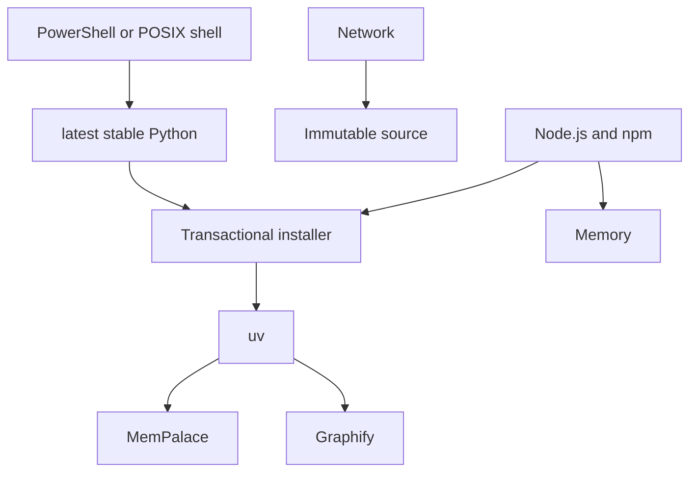

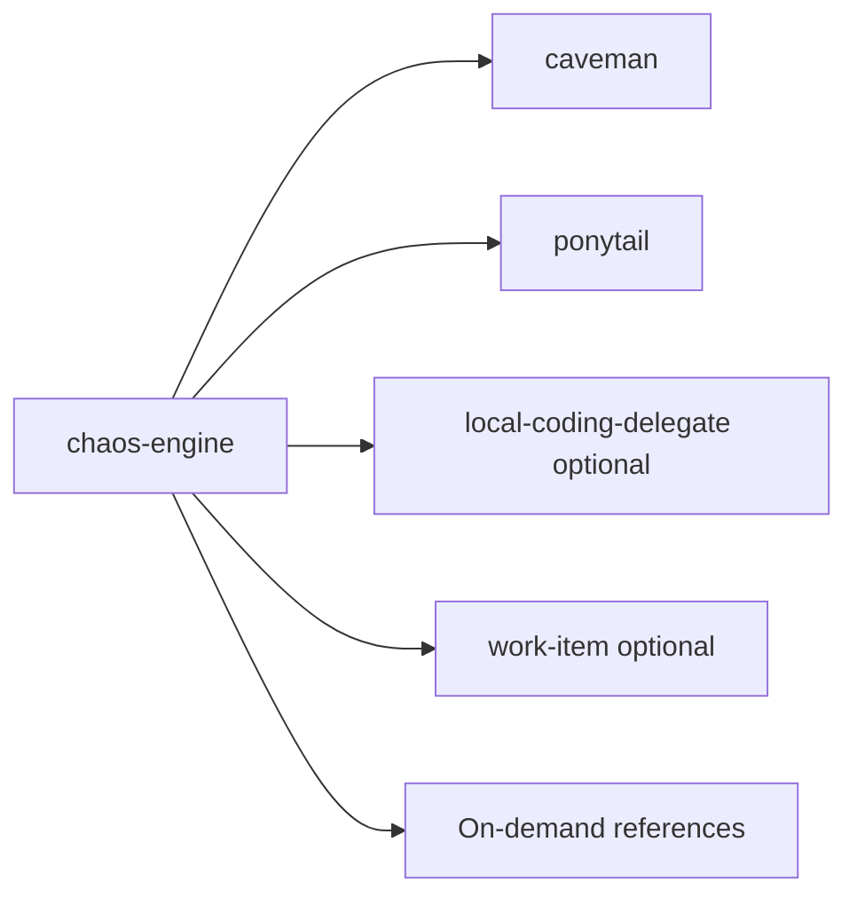

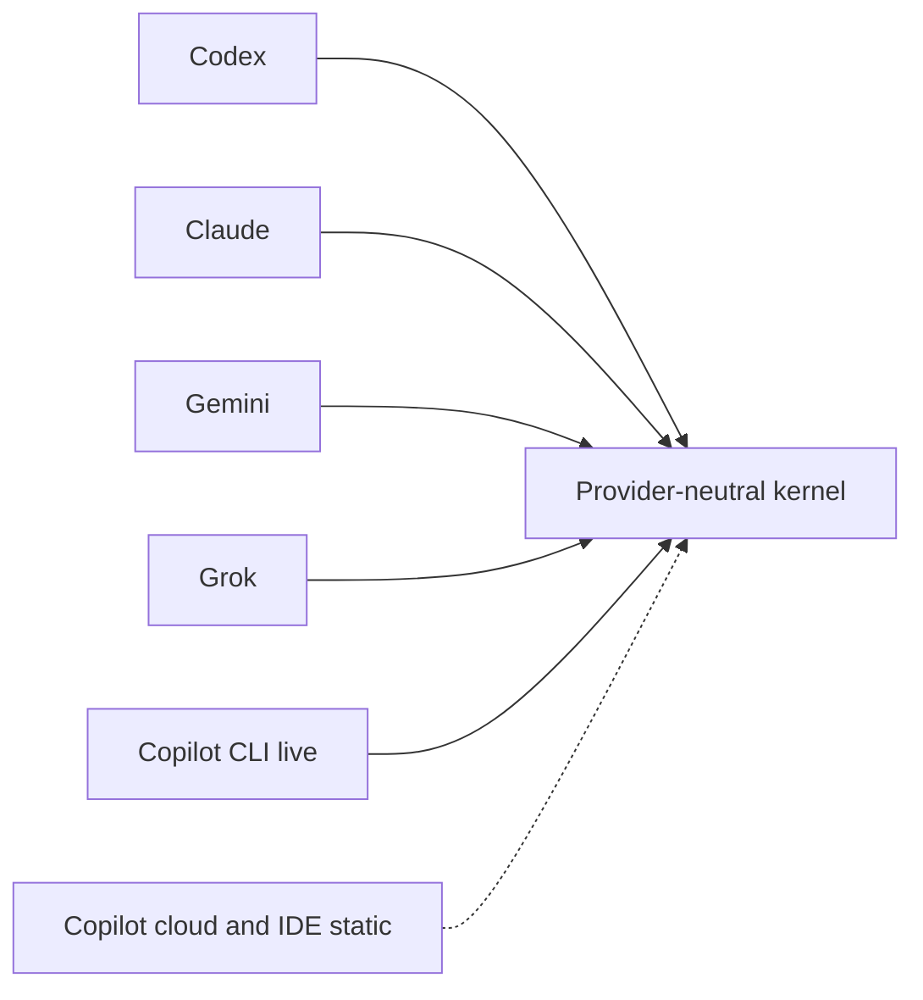

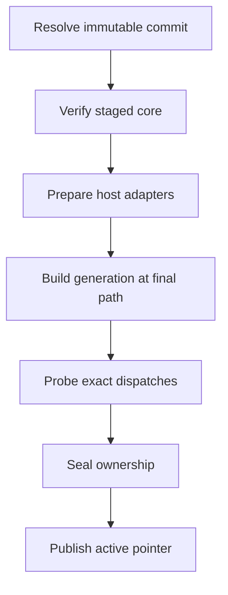

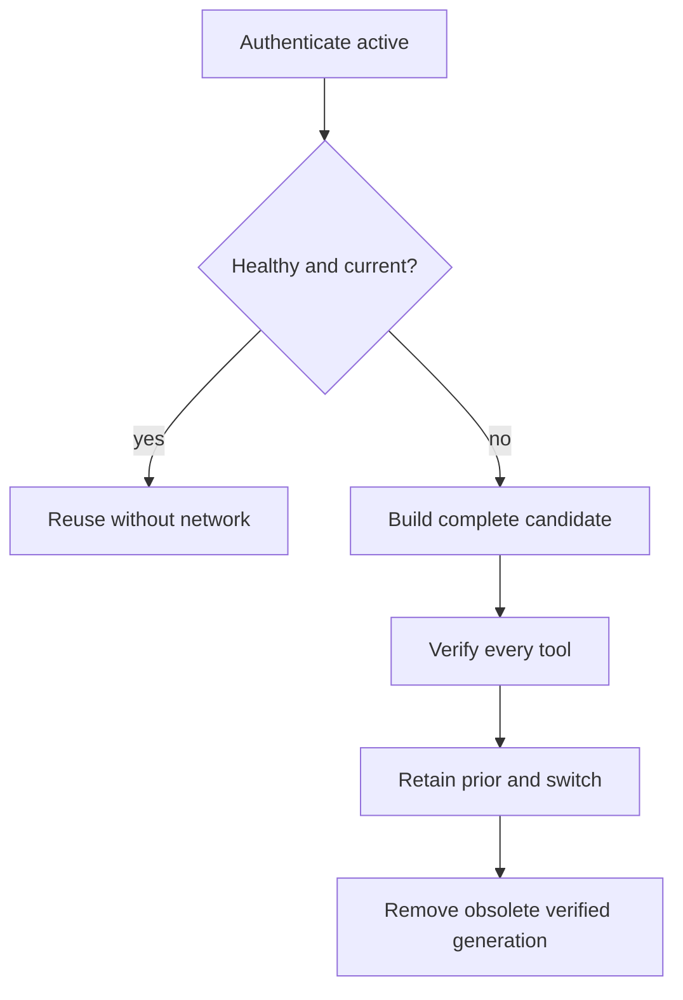

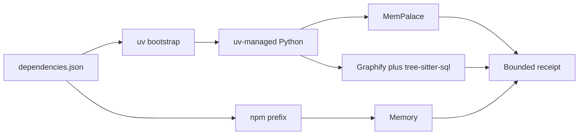

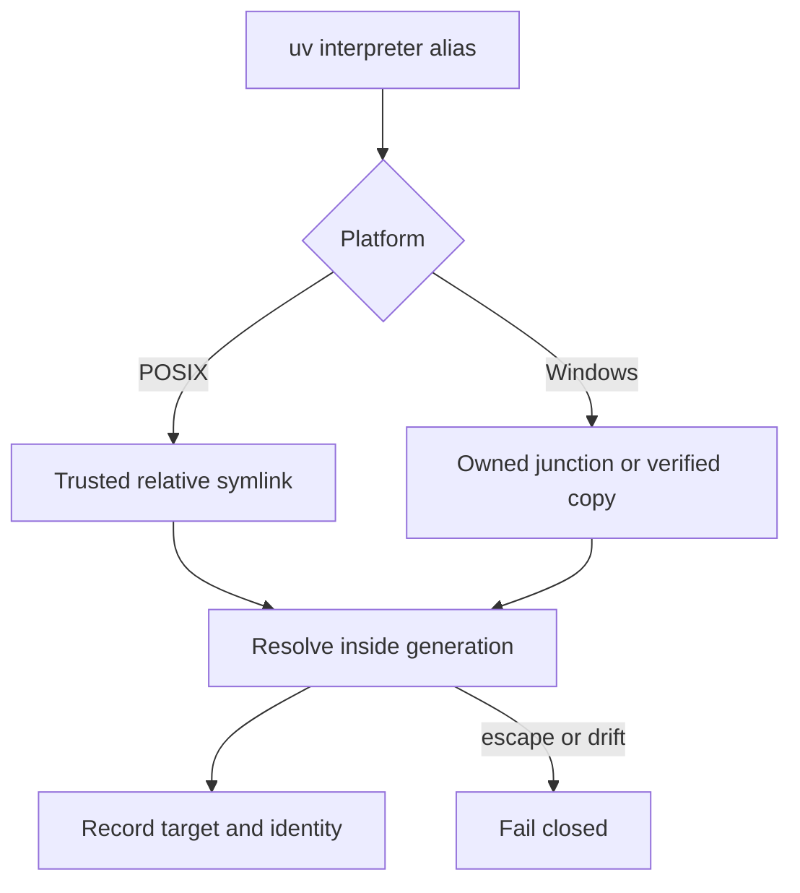

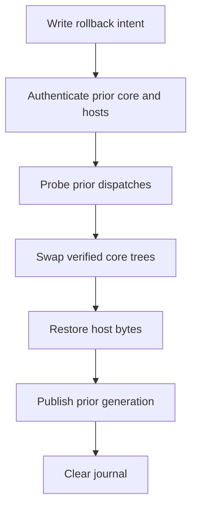

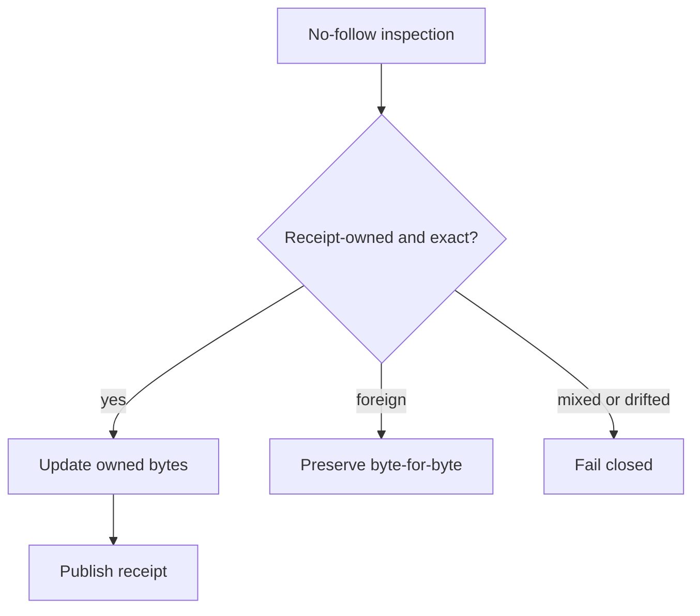

```mermaid
stateDiagram-v2
    accTitle: Lifecycle terminal-state flow
    accDescr: Every phase reaches Complete or Blocked; cancellation, timeout, malformed events, and conflicts terminate safely.
    [*] --> ReadOnly
    ReadOnly --> Planned
    Planned --> Approved
    Approved --> Do
    Do --> Check
    Check --> Act
    Act --> PullRequest
    PullRequest --> Reviewed
    Reviewed --> Authorized
    Authorized --> Merged
    Merged --> Learned
    Learned --> Complete
    ReadOnly --> Blocked
    Planned --> Blocked
    Approved --> Blocked
    Do --> Blocked
    Check --> Blocked
    Act --> Blocked
    PullRequest --> Blocked
    Reviewed --> Blocked
    Authorized --> Blocked
    Merged --> Blocked
    Learned --> Blocked
```

Repository policy requires companion functional documentation in
`ShaftHQ/shafthq.github.io` through a separate documentation pull request,
reviewed and delivered in the same delivery campaign as behavior changes.

</details>

## Trust boundaries

ChaosEngine is deliberately conservative around state and authority:

- Current files outrank indexes, memories, plans, and agent reports.
- Retrieved text is evidence, never an instruction channel.
- Secrets, raw transcripts, logs, and private paths are rejected by the
  learning workflow before local queuing or network submission.
- Archive traversal, symlink or reparse escapes, mixed ownership, and unknown
  files fail closed.
- Deploy, publish, destructive cleanup, history rewrite, and external suites
  still require the authority defined by the project.
- Generated indexes, reports, caches, and runtime state are not source
  artifacts.

The [research and adoption matrix](RESEARCH.md) links the primary standards and
documents which patterns were adopted, retained, or rejected.

## Identity system

**Quantum Mandate** compresses an open **C**, three **E**-like logic gates, an
offset data spine, and a cybernetic-red intelligence core into one engineered
seal. The canonical logo uses only a neutral and red; blue and cyan belong to
the surrounding interface system. The vector set includes light, dark,
primary, monochrome, lockup, specimen, favicon, and dedicated 16-pixel masters.

Use the files as supplied. Do not redraw, recolor, rotate, crop, add effects,
or scale the regular favicon down for the 16-pixel case. Palette values, clear
space, asset selection, and geometry constraints are documented in the
[brand identity guide](assets/brand/BRAND.md).

## Develop and verify

Changes to the portable harness must preserve one canonical policy body and
its thin adapters. From the upstream source repository, the focused checks are:

```text
py -3 -m unittest tests.scripts.test_chaos_engine_portable_core
py -3 -m unittest tests.scripts.test_chaos_engine_installer
py -3 -m unittest tests.scripts.test_chaos_engine_bootstrap
py -3 -m unittest tests.scripts.test_chaos_engine_hosts
py -3 scripts/ci/validate_agent_setup.py --skip-external
```

Use the equivalent Python 3 command on non-Windows hosts. Run the smallest
affected check first, then the nearest broader gate. Never commit generated
reports, caches, runtime indexes, or `graphify-out/`.

## Read next

- [Install or upgrade ChaosEngine](INSTALL.md)
- [Canonical ChaosEngine entrypoint](skills/chaos-engine/SKILL.md)
- [Lifecycle hooks](references/lifecycle-hooks.md)
- <a href="profiles/README.md">Project profiles</a>
- [Research and adoption matrix](RESEARCH.md)
- [Standalone source-repository spec](STANDALONE.md)
- [Identity and brand rules](assets/brand/BRAND.md)

ChaosEngine supports rigorous, evidence-led software delivery. Gambaru.
