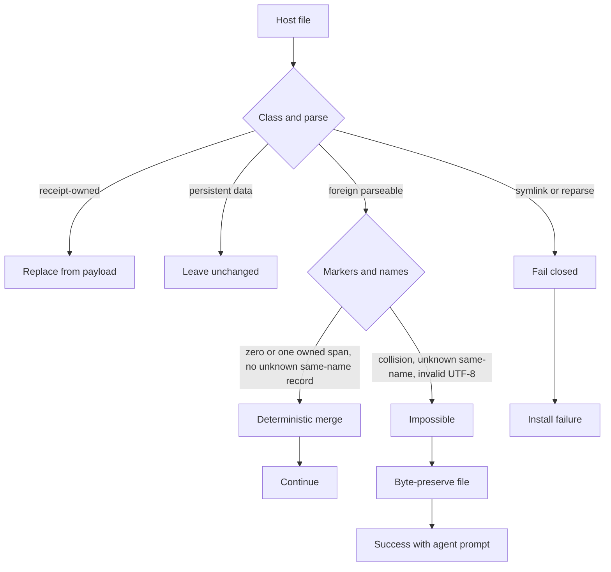

# ChaosEngine installer program

Spec-only contract for the installer rewrite. This file does not implement
`install.py`, `hosts.py`, or the wrappers. Delivery PRs for the children
implement it. Live operator steps today remain in [`INSTALL.md`](../INSTALL.md).

Triggered by Windows verify failure
[#5667](https://github.com/ShaftHQ/SHAFT_ENGINE/issues/5667)
(`CE-INSTALL-FAILED`, unhealthy `hooks` + `mcps`, `win32`,
`distribution=repository`, core rematerialized). Related closed reports of the
same template: #5636, #5630, #5606, #5556. Those closed items repaired other
failure classes; they do not cover this program.

## Goal

One official one-liner installs or upgrades ChaosEngine in three project
shapes (empty, Java/SHAFT Maven, non-Java) and leaves the operator with either:

1. **Healthy doctor**, or
2. **Success with an agent merge prompt** when a deterministic merge of
   existing agent configuration is impossible.

Unmergeable foreign agent configuration is not an install failure.

## Profiles

| Profile | Target shape | Distribution | Maven Tools MCP |
| --- | --- | --- | --- |
| Empty | New directory, no `pom.xml`, no prior ChaosEngine or host files | `portable` | Absent; optional, not required for health |
| Java | Root `pom.xml` whose project, module, or dependency artifact ids include a profile `installWhen.mavenArtifactIds` value (today `shaft-engine`) | `repository` (SHAFT profile) | Required when a root `pom.xml` exists |
| Non-Java | Existing project files, no matching Maven artifact id (Python, Node, mixed, or a Java POM that is not SHAFT) | `portable` | Optional; absence is not unhealthy |

Upgrade of a profile is the same one-liner on a tree that already has a verified
`.chaos-engine/` from that profile.

## Current root owners (live files, 2026-09-08)

These are the behaviors the rewrite must change or keep. Live code outranks this
paragraph if they drift; re-read before implementing.

- Host instruction merge (`hosts.py` `instruction_content`): if
  `<!-- CHAOSENGINE:START -->` / `END` already exist and the desired block is
  not an exact substring, raise `ChaosEngine instruction collision` and fail
  the install. Foreign prose without markers is appended.
- Marker-owned text (`replace_owned_text_block`): zero markers append; exactly
  one start and one end replace the owned span; any other count raises
  `{label} collision`.
- MCP / Codex: unknown same-name servers raise `ChaosEngine MCP server
  collision` / `Codex configuration collision`. Foreign servers outside owned
  markers are kept (`without_chaos_hooks`, Codex CE-owned table strip).
- Verify (`install.py` `doctor_with_dependencies`): if managed Python is
  missing, **both** `hooks` and `mcps` become `recovery-required` with **no**
  component `detail` or `code`. That is the cheapest shared explanation for
  #5667 listing both names after a successful core rematerialize.
- Hook probe (`hosts.py` `hook_runtime_healthy`): run `UserPromptSubmit`,
  `PreToolUse`, `PostToolUse` through
  `{managed_python} .chaos-engine/hooks/guard.py`. Any non-zero exit, invalid
  JSON, timeout, or missing interpreter returns `False`.
- MCP probe (`hosts.py` `mcp_runtime_status`): palace health, then
  `memory-mcp` + `mempalace-mcp` initialize/tools-list. Memory
  `HEAD != origin/main` is already `compatible-legacy` (#5630). Other probe
  failures fail verify.

## Deterministic merge

Merge is a pure function of `(existing bytes, desired owned bytes, file class)`.
Same inputs, same outputs, no LLM, no interactive prompt during the one-liner.

### File classes

| Class | Examples | Merge rule |
| --- | --- | --- |
| Marker-owned text | `AGENTS.md`, `CLAUDE.md`, `GEMINI.md`, `.github/copilot-instructions.md`, `.gitignore` runtime block, `.gitattributes` EOL block | Replace the single `START`/`END` span with the current owned block. Append the block when markers are absent. Keep all bytes outside the span. |
| Marker-owned JSON/TOML sections | `.codex/config.toml` `# CHAOSENGINE:START`…`END`, Claude/Grok/Gemini/Copilot hook documents | Same span rule. Foreign keys, handlers, and MCP servers outside the span stay. |
| Named owned records | CE MCP servers `chaosengine-memory`, `chaosengine-mempalace`, `context7`, `maven-tools-mcp`; CE hook commands that `chaos_hook_command` recognizes | Upsert exact owned records. Delete only exact recognized legacy names already covered by tests (`shaft-memory`, bare `mempalace`, local-npx Context7, covered Docker/JAR shapes). |
| Receipt-owned whole files | `.chaos-engine/**`, plugin manifests ChaosEngine publishes, role adapters it writes | Replace from the verified payload. |
| Persistent data | `.memory/**` (except installer-owned schema/config), `mempalace.yaml` palace data, `graphify-out` | Never delete or convert on install/upgrade. |
| Foreign | Anything else in those files | Byte-preserve. |

### Mergeable

A file is mergeable when every owned span and named record can be applied
without dropping or rewriting foreign bytes, and the result still parses as
that file's format (Markdown, JSON, TOML, hook JSON).

Idempotent: a second run on the merged result is a no-op for foreign bytes and
writes the current owned block.

### Impossible (handoff, not failure)

Merge is impossible when any of these hold. Stop mutating that file; leave it
byte-identical to before this run.

1. Marker count is not `{0, 1}` start and matching end (collision, nested, or
   split markers).
2. Markers exist but the interior is neither the current owned block nor a
   recognized legacy owned block (operator or other tool edited the CE span).
3. A same-name MCP server / hook command exists with unknown ownership.
4. The file is not valid UTF-8 or does not parse, so a span cannot be located
   without guessing.
5. The path is a symlink or reparse point (existing fail-closed rule).

Partial success is allowed: merge every mergeable file, hand off only the
impossible paths. Never roll back a verified core because a foreign
`AGENTS.md` could not be merged.



## Success with agent prompt

When at least one file is impossible to merge **and** the portable core
verifies:

1. Write a handoff markdown file at the stable path
   `.chaos-engine-state/merge-handoff.md` (gitignored state; overwrite on each
   run). The file lists every impossible path, the reason from the five-rule
   list, the desired owned block in a fenced snippet, and the doctor command.
2. Print the **same styled success** as a healthy install (checklist PASSes,
   first-session brief, host onboarding cards). Add one extra panel titled
   `Merge handoff` that names the markdown path and says the core is
   installed.
3. Print **one** copy-paste prompt wrapped in backticks (not a multi-line
   fence). The operator selects the inner text and pastes it into any supported
   host. Example shape (implementations must fill the real paths):

   `` `Merge ChaosEngine host configuration using .chaos-engine-state/merge-handoff.md. Follow chaos-engine/references/installer-program.md deterministic merge. Preserve every foreign handler and MCP server. Apply only the listed owned blocks. Then run py -3 .chaos-engine/install.py doctor --project . and follow each fix-next.` ``

   On POSIX the inner doctor command uses `python3` instead of `py -3`.

4. Exit **0**. Do not print `CE-INSTALL-FAILED`. Do not open the installer
   issue template for this class.

Doctor after a handoff may still report `hooks` / `mcps` / instruction files
as not yet healthy. That is expected until the agent finishes the prompt.
`fix-next` must name the handoff file, not "reinstall".

## Install guide

Human path. Python is not required before the wrapper.

### First install

1. `cd` into the target directory (empty, Java/SHAFT, or non-Java).
2. Run exactly one:

   Windows PowerShell:

   ```powershell
   irm "https://raw.githubusercontent.com/ShaftHQ/SHAFT_ENGINE/main/chaos-engine/install.ps1" | iex
   ```

   macOS or Linux:

   ```bash
   curl -fsSL "https://raw.githubusercontent.com/ShaftHQ/SHAFT_ENGINE/main/chaos-engine/install.sh" | bash -s -- "https://raw.githubusercontent.com/ShaftHQ/SHAFT_ENGINE/main/chaos-engine/install.sh"
   ```

3. If the TTY shows styled success without `Merge handoff`, run:

   ```text
   python3 .chaos-engine/install.py doctor --project .
   ```

   Windows: `py -3` instead of `python3`. Expect healthy required components.

4. If the TTY shows `Merge handoff`, paste the backtick prompt into an agent.
   Do not rerun the one-liner to "force" the merge.

5. Restart any host that was open during install.

### Upgrade

Same one-liner in a directory that already has `.chaos-engine/`. Expected:

- Core moves to the resolved upstream commit.
- Foreign bytes in mergeable files survive.
- Persistent Memory / MemPalace / Graphify data survive.
- Impossible files take the handoff path; they are not overwritten.

### Conflict with existing agent configs

Covered by the merge rules and the handoff path. Operators with pre-existing
Claude / Codex / Grok / Gemini / Copilot files should see either a silent
merge or success plus the backtick prompt. They should not see
`CE-INSTALL-FAILED` for that reason.

## Agentic one-command prompt

Paste this into a coding agent in the target project (empty, Java, or
non-Java). It is the agent-facing equivalent of the human one-liner.

```
Install or upgrade ChaosEngine in this project.

1. cd to the project root. Run the official one-liner from chaos-engine/INSTALL.md for this OS (install.ps1 on Windows, install.sh on macOS/Linux). Do not substitute a different repository URL.
2. If the installer prints a Merge handoff panel, execute the backtick prompt it printed. Read .chaos-engine-state/merge-handoff.md. Merge only using chaos-engine/references/installer-program.md deterministic merge. Never overwrite foreign handlers, MCP servers, or instruction text outside CHAOSENGINE markers.
3. If there is no handoff, run: python3 .chaos-engine/install.py doctor --project .  (Windows: py -3 .chaos-engine/install.py doctor --project .)
4. Follow every fix-next line. Restart open hosts. Do not implement a new installer. Do not treat an unmergeable foreign config as a failed install.
```

## Child work streams

File these as GitHub sub-issues of the program epic. Delivery PRs close
children only (`Fixes #<child>`). Never put a closing keyword on the epic.
#5667 is closed by the verify-failure child, not by this spec PR.

| Order | Stream | Proof |
| --- | --- | --- |
| 1 | [#5680](https://github.com/ShaftHQ/SHAFT_ENGINE/issues/5680) Fix #5667 hooks/mcps verify on Windows | Focused doctor/probe tests plus a win32 fixture where core is present and managed Python / MCP probes no longer emit a bare dual `recovery-required` |
| 2 | [#5676](https://github.com/ShaftHQ/SHAFT_ENGINE/issues/5676) First install empty | `scripts/ci/chaos_engine_empty_project_smoke.py` + doctor healthy, `portable` |
| 3 | [#5673](https://github.com/ShaftHQ/SHAFT_ENGINE/issues/5673) First install Java | Fixture root POM with `shaft-engine` artifact; `repository` distribution; Maven Tools present; doctor healthy |
| 4 | [#5677](https://github.com/ShaftHQ/SHAFT_ENGINE/issues/5677) First install non-Java | Fixture with files but no matching Maven id; `portable`; Maven Tools absent does not fail health |
| 5 | [#5671](https://github.com/ShaftHQ/SHAFT_ENGINE/issues/5671) Upgrade empty | Second one-liner on the empty fixture; foreign bytes preserved; doctor healthy or handoff |
| 6 | [#5672](https://github.com/ShaftHQ/SHAFT_ENGINE/issues/5672) Upgrade Java | Second one-liner on the Java fixture; POM bytes unchanged; `repository` stays |
| 7 | [#5678](https://github.com/ShaftHQ/SHAFT_ENGINE/issues/5678) Upgrade non-Java | Second one-liner on the non-Java fixture; `portable` stays |
| 8 | [#5679](https://github.com/ShaftHQ/SHAFT_ENGINE/issues/5679) Conflict with existing agent configs | Fixtures for mergeable foreign + each impossible class; mergeable stays silent; impossible is exit 0 + handoff md + backtick prompt; no `CE-INSTALL-FAILED` |

Implement #5667 first: it is a live adopter failure and unblocks Windows
verify. First-install empty next (golden path). Conflict last; it depends on
success-with-agent-prompt plumbing.

## Executable specification

Required before the first implementing commit on any child. Re-copy onto that
child if a cell changes.

### Resolved caller matrix

| Site | Effective cwd/path | Runtime/version/platform | Permissions/trust | Configuration precedence | Input existence |
| --- | --- | --- | --- | --- | --- |
| Empty first install | Operator cwd is the empty directory; wrappers install into cwd | POSIX `install.sh` / Windows `install.ps1`; Python bootstrapped | User-scoped uv/npm; no sudo | Official SHAFT_ENGINE URL unless `CHAOS_ENGINE_REPOSITORY` | Directory exists and is writable |
| Java first install | Operator cwd is the Maven project root that contains `pom.xml` | Same wrappers; Temurin 25 for Maven Tools | Same | `installWhen.mavenArtifactIds` selects `repository` | Root `pom.xml` readable, not a reparse point |
| Non-Java first install | Operator cwd is the existing project root | Same wrappers | Same | No matching Maven id → `portable` | Project files may already include host configs |
| Upgrade of each profile | Same cwd as the original install | Same wrappers; existing `.chaos-engine/` verified or rematerialized | Receipt-owned replace; persistent data retained | Existing bundle-options + current payload | `.chaos-engine/` present; hosts receipt may be drifted |
| Conflict merge | Same project cwd | Deterministic `hosts.py` merge, no LLM | Foreign bytes are operator-owned | Owned markers/records lose to fail-closed when ambiguous | Pre-existing `AGENTS.md` / hooks / `.mcp.json` / Codex TOML |
| #5667 verify | `D:/Automation-Shaft/UsingChaosEngine` class: win32, hosts receipt present, core present | `py -3`; `Scripts\python.exe` layout | Doctor probes must not require origin/main for required `mcps` | Doctor `status` ⊆ `doctor` for required components | Core rematerialized at commit `887facff34…` |

### State/failure matrix

| State | Immutable ownership | Preflight | Mutation order | Mixed state | Atomicity | Concurrency | Idempotency | Recovery | Fail-closed |
| --- | --- | --- | --- | --- | --- | --- | --- | --- | --- |
| Fresh empty | N/A | Writable cwd, not a link | Resolve → download → deps → core → hosts → verify | Not allowed | Existing journal/lock | Install lock | Second run is upgrade | Uninstall then retry | Link/reparse, unsigned payload |
| Fresh Java | Operator POM bytes | POM parse for ids | Same, plus Maven Tools cache publish | POM never rewritten | Cache rename-publish already atomic | User-cache lock | Re-run rediscovers JAR | Repair `--component` hosts/mcps | Missing Temurin 25 on Maven project |
| Fresh non-Java | Operator project files | Detect no matching id | Same as empty; skip required Maven Tools | Foreign files preserved | Host file writes stay staged then published | Install lock | Second run is upgrade | Handoff if merge impossible | Unknown same-name MCP |
| Upgrade | Receipt-owned vs persistent split | Drift/wiped-runtime gates (#5633/#5587/#5636) | Quarantine stale receipt if needed, rematerialize core, rebind hosts | Persistent data + new core is required | Backup/journal already in `install.py` | Install lock | No-op when already at commit | rollback then one-liner | Broken tree not used as backup |
| Mergeable foreign | Foreign bytes | Parse + marker count | Merge after core verify | Owned span new, foreign old | Per-file stage + replace | Single writer | Exact second merge is no-op | Re-run | None if mergeable |
| Impossible foreign | Entire foreign file | Detect impossible **before** write | Skip file, write handoff | Core new, that file old | Handoff write after core commit | Single writer | Re-run refreshes handoff only | Agent prompt then doctor | Do not guess-edit |
| #5667 probes | Core + receipts | Resolve managed Python on win32 | Probe after core; missing interpreter is a named component failure, not a silent dual fail | Core healthy, probes advisory or detailed recovery | Probes are read-only | Timeout 30s | Doctor repeatable | `repair --component hooks` / `mcps` with named `fix-next` | Symlink guard; never `{}` allow on missing guard |

### Acceptance-to-proof map

| Criterion or invariant | Positive proof | Negative or mutation proof | Command |
| --- | --- | --- | --- |
| Empty first install reaches healthy doctor | Smoke fixture doctor `status` healthy, distribution `portable` | Delete `hooks/guard.py` after install → doctor unhealthy `hooks` | `python3 scripts/ci/chaos_engine_empty_project_smoke.py --output /tmp/ce-smoke.json` plus focused unittest |
| Java first install selects repository | Manifest `distribution.id` is `repository`; Maven Tools component present | POM without `shaft-engine` must not select repository | Focused installer distribution tests |
| Non-Java first install stays portable | Manifest `portable`; missing Maven Tools does not fail required health | Inject matching artifact id → flips to repository | Same tests, non-Java fixture |
| Upgrade preserves foreign bytes | Pre-seed `AGENTS.md` prose; after upgrade file contains that prose plus current owned block | Pre-seed colliding markers → no overwrite of foreign file | Hosts merge tests |
| Impossible merge is success + handoff | Collision fixture: exit 0, `merge-handoff.md` exists, stdout has styled success and one backtick prompt, no `CE-INSTALL-FAILED` | Mutation: omit handoff write → test fails | New installer UX + hosts tests |
| Foreign MCP server survives | Unknown server in `.mcp.json` remains after install | Same-name unknown `chaosengine-memory` → impossible, not overwrite | Existing MCP migration tests + new collision-handoff test |
| #5667 no bare dual fail | When managed Python is missing on nt, `hooks` and `mcps` include `code` + `detail` + `fix-next`; verify does not fail solely because Memory origin/main is desynced | Mutation: drop detail → test fails | `tests.scripts.test_chaos_engine_installer` / hosts doctor tests on win32 layout |
| Doctor status ⊆ doctor for required components | Existing contract tests | Status healthy / doctor unhealthy still forbidden | `python3 -m unittest tests.scripts.test_chaos_engine_installer -v` (focused) |
| Sibling omission | Merge AGENTS.md but skip `.mcp.json` in a fixture → MCP test fails | — | Hosts publish atomicity tests already required by #5368 |

## Out of scope

- Rewriting the installer in this spec PR.
- Standalone ChaosEngine product split (`STANDALONE.md` remains later).
- Migrating MemPalace Chroma palaces.
- Changing companion intensity, host event table, or public SHAFT APIs.
- Companion documentation site PR until a child ships user-visible installer
  behavior.

## Proof for this spec PR

- File exists at `chaos-engine/references/installer-program.md`.
- Epic + children filed and linked.
- No `install.py` / `hosts.py` behavior change in the spec PR.
- `python3 scripts/ci/chaos_gauge/validate_experiment.py --write scripts/ci/chaos_gauge/experiment.json` after adding this file (harness tree digest).
- `python3 scripts/ci/validate_documentation_boundaries.py` (glob already allows `chaos-engine/**/*.md`).
