# 🏗️ Architecture

SHAFT Engine follows a modular architecture designed for scalability, maintainability, and ease of use. The framework is organized into specialized modules, each handling specific aspects of test automation.

## Architecture Diagram

```mermaid
graph TB
    subgraph "SHAFT Engine - Unified Test Automation"
        SHAFT[<b>SHAFT</b><br/>Main Entry Point]
    end
    
    subgraph "Core Testing Modules"
        GUI[<b>GUI Module</b><br/>Web & Mobile Automation]
        API[<b>API Module</b><br/>REST API Testing]
        CLI[<b>CLI Module</b><br/>File & Terminal Operations]
        DB[<b>DB Module</b><br/>Database Testing]
    end
    
    subgraph "GUI Components"
        WebDriver[WebDriver Manager]
        Browser[Browser Actions]
        Element[Element Actions]
        Touch[Touch Actions]
        Alert[Alert Actions]
        Locator[Locator Builder]
    end
    
    subgraph "API Components"
        RestActions[REST Actions]
        RequestBuilder[Request Builder]
    end
    
    subgraph "Supporting Modules"
        TestData[<b>TestData</b><br/>JSON/Excel/CSV/YAML]
        Validations[<b>Validations</b><br/>Fluent Assertions]
        Properties[<b>Properties</b><br/>Configuration]
        Report[<b>Report</b><br/>Logging & Attachments]
    end
    
    subgraph "Test Orchestration"
        TestNG[TestNG]
        JUnit[JUnit 5]
        Cucumber[Cucumber]
    end
    
    subgraph "Reporting & CI/CD"
        Allure[Allure Reports]
        GitHub[GitHub Actions]
        Jenkins[Jenkins/Other CI]
    end
    
    SHAFT --> GUI
    SHAFT --> API
    SHAFT --> CLI
    SHAFT --> DB
    SHAFT --> TestData
    SHAFT --> Validations
    SHAFT --> Properties
    SHAFT --> Report
    
    GUI --> WebDriver
    WebDriver --> Browser
    WebDriver --> Element
    WebDriver --> Touch
    WebDriver --> Alert
    WebDriver --> Locator
    
    API --> RestActions
    API --> RequestBuilder
    
    TestNG -.->|uses| SHAFT
    JUnit -.->|uses| SHAFT
    Cucumber -.->|uses| SHAFT
    
    SHAFT -.->|reports to| Allure
    Allure -.->|integrates| GitHub
    Allure -.->|integrates| Jenkins
    
    classDef coreModule fill:#4a90e2,stroke:#2e5c8a,stroke-width:3px,color:#fff,font-weight:bold
    classDef testingModule fill:#7b68ee,stroke:#483d8b,stroke-width:2px,color:#fff
    classDef component fill:#50c878,stroke:#2d7a4a,stroke-width:2px,color:#fff
    classDef support fill:#ffa500,stroke:#cc8400,stroke-width:2px,color:#fff
    classDef orchestration fill:#ff6b6b,stroke:#c92a2a,stroke-width:2px,color:#fff
    classDef reporting fill:#20c997,stroke:#17a078,stroke-width:2px,color:#fff
    
    class SHAFT coreModule
    class GUI,API,CLI,DB testingModule
    class WebDriver,Browser,Element,Touch,Alert,Locator,RestActions,RequestBuilder component
    class TestData,Validations,Properties,Report support
    class TestNG,JUnit,Cucumber orchestration
    class Allure,GitHub,Jenkins reporting
```

## Module Overview

### Core Testing Modules
- **🌐 GUI Module**: Selenium and Appium-based web and mobile automation with fluent API
- **🔌 API Module**: REST API testing powered by REST Assured
- **💻 CLI Module**: Command-line execution and file system operations
- **🗄️ DB Module**: Database connectivity and SQL operations

### Supporting Modules
- **📊 TestData Module**: Multi-format data readers (JSON, Excel, CSV, YAML)
- **✅ Validations Module**: Fluent assertion builders for all test types
- **⚙️ Properties Module**: Centralized configuration management
- **📝 Report Module**: Enhanced logging and attachment capabilities

### Integration Layer
- **Test Runners**: Native support for TestNG, JUnit 5, and Cucumber
- **CI/CD**: Seamless integration with GitHub Actions, Jenkins, and other CI platforms
- **Reporting**: Built-in Allure Reports integration with rich test evidence

---

[← Back to README](../README.md) | [Quick Start →](QUICK_START.md)
