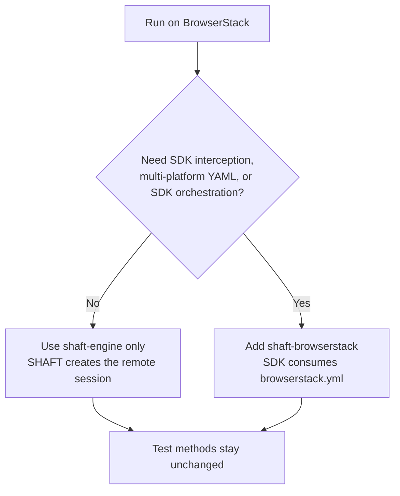

# SHAFT BrowserStack module

`io.github.shafthq:shaft-browserstack` adds the BrowserStack Java SDK runtime.
It does not add or replace SHAFT WebDriver methods. Direct BrowserStack
WebDriver/Appium support remains in `shaft-engine`.

## Direct session or SDK orchestration?



## Works with `shaft-engine` only

With `executionAddress=browserstack`, these paths are core:

- `new SHAFT.GUI.WebDriver()` and `DriverFactory` routing.
- Desktop web, mobile web, and native Appium sessions.
- W3C `bstack:options` construction.
- BrowserStack app upload from `browserStack.appRelativeFilePath`.
- Credentials, device/browser/OS properties, BrowserStack Local flag,
  debug/network logs, geolocation, and custom capabilities.
- `BrowserStackSdkHelper.generateBrowserStackYml()` generation/copy behavior.

The generated `browserstack.yml` does not orchestrate anything by itself. With
no SDK runtime, SHAFT simply creates the configured direct remote session.

The test body is the same as the bundled TestNG web sample:

```java
@BeforeMethod
public void beforeMethod() {
    driver = new SHAFT.GUI.WebDriver();
}

@Test
public void searchForQueryAndAssert() {
    driver.browser().navigateToURL(targetUrl)
            .and().element().type(searchBox, testData.get("searchQuery") + Keys.ENTER)
            .and().assertThat(firstSearchResult).text()
            .doesNotEqual(testData.get("unexpectedInFirstResult"));
}
```

## Requires `shaft-browserstack`

Add the optional module when the BrowserStack SDK must read the YAML and
intercept the test runtime:

```xml
<dependency>
    <groupId>io.github.shafthq</groupId>
    <artifactId>shaft-browserstack</artifactId>
</dependency>
```

| Configuration/functionality                                                            | Why the SDK module is required                                            |
|----------------------------------------------------------------------------------------|---------------------------------------------------------------------------|
| `browserStack.platformsList`                                                           | The SDK expands the YAML platform array into executions.                  |
| `browserStack.parallelsPerPlatform`                                                    | The SDK controls parallel executions per platform.                        |
| `browserStack.browserstackAutomation`                                                  | The SDK interprets whether to intercept and route WebDriver creation.     |
| `browserStack.customBrowserStackYmlPath`                                               | SHAFT copies the file in core; the SDK interprets its settings.           |
| SDK capability override, listeners, test orchestration, and SDK reporting integrations | Implemented by `browserstack-java-sdk`, which is supplied by this module. |

Example SDK-specific configuration:

```java
SHAFT.Properties.browserStack.set()
        .

platformsList("""
                [
                  {"os":"Windows","osVersion":"11","browserName":"Chrome"},
                  {"os":"OS X","osVersion":"Sonoma","browserName":"Safari"}
                ]
                """)
        .

parallelsPerPlatform(2)
        .

browserstackAutomation(true);
```

Credentials should remain in SHAFT property files, environment-backed Maven/CI
configuration, or the selected secret store. Do not hardcode them in tests.

For the SDK's runtime behavior, see
[How BrowserStack SDK works](https://www.browserstack.com/docs/automate/selenium/how-sdk-works).
