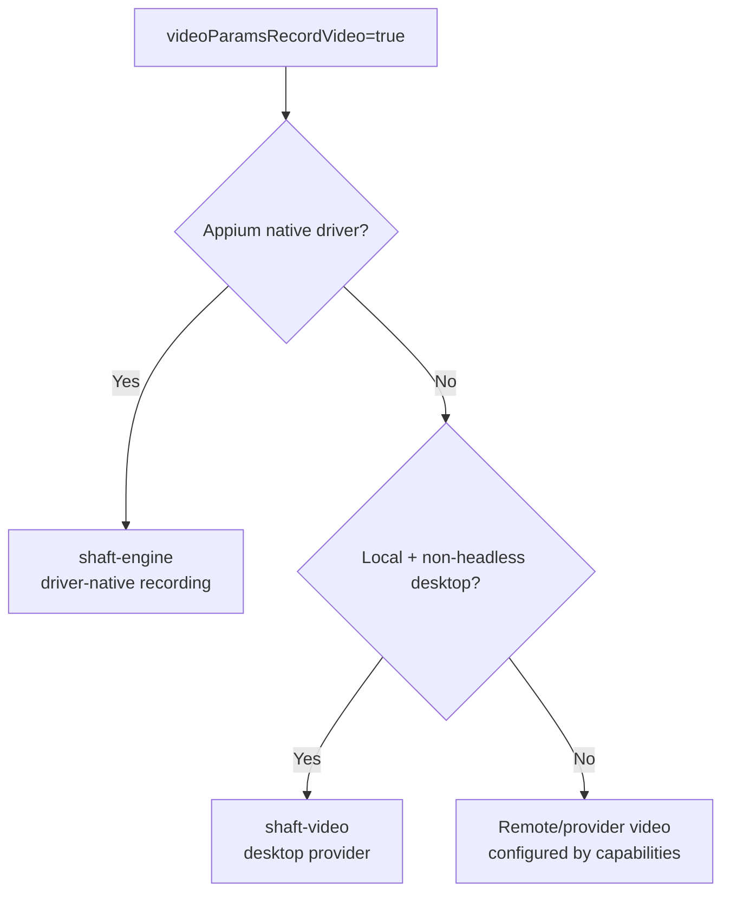

# SHAFT video module

`io.github.shafthq:shaft-video` supplies SHAFT's optional local desktop recording
provider, including Automation Remarks and the platform-specific JAVE/FFmpeg
payload.



Add the module only for local, non-headless desktop recording:

```xml

<dependency>
    <groupId>io.github.shafthq</groupId>
    <artifactId>shaft-video</artifactId>
</dependency>
```

`RecordManager.startVideoRecording()` requires the desktop provider when those
conditions are met. `RecordManager.startVideoRecording(WebDriver)` keeps Appium
Android/iOS recording in `shaft-engine` through driver-native
`startRecordingScreen()`/`stopRecordingScreen()` calls.

Remote BrowserStack, LambdaTest, Selenium Grid, Selenoid, or Moon video options
are capabilities of those remote providers and do not require `shaft-video`.
