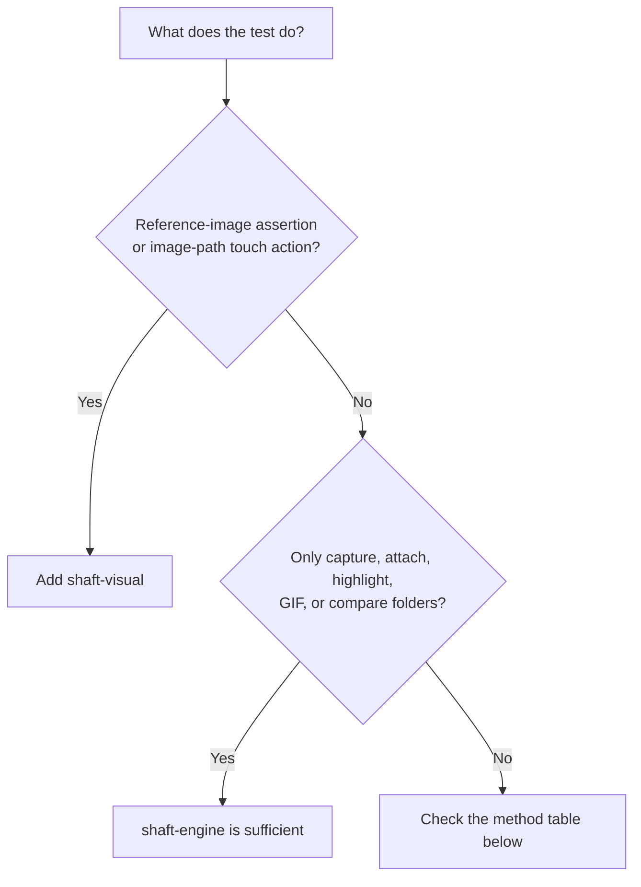

# SHAFT visual module

`io.github.shafthq:shaft-visual` supplies the optional
`VisualProcessingProvider` implementation and its OpenCV, Applitools Eyes, and
Selenium Shutterbug dependencies.

## Add the module

```xml
<dependencyManagement>
    <dependencies>
        <dependency>
            <groupId>io.github.shafthq</groupId>
            <artifactId>shaft-bom</artifactId>
            <version>${shaft.version}</version>
            <type>pom</type>
            <scope>import</scope>
        </dependency>
    </dependencies>
</dependencyManagement>

<dependencies>
    <dependency>
        <groupId>io.github.shafthq</groupId>
        <artifactId>shaft-engine</artifactId>
    </dependency>
    <dependency>
        <groupId>io.github.shafthq</groupId>
        <artifactId>shaft-visual</artifactId>
    </dependency>
</dependencies>
```

No initialization call is required. Java `ServiceLoader` discovers the provider.

## Dependency decision



## Requires `shaft-visual`

| API                                                            | Functionality                                                |
|----------------------------------------------------------------|--------------------------------------------------------------|
| `matchesReferenceImage()`                                      | Shutterbug reference-image comparison.                       |
| `matchesReferenceImage(VisualValidationEngine)`                | OpenCV, Shutterbug, or Eyes comparison selected by the enum. |
| `doesNotMatchReferenceImage()` and its overload                | Negative OpenCV/visual-engine comparison.                    |
| `TouchActions.tap(String)`                                     | Finds and taps an image inside the current screen.           |
| `TouchActions.waitUntilElementIsVisible(String)`               | Waits for an image match.                                    |
| `TouchActions.swipeElementIntoView(String, ...)`               | Swipes until the reference image is found.                   |
| `ImageProcessingActions.findImageWithinCurrentPage(...)`       | Direct OpenCV-backed image lookup.                           |
| `ImageProcessingActions.compareAgainstBaseline(...)`           | Direct baseline comparison.                                  |
| `ImageProcessingActions.loadOpenCV()`                          | Explicit provider/native-library loading.                    |
| Built-in Cucumber OpenCV, Shutterbug, and Eyes assertion steps | Delegates to the same provider.                              |

The bundled TestNG/JUnit web samples use:

```java
driver.browser().navigateToURL(targetUrl)
        .and().element().assertThat(logo).matchesReferenceImage();
```

The bundled Cucumber sample uses:

```gherkin
Then I Assert that the element found by "xpath": "//div[contains(@class,'container_fullWidth__1H_L8')]//img", exactly matches with the expected reference image using AI OpenCV
```

Both styles require `shaft-visual`.

## Remains in `shaft-engine`

| API/functionality                                                 | Implementation                        |
|-------------------------------------------------------------------|---------------------------------------|
| WebDriver/Appium screenshots and report attachments               | Selenium/Appium plus SHAFT reporting. |
| `ImageProcessingActions.highlightElementInScreenshot(...)`        | JDK `BufferedImage`/`Graphics2D`.     |
| `ImageProcessingActions.compareImageFolders(...)`                 | JDK `ImageIO` and data buffers.       |
| `formatElementLocatorToImagePath(...)`                            | Baseline naming only.                 |
| `getReferenceImage(...)` and `getShutterbugDifferencesImage(...)` | Baseline file reads only.             |
| Animated GIF generation                                           | Core image/reporting implementation.  |
| Locator-based touch methods such as `tap(By)`                     | Selenium/Appium locator execution.    |
| Healenium                                                         | Independent integration.              |

Without `shaft-visual`, provider-dependent methods throw an
`IllegalStateException` that names the missing Maven coordinate. Core screenshot
and image-file operations continue to work.
