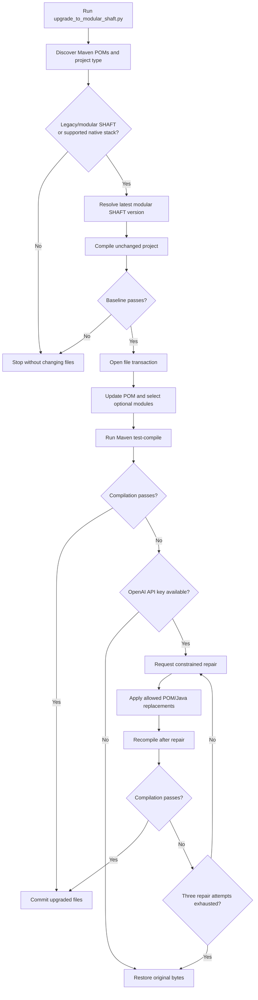
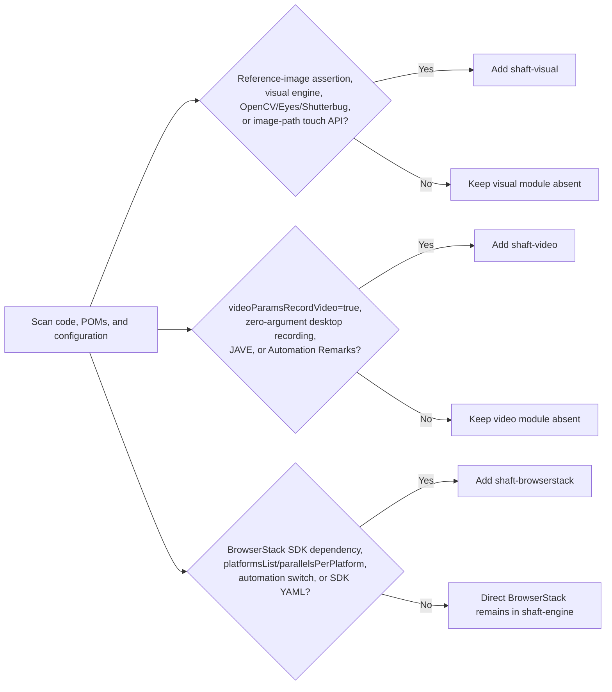
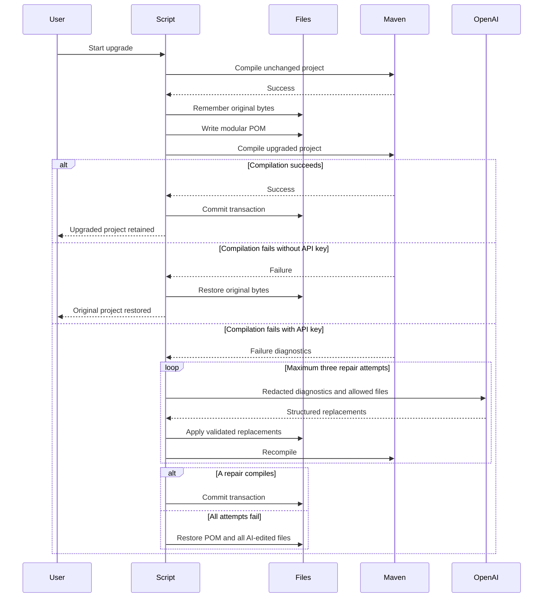
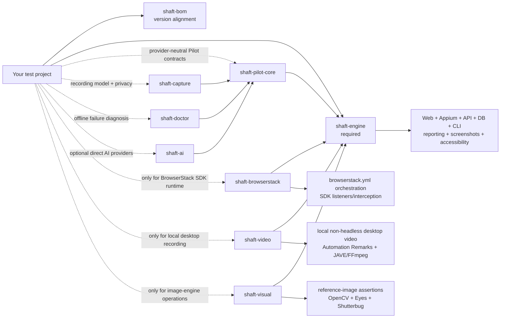

# Upgrade to modular SHAFT

The preferred upgrade route is the transactional
[`shaft-upgrader`](../shaft-upgrader/README.md) module and its
[`upgrade_to_modular_shaft.py`](../shaft-upgrader/upgrade_to_modular_shaft.py)
script. It upgrades:

- Native Selenium, Appium, or REST Assured Maven projects using TestNG or JUnit.
- Projects already using modular SHAFT.
- Legacy projects using `io.github.shafthq:SHAFT_ENGINE`.

For native projects, the script preserves the existing Selenium, Appium, REST
Assured, TestNG, and JUnit source and dependencies. It adds modular SHAFT so the
project can adopt the SHAFT API incrementally; it does not mechanically rewrite
all native test code. Native projects start with `shaft-engine` only; their
existing third-party BrowserStack, OpenCV, or video dependencies are preserved
without being reinterpreted as SHAFT optional-module usage.

For legacy SHAFT projects, Java imports remain under `com.shaft`. The script
replaces the old Maven coordinate, imports the BOM, scans source and
configuration for optional capabilities, compiles the result, and rolls back
every changed file if compilation does not pass.

The manual dependency reference remains below for review and troubleshooting.

## Preferred automated upgrade

### What the script guarantees

1. Finds supported Maven POMs without scanning generated `target`, `build`,
   `.git`, IDE, or report directories.
2. Resolves the latest published `shaft-engine` release from Maven Central,
   unless `--shaft-version` is supplied.
3. Compiles the unchanged project first. A broken baseline stops the migration
   before any file is changed.
4. Parses `pom.xml` as XML, imports `shaft-bom`, adds `shaft-engine`, and removes
   the legacy `SHAFT_ENGINE` dependency.
5. Adds only the optional modules supported by project evidence.
6. Runs Maven `test-compile` so both main and test source are compiled.
7. Commits the file transaction only after compilation passes.
8. Restores every touched file byte-for-byte when validation fails.
9. Optionally uses the OpenAI Responses API for exactly three repair attempts
   before rollback.



### Prerequisites

- A Maven project with at least one `pom.xml`.
- Python 3.9 or newer. The script uses only the Python standard library.
- Maven on `PATH`, or a project Maven wrapper (`mvnw`/`mvnw.cmd`).
- A JDK compatible with the latest SHAFT release. Current SHAFT builds require
  JDK 25.
- A clean version-control working tree is strongly recommended. The script has
  its own transaction, but Git remains useful for reviewing the successful
  migration.

### Download and run

From the project that should be upgraded:

Linux/macOS:

```bash
curl -fsSLo upgrade_to_modular_shaft.py \
  https://raw.githubusercontent.com/ShaftHQ/SHAFT_ENGINE/main/shaft-upgrader/upgrade_to_modular_shaft.py
python3 upgrade_to_modular_shaft.py --project .
```

Windows PowerShell:

```powershell
Invoke-WebRequest `
  https://raw.githubusercontent.com/ShaftHQ/SHAFT_ENGINE/main/shaft-upgrader/upgrade_to_modular_shaft.py `
  -OutFile upgrade_to_modular_shaft.py
python .\upgrade_to_modular_shaft.py --project .
```

The script prints:

- Detected project type, native automation stack, and test runner.
- Every POM selected for migration.
- Whether each optional module will be added.
- The source/configuration evidence behind each optional-module decision.
- Baseline, upgraded, and optional AI repair compilation status.

Review the plan and answer `y` to start the transaction.

### Preview without changing files

```bash
python3 upgrade_to_modular_shaft.py --project . --dry-run
```

Dry-run prints unified POM diffs. It does not write files or run Maven.

### Non-interactive usage

```bash
python3 upgrade_to_modular_shaft.py \
  --project . \
  --yes \
  --report target/shaft-upgrade-report.json
```

`--yes` is required when standard input is not interactive. The optional report
records the selected version, POMs, detected modules, evidence, compile count,
AI attempt count, and rollback status. It never contains the API key.

### Command reference

| Option | Purpose |
| --- | --- |
| `--project PATH` | Project root. Defaults to the current directory. |
| `--shaft-version VERSION` | Use a controlled version instead of Maven Central's latest release. Useful for local/offline repositories. |
| `--compile-command COMMAND` | Override the default Maven `test-compile -DskipTests -Dgpg.skip` command. |
| `--compile-timeout SECONDS` | Set the timeout for each compile invocation. Default: 900 seconds. |
| `--skip-baseline-compile` | Skip the unchanged-project compile. This weakens failure attribution and is not recommended. |
| `--dry-run` | Print POM diffs without writing or compiling. |
| `--yes` | Do not prompt before applying changes. |
| `--report PATH` | Write an optional JSON result report. |
| `--prompt-for-openai-key` | Securely prompt for an optional API key. |
| `--openai-key-env NAME` | Read the API key from another environment variable. Default: `OPENAI_API_KEY`. |
| `--openai-model MODEL` | Select another Responses API model. |
| `--no-ai` | Disable AI repair even if an API key is present. |

## Project detection

The script supports projects when it detects one of these shapes:

| Project shape | Detection |
| --- | --- |
| Legacy SHAFT | `io.github.shafthq:SHAFT_ENGINE` in a POM. |
| Modular SHAFT | `shaft-engine`, `shaft-bom`, or an optional SHAFT module in a POM. |
| Native Selenium | Selenium dependency/import plus TestNG or JUnit dependency/import. |
| Native Appium | Appium dependency/import plus TestNG or JUnit dependency/import. |
| Native REST Assured | REST Assured dependency/import plus TestNG or JUnit dependency/import. |

For multi-module builds, POMs that directly declare SHAFT or a supported native
stack/runner pair are updated. Other reactor POMs are left unchanged.

## Optional-module scan

For legacy and existing modular SHAFT projects, optional modules are inferred
from existing POMs, Java source, properties, JSON, XML, and YAML. File contents
are not printed; the report records only paths and detection reasons. Native
projects receive `shaft-engine` only because native third-party integrations do
not prove that the corresponding SHAFT provider API is used.



Existing modular optional dependencies are preserved even when no additional
scan evidence is found.

### BrowserStack evidence

The BrowserStack module is selected for BrowserStack Java SDK behavior, not for
ordinary remote sessions. Evidence includes:

- `com.browserstack:browserstack-java-sdk`.
- `browserStack.platformsList`.
- `browserStack.parallelsPerPlatform`.
- `browserStack.browserstackAutomation`.
- `browserStack.customBrowserStackYmlPath`.
- A BrowserStack YAML file with SDK `platforms` or `parallelsPerPlatform`.

Direct BrowserStack WebDriver/Appium execution still requires only
`shaft-engine`.

### Visual evidence

The visual module is selected for reference-image or image-engine behavior,
including:

- `matchesReferenceImage(...)` and `doesNotMatchReferenceImage(...)`.
- `VisualValidationEngine`.
- `findImageWithinCurrentPage(...)`, `compareAgainstBaseline(...)`, or
  `loadOpenCV()`.
- Image-path touch/wait/swipe APIs.
- Explicit OpenCV, Applitools Eyes, Selenium Shutterbug, or `shaft-visual`
  dependencies.

Ordinary screenshots, highlighting, GIF generation, and folder comparison do
not select `shaft-visual`.

### Video evidence

The video module is selected for local desktop recording:

- `videoParamsRecordVideo=true`.
- A zero-argument `startVideoRecording()` call.
- Explicit Automation Remarks, JAVE/FFmpeg, or `shaft-video` dependencies.

Appium driver-native recording and cloud-provider video do not select
`shaft-video`.

## Compilation and rollback

The default validation command is:

```bash
mvn test-compile -DskipTests -Dgpg.skip
```

`test-compile` compiles both production and test source without executing tests.
The same command runs before and after migration. Use `--compile-command` only
when the project requires a profile, settings file, module selector, or another
project-specific compile entry point.

The transaction records original bytes and file permissions immediately before
the first write to each file. A normal success discards that in-memory
snapshot. A failure, invalid AI response, path-policy violation, interruption,
or exhausted retry budget restores the originals.



The rollback guarantee covers failures handled by the running process. An
operating-system kill, power loss, or hardware failure can terminate any
program before cleanup runs, which is another reason to use version control.

## Optional OpenAI compile repair

OpenAI repair is disabled unless a key is supplied. The safest interactive
setup avoids shell history:

```bash
python3 upgrade_to_modular_shaft.py \
  --project . \
  --prompt-for-openai-key
```

For CI or an existing secret manager, set `OPENAI_API_KEY` and run the normal
command:

```bash
export OPENAI_API_KEY="..."
python3 upgrade_to_modular_shaft.py --project . --yes
```

PowerShell:

```powershell
$env:OPENAI_API_KEY = "..."
python .\upgrade_to_modular_shaft.py --project . --yes
```

Do not paste a real API key into the script, `pom.xml`, source code, or a
checked-in properties file.

When the upgraded compile fails, the script uses the
[OpenAI Responses API](https://developers.openai.com/api/docs/guides/text) with
[Structured Outputs](https://developers.openai.com/api/docs/guides/structured-outputs).
The default model is `gpt-5.5`; override it with `--openai-model` when required.

Each request is constrained as follows:

- Compiler output is redacted for common tokens, passwords, bearer headers, and
  private keys.
- Only candidate POMs and Java files named by compiler diagnostics are
  considered.
- A file containing a detected secret is excluded from editable context.
- The model can replace only existing, non-symlink `pom.xml` and `.java` files
  that were supplied in the request.
- Absolute paths, parent traversal, new files, unrelated extensions, invalid
  XML, oversized output, and changes outside the supplied context are rejected.
- The modular BOM/version contract is revalidated after every accepted repair.
- The project is recompiled after each of the three repair attempts.
- If no attempt passes, the POM and every AI-edited file are rolled back.

Use `--no-ai` to force deterministic rollback even when the environment already
contains an API key.

## Manual migration reference

The following sections describe the exact Maven result produced by the script
and remain useful for review, unusual project layouts, and troubleshooting.

## Migration outcome

A completed migration has:

- `shaft-bom` managing one SHAFT version.
- `shaft-engine` replacing the old uppercase artifact.
- Only the optional modules used by the project.
- No mixture of `SHAFT_ENGINE` and modular JARs in the dependency tree.
- Passing compile/tests with a populated Allure result set when SHAFT tests run.

## Coordinates: before and after

Before:

```xml
<dependency>
    <groupId>io.github.shafthq</groupId>
    <artifactId>SHAFT_ENGINE</artifactId>
    <version>10.2.20260605</version>
</dependency>
```

After, using the recommended BOM:

```xml
<properties>
    <shaft.version>10.2.20260610</shaft.version>
</properties>

<dependencyManagement>
    <dependencies>
        <dependency>
            <groupId>io.github.shafthq</groupId>
            <artifactId>shaft-bom</artifactId>
            <version>${shaft.version}</version>
            <type>pom</type>
            <scope>import</scope>
        </dependency>
    </dependencies>
</dependencyManagement>

<dependencies>
    <dependency>
        <groupId>io.github.shafthq</groupId>
        <artifactId>shaft-engine</artifactId>
    </dependency>
</dependencies>
```

Version `10.2.20260610` is the prepared first modular SHAFT release.

> [!IMPORTANT]
> Do not change production coordinates until
> [the canonical artifact on Maven Central](https://central.sonatype.com/artifact/io.github.shafthq/shaft-engine)
> lists `10.2.20260610`. Until that publication completes, the latest public
> artifact remains `io.github.shafthq:SHAFT_ENGINE:10.2.20260605`.

## Module map

Importing `shaft-bom` aligns versions; it does not add runtime code.



## Select dependencies by functionality

| Functionality                                                                | Required artifact    | Do not add an optional module for                                                |
|------------------------------------------------------------------------------|----------------------|----------------------------------------------------------------------------------|
| WebDriver browser actions, element actions, locators, screenshots, reporting | `shaft-engine`       | Normal local, Docker, Selenium Grid, LambdaTest, or direct BrowserStack sessions |
| Appium native/mobile web/Flutter actions and Appium screen recording         | `shaft-engine`       | Driver-native Android/iOS recording                                              |
| REST Assured API, database, CLI, test data, accessibility, Cucumber steps    | `shaft-engine`       | Any of these capabilities by themselves                                          |
| Provider-neutral Pilot requests, approval, redaction, and deterministic fallback | `shaft-pilot-core` | Direct provider HTTP calls                                                        |
| Versioned browser recording, privacy classification, and capture JSON        | `shaft-capture`      | Ordinary engine screenshots or desktop video                                     |
| Portable evidence bundles and deterministic offline failure diagnosis         | `shaft-doctor`       | Allure report rendering or direct AI provider calls                               |
| Direct OpenAI, Anthropic, Gemini, or Ollama provider calls                    | `shaft-ai`           | Deterministic Capture creation, validation, migration, or replay data             |
| BrowserStack SDK interception and `browserstack.yml` orchestration           | `shaft-browserstack` | Direct BrowserStack WebDriver/Appium sessions built by SHAFT                     |
| Local, non-headless desktop recording managed by SHAFT                       | `shaft-video`        | Remote-provider video or Appium `startRecordingScreen()`                         |
| Reference-image assertions and image-based touch lookup                      | `shaft-visual`       | Ordinary screenshots, screenshot highlighting, GIFs, or folder comparison        |

Add optional modules beside `shaft-engine`; their versions come from the BOM:

```xml
<dependency>
    <groupId>io.github.shafthq</groupId>
    <artifactId>shaft-visual</artifactId>
</dependency>
```

Use the same shape for `shaft-pilot-core`, `shaft-capture`, `shaft-doctor`, `shaft-ai`,
`shaft-browserstack`, or `shaft-video`, but add only the artifacts selected by
the tables below.

## Capture dependency boundary

Add `shaft-capture` when a project creates, validates, migrates, reviews, or
persists SHAFT Capture recording JSON. It transitively uses
`shaft-pilot-core` for provider-neutral security contracts but does not resolve
`shaft-ai`. Recording and privacy enforcement remain deterministic with
`pilot.ai.enabled=false`.

See the [SHAFT Capture format guide](SHAFT_CAPTURE.md).

## Doctor dependency boundary

Add `shaft-doctor` when a project needs allowlisted local evidence collection,
portable redacted bundles, deterministic root-cause classification, or
JSON/Markdown diagnosis reports. It uses `shaft-pilot-core` security helpers
but does not resolve `shaft-ai` or make network calls. See the
[SHAFT Doctor guide](SHAFT_DOCTOR.md).

## Visual dependency boundary

`shaft-visual` is required when execution reaches the optional
`VisualProcessingProvider`. Merely taking or attaching a screenshot does not
reach that provider.

### Methods that require `shaft-visual`

| Public API or behavior                                                                 | Why it needs the module                                                                                                            |
|----------------------------------------------------------------------------------------|------------------------------------------------------------------------------------------------------------------------------------|
| `matchesReferenceImage()`                                                              | Defaults to `EXACT_SHUTTERBUG`; all reference-image engines are implemented by the provider.                                       |
| `matchesReferenceImage(VisualValidationEngine)`                                        | `EXACT_SHUTTERBUG`, `EXACT_OPENCV`, `EXACT_EYES`, `STRICT_EYES`, `CONTENT_EYES`, and `LAYOUT_EYES` all delegate to `shaft-visual`. |
| `doesNotMatchReferenceImage()` and its engine overload                                 | The default is `EXACT_OPENCV`; every overload delegates to the provider.                                                           |
| Cucumber reference-image assertion steps                                               | The built-in OpenCV, Shutterbug, and Eyes steps invoke the same validation path.                                                   |
| `TouchActions.tap(String)`                                                             | Locates the reference image inside the current screenshot using OpenCV.                                                            |
| `TouchActions.waitUntilElementIsVisible(String)`                                       | Uses OpenCV to find the supplied image.                                                                                            |
| `TouchActions.swipeElementIntoView(String, ...)` and the scrollable-container overload | Uses image matching after each swipe.                                                                                              |
| `ImageProcessingActions.findImageWithinCurrentPage(...)`                               | Direct provider operation.                                                                                                         |
| `ImageProcessingActions.compareAgainstBaseline(...)`                                   | Direct provider operation for every visual engine.                                                                                 |
| `ImageProcessingActions.loadOpenCV()`                                                  | Explicitly loads the optional provider.                                                                                            |

The TestNG and JUnit web samples contain this visual assertion:

```java
@Test
public void navigateToDuckDuckGoAndAssertLogoIsDisplayedCorrectly() {
    driver.browser().navigateToURL(targetUrl)
            .and().element().assertThat(logo).matchesReferenceImage();
}
```

Their POMs therefore include `shaft-visual`. Removing the visual test allows
those projects to return to `shaft-engine` only.

### Functionality that remains in `shaft-engine`

| Method or behavior                                                                                     | Why no visual module is needed                             |
|--------------------------------------------------------------------------------------------------------|------------------------------------------------------------|
| Selenium/Appium screenshot capture and Allure attachments                                              | Uses WebDriver/Appium screenshot APIs and SHAFT reporting. |
| `ImageProcessingActions.highlightElementInScreenshot(...)`                                             | Uses JDK `BufferedImage` and `Graphics2D`.                 |
| `ImageProcessingActions.compareImageFolders(...)`                                                      | Uses JDK `ImageIO` and image data buffers.                 |
| `formatElementLocatorToImagePath(...)`, `getReferenceImage(...)`, `getShutterbugDifferencesImage(...)` | Performs naming and file access only.                      |
| Animated GIF creation                                                                                  | Does not invoke the visual provider.                       |
| Healenium integration                                                                                  | Independent of OpenCV.                                     |
| Normal locator-based `tap(By)`, `waitUntilElementIsVisible(By)`, and `swipeElementIntoView(By, ...)`   | Uses Selenium/Appium locators, not reference images.       |

See the detailed [visual module guide](SHAFT_VISUAL_MODULE.md).

## BrowserStack dependency boundary

`shaft-browserstack` does not add a new SHAFT facade method. It adds the
BrowserStack Java SDK runtime. The ordinary BrowserStack driver path remains in
`shaft-engine`.

### Works with `shaft-engine` only

The standard web sample remains unchanged when a direct BrowserStack session is
selected:

```java
@BeforeMethod
public void beforeMethod() {
    driver = new SHAFT.GUI.WebDriver();
}

@Test
public void searchForQueryAndAssert() {
    driver.browser().navigateToURL(targetUrl)
            .and().element().type(searchBox, testData.get("searchQuery") + Keys.ENTER)
            .and().assertThat(firstSearchResult).text()
            .doesNotEqual(testData.get("unexpectedInFirstResult"));
}
```

With `executionAddress=browserstack`, `shaft-engine` performs all of the
following without `shaft-browserstack`:

- `new SHAFT.GUI.WebDriver()` and `DriverFactory` BrowserStack routing.
- Desktop web, mobile web, and native Appium session creation.
- W3C `bstack:options` capability construction.
- BrowserStack app upload when `browserStack.appRelativeFilePath` is used.
- Credentials, device/browser/OS selection, local flag, debug/network logs,
  Selenium/Appium version, geolocation, and custom capability handling.
- Generation or copying of `browserstack.yml` through
  `BrowserStackSdkHelper.generateBrowserStackYml()`.

The generated YAML is harmless but has no SDK orchestration effect when the SDK
runtime is absent.

### Requires `shaft-browserstack`

Add the module when BrowserStack's SDK must consume `browserstack.yml` and
intercept/orchestrate the test runtime:

```xml
<dependency>
    <groupId>io.github.shafthq</groupId>
    <artifactId>shaft-browserstack</artifactId>
</dependency>
```

These SHAFT properties configure SDK-only behavior:

```java
SHAFT.Properties.browserStack.set()
        .platformsList("""
                [
                  {"os":"Windows","osVersion":"11","browserName":"Chrome"},
                  {"os":"OS X","osVersion":"Sonoma","browserName":"Safari"}
                ]
                """)
        .parallelsPerPlatform(2)
        .browserstackAutomation(true);
```

| SDK-dependent configuration/functionality                                     | Without `shaft-browserstack`                                                     |
|-------------------------------------------------------------------------------|----------------------------------------------------------------------------------|
| `browserStack.platformsList` multi-platform expansion                         | The value is written to YAML, but no SDK consumes it.                            |
| `browserStack.parallelsPerPlatform` SDK parallel orchestration                | Direct SHAFT session creation still follows the test runner's own parallelism.   |
| `browserStack.browserstackAutomation` interception switch                     | No BrowserStack SDK is present to intercept WebDriver creation.                  |
| `browserStack.customBrowserStackYmlPath` as SDK configuration                 | SHAFT can copy the file, but only the SDK interprets its orchestration settings. |
| SDK listeners, automatic capability override, and SDK reporting/orchestration | Unavailable; the direct SHAFT BrowserStack session still works.                  |

See the [BrowserStack module guide](SHAFT_BROWSERSTACK_MODULE.md) and
[BrowserStack's SDK architecture](https://www.browserstack.com/docs/automate/selenium/how-sdk-works).

## Video dependency boundary

`shaft-video` is required only when
`videoParamsRecordVideo=true` starts local, non-headless desktop recording.
`RecordManager.startVideoRecording()` then discovers the desktop provider and
fails with an actionable message when it is absent.

Appium native recording through `RecordManager.startVideoRecording(WebDriver)`
and Android/iOS `startRecordingScreen()` remains in `shaft-engine`. Remote cloud
video configured through provider capabilities also does not use
`shaft-video`.

See the [video module guide](SHAFT_VIDEO_MODULE.md).

## Legacy relocation and support window

The old `io.github.shafthq:SHAFT_ENGINE` coordinate is a relocation POM pointing
to `io.github.shafthq:shaft-engine` for the modular release line. It contains no
classes and selects only `shaft-engine`. Maven cannot infer whether a project
needs BrowserStack SDK orchestration, desktop recording, or image-engine
operations, so relocation never adds optional modules.

Use relocation only as a temporary compatibility bridge. Do not declare the
legacy coordinate together with modular artifacts.

## CI and cache migration

1. Change cache keys when `pom.xml` hashes are not already part of the key.
2. Do not copy the old `SHAFT_ENGINE` repository directory to `shaft-engine`.
3. Let Maven resolve and checksum the new paths under
   `~/.m2/repository/io/github/shafthq/`.
4. Use the purge command only for a suspected stale or failed relocation:

   ```bash
   mvn dependency:purge-local-repository \
     -DmanualInclude=io.github.shafthq:SHAFT_ENGINE,io.github.shafthq:shaft-engine \
     -DreResolve=false
   ```

5. Build once with an empty CI cache before comparing dependency size or timing.

## Validate the migration

```bash
mvn dependency:tree -Dincludes=io.github.shafthq
mvn clean install -DskipTests -Dgpg.skip
mvn test
```

The dependency tree should contain one aligned SHAFT version, `shaft-engine`,
and only the selected optional modules. When tests run, confirm the expected
number of `allure-results/*-result.json` files exists before treating the
Allure summary as authoritative.

### Missing-provider troubleshooting

| Symptom                                                                         | Action                                                                                                                                |
|---------------------------------------------------------------------------------|---------------------------------------------------------------------------------------------------------------------------------------|
| Reference-image assertion or image-path touch action reports no visual provider | Add `shaft-visual`; verify `org.openpnp:opencv`, Applitools Eyes, and Selenium Shutterbug resolve transitively.                       |
| Ordinary screenshot capture fails                                               | Do not add `shaft-visual` reflexively; diagnose WebDriver/Appium screenshot support and reporting paths.                              |
| Direct BrowserStack session fails to start                                      | Check credentials, execution address, capabilities, and connectivity first; `shaft-browserstack` is not required for the direct path. |
| `platformsList` or `parallelsPerPlatform` has no effect                         | Add `shaft-browserstack` and verify the BrowserStack SDK is active and reading the generated `browserstack.yml`.                      |
| Desktop recording reports no provider                                           | Add `shaft-video`; confirm the OS-specific `ws.schild:jave-nativebin-*` artifact resolves.                                            |
| Mobile recording changed unexpectedly                                           | Do not add `shaft-video`; verify the Appium driver supports native recording.                                                         |
| `NoSuchMethodError` or mixed SHAFT modules                                      | Import `shaft-bom`, remove explicit mismatched module versions, and inspect `mvn dependency:tree -Dincludes=io.github.shafthq`.       |

## Verified cold-cache download measurements

The table records compressed classpath JAR bytes from isolated Maven
repositories. The monolithic graph is the committed `10.2.20260605` baseline at
commit `570a836`; the modular graph is `shaft-engine` only. MiB uses 1,048,576
bytes.

| Supported platform | Before: `SHAFT_ENGINE` | After: `shaft-engine` only | Saved |
| --- | ---: | ---: | ---: |
| Linux x64 | 352,001,986 (335.70 MiB) | 169,941,464 (162.07 MiB) | 182,060,522 (173.63 MiB / 51.7%) |
| Linux ARM64 | 348,005,291 (331.88 MiB) | 169,941,464 (162.07 MiB) | 178,063,827 (169.81 MiB / 51.2%) |
| Windows x64 | 350,617,708 (334.38 MiB) | 169,941,464 (162.07 MiB) | 180,676,244 (172.31 MiB / 51.5%) |
| macOS x64 | 344,700,722 (328.73 MiB) | 169,941,464 (162.07 MiB) | 174,759,258 (166.66 MiB / 50.7%) |
| macOS ARM64 | 341,487,898 (325.67 MiB) | 169,941,464 (162.07 MiB) | 171,546,434 (163.60 MiB / 50.2%) |

Reproduce the current modular graph after a reactor build:

```bash
mvn clean install -DskipTests -Dgpg.skip
python3 scripts/ci/measure_consumer_dependencies.py \
  --fixture api \
  --output target/modular-measurement
```

The platform totals substitute the exact JAVE native JAR selected by the old
POM: Linux x64 28,201,169 bytes, Linux ARM64 24,204,474 bytes, Windows x64
26,816,891 bytes, macOS x64 20,899,905 bytes, and macOS ARM64 17,687,081 bytes.

## Completion checklist

- [ ] Replace `SHAFT_ENGINE` with `shaft-engine`.
- [ ] Import `shaft-bom` and remove explicit versions from SHAFT module dependencies.
- [ ] Add `shaft-visual` only for the listed reference-image and image-lookup methods.
- [ ] Add `shaft-browserstack` only for BrowserStack SDK orchestration.
- [ ] Add `shaft-video` only for local non-headless desktop recording.
- [ ] Update CI cache keys and run one clean-cache build.
- [ ] Verify one SHAFT version with `mvn dependency:tree`.
- [ ] Compile, test, and confirm Allure results are populated.

## Rollback

If migration blocks a release, revert the POM to
`io.github.shafthq:SHAFT_ENGINE:10.2.20260605`, restore the previous dependency
cache key, and remove all modular artifact declarations. Do not mix the old JAR
with modular artifacts. Capture `mvn dependency:tree` before rollback so a
missing provider or version mismatch can be diagnosed before the next attempt.
