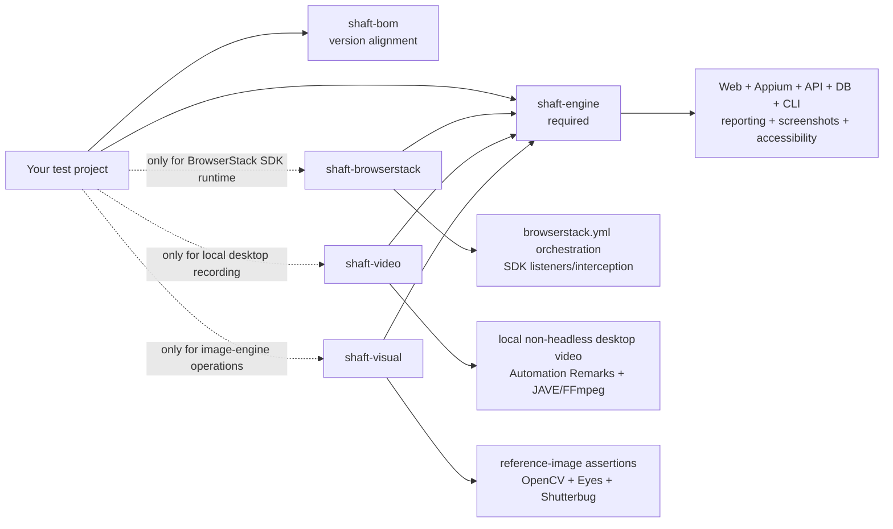

# Upgrade to modular SHAFT

This guide migrates projects from the final monolithic release,
`io.github.shafthq:SHAFT_ENGINE:10.2.20260605`, to modular SHAFT
`10.2.20260609`. Java imports remain under `com.shaft`; the migration changes
Maven coordinates and moves three dependency-heavy capabilities into optional
runtime modules.

## Migration outcome

A completed migration has:

- `shaft-bom` managing one SHAFT version.
- `shaft-engine` replacing the old uppercase artifact.
- Only the optional modules used by the project.
- No mixture of `SHAFT_ENGINE` and modular JARs in the dependency tree.
- Passing compile/tests with a populated Allure result set when SHAFT tests run.

## Coordinates: before and after

Before:

```xml
<dependency>
    <groupId>io.github.shafthq</groupId>
    <artifactId>SHAFT_ENGINE</artifactId>
    <version>10.2.20260605</version>
</dependency>
```

After, using the recommended BOM:

```xml
<properties>
    <shaft.version>10.2.20260609</shaft.version>
</properties>

<dependencyManagement>
    <dependencies>
        <dependency>
            <groupId>io.github.shafthq</groupId>
            <artifactId>shaft-bom</artifactId>
            <version>${shaft.version}</version>
            <type>pom</type>
            <scope>import</scope>
        </dependency>
    </dependencies>
</dependencyManagement>

<dependencies>
    <dependency>
        <groupId>io.github.shafthq</groupId>
        <artifactId>shaft-engine</artifactId>
    </dependency>
</dependencies>
```

Version `10.2.20260609` is the prepared first modular SHAFT release.

> [!IMPORTANT]
> Do not change production coordinates until
> [the canonical artifact on Maven Central](https://central.sonatype.com/artifact/io.github.shafthq/shaft-engine)
> lists `10.2.20260609`. Until that publication completes, the latest public
> artifact remains `io.github.shafthq:SHAFT_ENGINE:10.2.20260605`.

## Module map

Importing `shaft-bom` aligns versions; it does not add runtime code.



## Select dependencies by functionality

| Functionality                                                                | Required artifact    | Do not add an optional module for                                                |
|------------------------------------------------------------------------------|----------------------|----------------------------------------------------------------------------------|
| WebDriver browser actions, element actions, locators, screenshots, reporting | `shaft-engine`       | Normal local, Docker, Selenium Grid, LambdaTest, or direct BrowserStack sessions |
| Appium native/mobile web/Flutter actions and Appium screen recording         | `shaft-engine`       | Driver-native Android/iOS recording                                              |
| REST Assured API, database, CLI, test data, accessibility, Cucumber steps    | `shaft-engine`       | Any of these capabilities by themselves                                          |
| BrowserStack SDK interception and `browserstack.yml` orchestration           | `shaft-browserstack` | Direct BrowserStack WebDriver/Appium sessions built by SHAFT                     |
| Local, non-headless desktop recording managed by SHAFT                       | `shaft-video`        | Remote-provider video or Appium `startRecordingScreen()`                         |
| Reference-image assertions and image-based touch lookup                      | `shaft-visual`       | Ordinary screenshots, screenshot highlighting, GIFs, or folder comparison        |

Add optional modules beside `shaft-engine`; their versions come from the BOM:

```xml
<dependency>
    <groupId>io.github.shafthq</groupId>
    <artifactId>shaft-visual</artifactId>
</dependency>
```

Use the same shape for `shaft-browserstack` or `shaft-video`, but add only the
artifacts selected by the tables below.

## Visual dependency boundary

`shaft-visual` is required when execution reaches the optional
`VisualProcessingProvider`. Merely taking or attaching a screenshot does not
reach that provider.

### Methods that require `shaft-visual`

| Public API or behavior                                                                 | Why it needs the module                                                                                                            |
|----------------------------------------------------------------------------------------|------------------------------------------------------------------------------------------------------------------------------------|
| `matchesReferenceImage()`                                                              | Defaults to `EXACT_SHUTTERBUG`; all reference-image engines are implemented by the provider.                                       |
| `matchesReferenceImage(VisualValidationEngine)`                                        | `EXACT_SHUTTERBUG`, `EXACT_OPENCV`, `EXACT_EYES`, `STRICT_EYES`, `CONTENT_EYES`, and `LAYOUT_EYES` all delegate to `shaft-visual`. |
| `doesNotMatchReferenceImage()` and its engine overload                                 | The default is `EXACT_OPENCV`; every overload delegates to the provider.                                                           |
| Cucumber reference-image assertion steps                                               | The built-in OpenCV, Shutterbug, and Eyes steps invoke the same validation path.                                                   |
| `TouchActions.tap(String)`                                                             | Locates the reference image inside the current screenshot using OpenCV.                                                            |
| `TouchActions.waitUntilElementIsVisible(String)`                                       | Uses OpenCV to find the supplied image.                                                                                            |
| `TouchActions.swipeElementIntoView(String, ...)` and the scrollable-container overload | Uses image matching after each swipe.                                                                                              |
| `ImageProcessingActions.findImageWithinCurrentPage(...)`                               | Direct provider operation.                                                                                                         |
| `ImageProcessingActions.compareAgainstBaseline(...)`                                   | Direct provider operation for every visual engine.                                                                                 |
| `ImageProcessingActions.loadOpenCV()`                                                  | Explicitly loads the optional provider.                                                                                            |

The TestNG and JUnit web samples contain this visual assertion:

```java
@Test
public void navigateToDuckDuckGoAndAssertLogoIsDisplayedCorrectly() {
    driver.browser().navigateToURL(targetUrl)
            .and().element().assertThat(logo).matchesReferenceImage();
}
```

Their POMs therefore include `shaft-visual`. Removing the visual test allows
those projects to return to `shaft-engine` only.

### Functionality that remains in `shaft-engine`

| Method or behavior                                                                                     | Why no visual module is needed                             |
|--------------------------------------------------------------------------------------------------------|------------------------------------------------------------|
| Selenium/Appium screenshot capture and Allure attachments                                              | Uses WebDriver/Appium screenshot APIs and SHAFT reporting. |
| `ImageProcessingActions.highlightElementInScreenshot(...)`                                             | Uses JDK `BufferedImage` and `Graphics2D`.                 |
| `ImageProcessingActions.compareImageFolders(...)`                                                      | Uses JDK `ImageIO` and image data buffers.                 |
| `formatElementLocatorToImagePath(...)`, `getReferenceImage(...)`, `getShutterbugDifferencesImage(...)` | Performs naming and file access only.                      |
| Animated GIF creation                                                                                  | Does not invoke the visual provider.                       |
| Healenium integration                                                                                  | Independent of OpenCV.                                     |
| Normal locator-based `tap(By)`, `waitUntilElementIsVisible(By)`, and `swipeElementIntoView(By, ...)`   | Uses Selenium/Appium locators, not reference images.       |

See the detailed [visual module guide](SHAFT_VISUAL_MODULE.md).

## BrowserStack dependency boundary

`shaft-browserstack` does not add a new SHAFT facade method. It adds the
BrowserStack Java SDK runtime. The ordinary BrowserStack driver path remains in
`shaft-engine`.

### Works with `shaft-engine` only

The standard web sample remains unchanged when a direct BrowserStack session is
selected:

```java
@BeforeMethod
public void beforeMethod() {
    driver = new SHAFT.GUI.WebDriver();
}

@Test
public void searchForQueryAndAssert() {
    driver.browser().navigateToURL(targetUrl)
            .and().element().type(searchBox, testData.get("searchQuery") + Keys.ENTER)
            .and().assertThat(firstSearchResult).text()
            .doesNotEqual(testData.get("unexpectedInFirstResult"));
}
```

With `executionAddress=browserstack`, `shaft-engine` performs all of the
following without `shaft-browserstack`:

- `new SHAFT.GUI.WebDriver()` and `DriverFactory` BrowserStack routing.
- Desktop web, mobile web, and native Appium session creation.
- W3C `bstack:options` capability construction.
- BrowserStack app upload when `browserStack.appRelativeFilePath` is used.
- Credentials, device/browser/OS selection, local flag, debug/network logs,
  Selenium/Appium version, geolocation, and custom capability handling.
- Generation or copying of `browserstack.yml` through
  `BrowserStackSdkHelper.generateBrowserStackYml()`.

The generated YAML is harmless but has no SDK orchestration effect when the SDK
runtime is absent.

### Requires `shaft-browserstack`

Add the module when BrowserStack's SDK must consume `browserstack.yml` and
intercept/orchestrate the test runtime:

```xml
<dependency>
    <groupId>io.github.shafthq</groupId>
    <artifactId>shaft-browserstack</artifactId>
</dependency>
```

These SHAFT properties configure SDK-only behavior:

```java
SHAFT.Properties.browserStack.set()
        .platformsList("""
                [
                  {"os":"Windows","osVersion":"11","browserName":"Chrome"},
                  {"os":"OS X","osVersion":"Sonoma","browserName":"Safari"}
                ]
                """)
        .parallelsPerPlatform(2)
        .browserstackAutomation(true);
```

| SDK-dependent configuration/functionality                                     | Without `shaft-browserstack`                                                     |
|-------------------------------------------------------------------------------|----------------------------------------------------------------------------------|
| `browserStack.platformsList` multi-platform expansion                         | The value is written to YAML, but no SDK consumes it.                            |
| `browserStack.parallelsPerPlatform` SDK parallel orchestration                | Direct SHAFT session creation still follows the test runner's own parallelism.   |
| `browserStack.browserstackAutomation` interception switch                     | No BrowserStack SDK is present to intercept WebDriver creation.                  |
| `browserStack.customBrowserStackYmlPath` as SDK configuration                 | SHAFT can copy the file, but only the SDK interprets its orchestration settings. |
| SDK listeners, automatic capability override, and SDK reporting/orchestration | Unavailable; the direct SHAFT BrowserStack session still works.                  |

See the [BrowserStack module guide](SHAFT_BROWSERSTACK_MODULE.md) and
[BrowserStack's SDK architecture](https://www.browserstack.com/docs/automate/selenium/how-sdk-works).

## Video dependency boundary

`shaft-video` is required only when
`videoParamsRecordVideo=true` starts local, non-headless desktop recording.
`RecordManager.startVideoRecording()` then discovers the desktop provider and
fails with an actionable message when it is absent.

Appium native recording through `RecordManager.startVideoRecording(WebDriver)`
and Android/iOS `startRecordingScreen()` remains in `shaft-engine`. Remote cloud
video configured through provider capabilities also does not use
`shaft-video`.

See the [video module guide](SHAFT_VIDEO_MODULE.md).

## Legacy relocation and support window

The old `io.github.shafthq:SHAFT_ENGINE` coordinate is a relocation POM pointing
to `io.github.shafthq:shaft-engine` for the modular release line. It contains no
classes and selects only `shaft-engine`. Maven cannot infer whether a project
needs BrowserStack SDK orchestration, desktop recording, or image-engine
operations, so relocation never adds optional modules.

Use relocation only as a temporary compatibility bridge. Do not declare the
legacy coordinate together with modular artifacts.

## CI and cache migration

1. Change cache keys when `pom.xml` hashes are not already part of the key.
2. Do not copy the old `SHAFT_ENGINE` repository directory to `shaft-engine`.
3. Let Maven resolve and checksum the new paths under
   `~/.m2/repository/io/github/shafthq/`.
4. Use the purge command only for a suspected stale or failed relocation:

   ```bash
   mvn dependency:purge-local-repository \
     -DmanualInclude=io.github.shafthq:SHAFT_ENGINE,io.github.shafthq:shaft-engine \
     -DreResolve=false
   ```

5. Build once with an empty CI cache before comparing dependency size or timing.

## Validate the migration

```bash
mvn dependency:tree -Dincludes=io.github.shafthq
mvn clean install -DskipTests -Dgpg.skip
mvn test
```

The dependency tree should contain one aligned SHAFT version, `shaft-engine`,
and only the selected optional modules. When tests run, confirm the expected
number of `allure-results/*-result.json` files exists before treating the
Allure summary as authoritative.

### Missing-provider troubleshooting

| Symptom                                                                         | Action                                                                                                                                |
|---------------------------------------------------------------------------------|---------------------------------------------------------------------------------------------------------------------------------------|
| Reference-image assertion or image-path touch action reports no visual provider | Add `shaft-visual`; verify `org.openpnp:opencv`, Applitools Eyes, and Selenium Shutterbug resolve transitively.                       |
| Ordinary screenshot capture fails                                               | Do not add `shaft-visual` reflexively; diagnose WebDriver/Appium screenshot support and reporting paths.                              |
| Direct BrowserStack session fails to start                                      | Check credentials, execution address, capabilities, and connectivity first; `shaft-browserstack` is not required for the direct path. |
| `platformsList` or `parallelsPerPlatform` has no effect                         | Add `shaft-browserstack` and verify the BrowserStack SDK is active and reading the generated `browserstack.yml`.                      |
| Desktop recording reports no provider                                           | Add `shaft-video`; confirm the OS-specific `ws.schild:jave-nativebin-*` artifact resolves.                                            |
| Mobile recording changed unexpectedly                                           | Do not add `shaft-video`; verify the Appium driver supports native recording.                                                         |
| `NoSuchMethodError` or mixed SHAFT modules                                      | Import `shaft-bom`, remove explicit mismatched module versions, and inspect `mvn dependency:tree -Dincludes=io.github.shafthq`.       |

## Verified cold-cache download measurements

The table records compressed classpath JAR bytes from isolated Maven
repositories. The monolithic graph is the committed `10.2.20260605` baseline at
commit `570a836`; the modular graph is `shaft-engine` only. MiB uses 1,048,576
bytes.

| Supported platform | Before: `SHAFT_ENGINE` | After: `shaft-engine` only | Saved |
| --- | ---: | ---: | ---: |
| Linux x64 | 352,001,986 (335.70 MiB) | 169,941,464 (162.07 MiB) | 182,060,522 (173.63 MiB / 51.7%) |
| Linux ARM64 | 348,005,291 (331.88 MiB) | 169,941,464 (162.07 MiB) | 178,063,827 (169.81 MiB / 51.2%) |
| Windows x64 | 350,617,708 (334.38 MiB) | 169,941,464 (162.07 MiB) | 180,676,244 (172.31 MiB / 51.5%) |
| macOS x64 | 344,700,722 (328.73 MiB) | 169,941,464 (162.07 MiB) | 174,759,258 (166.66 MiB / 50.7%) |
| macOS ARM64 | 341,487,898 (325.67 MiB) | 169,941,464 (162.07 MiB) | 171,546,434 (163.60 MiB / 50.2%) |

Reproduce the current modular graph after a reactor build:

```bash
mvn clean install -DskipTests -Dgpg.skip
python3 scripts/ci/measure_consumer_dependencies.py \
  --fixture api \
  --output target/modular-measurement
```

The platform totals substitute the exact JAVE native JAR selected by the old
POM: Linux x64 28,201,169 bytes, Linux ARM64 24,204,474 bytes, Windows x64
26,816,891 bytes, macOS x64 20,899,905 bytes, and macOS ARM64 17,687,081 bytes.

## Completion checklist

- [ ] Replace `SHAFT_ENGINE` with `shaft-engine`.
- [ ] Import `shaft-bom` and remove explicit versions from SHAFT module dependencies.
- [ ] Add `shaft-visual` only for the listed reference-image and image-lookup methods.
- [ ] Add `shaft-browserstack` only for BrowserStack SDK orchestration.
- [ ] Add `shaft-video` only for local non-headless desktop recording.
- [ ] Update CI cache keys and run one clean-cache build.
- [ ] Verify one SHAFT version with `mvn dependency:tree`.
- [ ] Compile, test, and confirm Allure results are populated.

## Rollback

If migration blocks a release, revert the POM to
`io.github.shafthq:SHAFT_ENGINE:10.2.20260605`, restore the previous dependency
cache key, and remove all modular artifact declarations. Do not mix the old JAR
with modular artifacts. Capture `mvn dependency:tree` before rollback so a
missing provider or version mismatch can be diagnosed before the next attempt.
