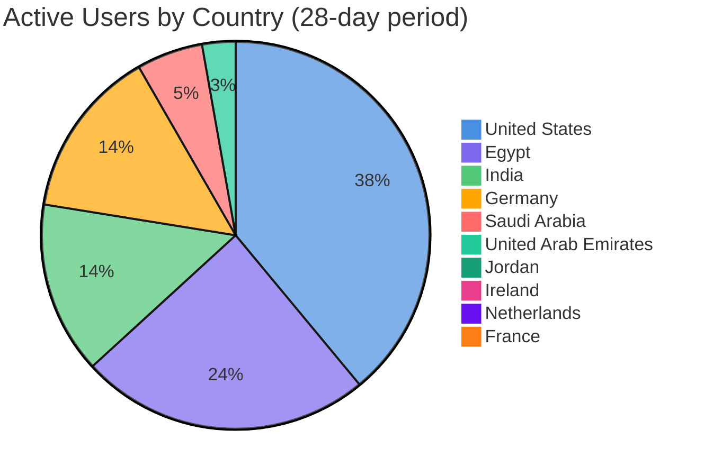

# 📊 User Analytics

SHAFT Engine continues to grow globally, serving automation engineers across multiple continents.

## 28-Day Active Users: 41,511 (+1,990 ↑ 5.04%)

### Geographic Distribution

### Detailed Breakdown

| Country | Active Users | Change | Growth Rate |
|---------|--------------|--------|-------------|
| 🇺🇸 United States | 15,882 | +189 | ↑ 1.2% |
| 🇪🇬 Egypt | 9,860 | +356 | ↑ 3.75% |
| 🇮🇳 India | 5,846 | +942 | ↑ 19.21% |
| 🇩🇪 Germany | 5,766 | +814 | ↑ 16.44% |
| 🇸🇦 Saudi Arabia | 2,248 | +176 | ↑ 8.49% |
| 🇦🇪 United Arab Emirates | 1,133 | -729 | ↓ 39.15% |
| 🇯🇴 Jordan | 341 | -61 | ↓ 15.17% |
| 🇮🇪 Ireland | 301 | +153 | ↑ 103.38% |
| 🇳🇱 Netherlands | 145 | +120 | ↑ 480.0% |
| 🇫🇷 France | 44 | +44 | New! 🎉 |

### Key Insights

- **Total Growth**: 5.04% increase in 28-day active users
- **Top Market**: United States leads with 38.3% of total users
- **Fastest Growing**: Netherlands shows exceptional growth at 480%
- **New Market**: France joined our user community this period
- **Strong MENA Presence**: Egypt and Saudi Arabia remain key markets

### Regional Distribution

- **North America**: 38.3%
- **Africa/MENA**: 32.7%
- **Asia**: 14.1%
- **Europe**: 15.0%

---

*Data source: Google Analytics | Last updated: November 10, 2025*

[← Back to README](../README.md)
