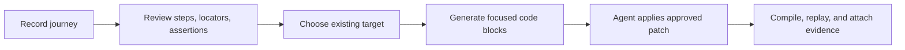

# Recorder Codegen Top 10 Implementation Plan

> **For agentic workers:** REQUIRED SUB-SKILL: Use superpowers:subagent-driven-development (recommended) or superpowers:executing-plans to implement this plan task-by-task. Steps use checkbox (`- [ ]`) syntax for tracking.

**Goal:** Make recorded browser, Playwright, and mobile journeys land in existing test suites with less manual cleanup and clearer risk evidence.

**Architecture:** Extend the current `shaft-capture` generation report, `shaft-mcp` code-block handoff, and IntelliJ workflow templates instead of adding a second recorder. Each enhancement returns deterministic review artifacts first; source edits remain agent-applied after user approval.

**Tech Stack:** Java 25, Maven, JUnit 5, SHAFT Capture, SHAFT MCP, IntelliJ plugin UI, Docusaurus guide docs.

---

## Kevin Plan



Acceptance target: each enhancement must reduce one repeated user decision after recording: where to paste code, which locator to trust, which assertion is missing, which fixture is required, or which evidence proves the generated flow is usable.

Risk rule: no enhancement may silently edit source, store secrets, or hide coordinate/locator fallback risk.

## Office-Hours Pressure Test

Demand reality: the plan targets repeated post-recording work already visible in Capture, MCP, IntelliJ, and guide handoffs: users must decide where code goes, which generated locator is trustworthy, what assertion is missing, and what evidence belongs in review.

Status quo: the current path is record, copy generated Java, manually inspect locators, manually choose insertion points, and manually collect screenshots or generated files for PR review.

Desperate specificity: the highest-friction user is an agent or developer trying to add a recorded flow to an existing SHAFT suite without accidentally editing the wrong file or leaking secret test data.

Narrowest wedge: start with deterministic review artifacts around existing record-at-target output, then add scanning, risk queues, and evidence manifests. Do not start with a new recorder or autonomous source-editing engine.

Observation plan: every implementation task must expose an artifact that reviewers can inspect in text or screenshots before source changes are applied.

Future fit: the same artifact-first contract scales across WebDriver, Playwright, and mobile because each backend can emit review blocks before any code patch is approved.

### Premises

1. Recorder/codegen pain is primarily a handoff problem, not a recording problem.
2. Reviewable artifacts are safer than automatic source edits for existing suites.
3. The right first implementation path reuses `shaft-capture`, `shaft-mcp`, and IntelliJ handoff surfaces instead of creating another generation pipeline.

### Alternatives

| Approach | Summary | Effort | Risk | Reuses |
| --- | --- | --- | --- | --- |
| A. Artifact-first increments | Add one review block or manifest per enhancement, landing each behind focused tests. | M | Low | Existing Capture reports, MCP code blocks, guide docs |
| B. Unified recorder workbench | Build a richer single workbench model that owns targeting, patch preview, replay, and evidence. | XL | Medium | Existing workbench HTML, Capture generation model |
| C. IDE-first assistant | Put most guidance into IntelliJ actions and labels, then backfill CLI/MCP parity later. | L | Medium | IntelliJ plugin UI, Assistant command templates |

Recommendation: choose Approach A because it gives users immediate, inspectable value while keeping source edits explicit and cross-backend contracts small.

## Top 10 Enhancements

| Rank | Enhancement | User value | Primary files |
| --- | --- | --- | --- |
| 1 | Patch preview for record-at-target | Shows the exact Java diff before an agent edits an existing Page Object or test. | `shaft-mcp/src/main/java/com/shaft/mcp/McpCaptureCodeBlockService.java`, `shaft-mcp/src/main/java/com/shaft/mcp/McpMobileRecordingService.java` |
| 2 | Existing-suite target scanner | Finds likely Page Objects, test classes, package names, and driver variables from a repository path. | `shaft-mcp/src/main/java/com/shaft/mcp`, `shaft-mcp/src/test/java/com/shaft/mcp` |
| 3 | Assertion gap checklist | Lists missing post-login, post-submit, navigation, and error-state assertions before code is copied. | `shaft-capture/src/main/java/com/shaft/capture/generate`, `shaft-mcp/src/main/java/com/shaft/mcp` |
| 4 | Locator confidence queue | Groups low-confidence locators, coordinate fallbacks, and multi-match candidates into a fix-first review list. | `shaft-capture/src/main/java/com/shaft/capture/generate`, `shaft-mcp/src/main/java/com/shaft/mcp/McpMobileRecordingService.java` |
| 5 | Fixture and secret handoff | Produces a compact required-data block for usernames, passwords, files, and environment variables. | `shaft-capture/src/main/java/com/shaft/capture/generate`, `shaft-mcp/src/test/java/com/shaft/mcp` |
| 6 | Flow grouping assistant | Converts explicit checkpoints and repeated page transitions into named helper-method proposals. | `shaft-capture/src/main/java/com/shaft/capture/generate`, `shaft-capture/src/test/java` |
| 7 | Replay failure back-links | Maps compile/replay failures to recording step ids and generated code blocks. | `shaft-capture/src/main/java/com/shaft/capture/generate`, `shaft-mcp/src/main/java/com/shaft/mcp` |
| 8 | Backend comparison blocks | Shows WebDriver, Playwright, and mobile output differences when a session can map to more than one backend. | `shaft-mcp/src/main/java/com/shaft/mcp/CaptureService.java`, `shaft-capture/src/main/java/com/shaft/capture/generate` |
| 9 | PR evidence pack | Emits a small manifest with screenshots, workbench HTML, generated source path, and validation commands. | `shaft-mcp/src/main/java/com/shaft/mcp`, `.github/pr-evidence` |
| 10 | Guided IDE action copy | Makes IntelliJ Guided/Recorder labels match the handoff: record, review, preview patch, apply, verify. | `shaft-intellij/src/main`, `modular-era-feature-catalog.md` |

## Bob Execution Tasks

### Task 1: Patch Preview For Record-At-Target

**Files:**
- Modify: `shaft-mcp/src/main/java/com/shaft/mcp/McpCaptureCodeBlockService.java`
- Modify: `shaft-mcp/src/main/java/com/shaft/mcp/McpMobileRecordingService.java`
- Test: `shaft-mcp/src/test/java/com/shaft/mcp/CaptureServiceTest.java`
- Test: `shaft-mcp/src/test/java/com/shaft/mcp/MobileRecordingServiceTest.java`

- [ ] **Step 1: Write failing tests**

Add assertions that `capture_record_at_target_code_blocks` and `mobile_record_at_target_code_blocks` return a `PATCH_PREVIEW` code block whose text includes target filename, insertion anchor, imports, locator fields, and action lines.

- [ ] **Step 2: Verify red**

Run:

```powershell
mvn -pl shaft-mcp -Dtest=CaptureServiceTest,MobileRecordingServiceTest test '-DheadlessExecution=true' '-Dgpg.skip'
```

Expected: fails because no `PATCH_PREVIEW` block exists.

- [ ] **Step 3: Implement minimal block generation**

Reuse the existing target insertion context and emit one additional block after the focused locator/action blocks. Do not edit the target source file.

- [ ] **Step 4: Verify green**

Run the same Maven command. Expected: exit code 0.

### Task 2: Existing-Suite Target Scanner

**Files:**
- Create: `shaft-mcp/src/main/java/com/shaft/mcp/McpJavaTargetScanner.java`
- Modify: `shaft-mcp/src/main/java/com/shaft/mcp/CaptureService.java`
- Modify: `shaft-mcp/src/test/resources/fixtures/mcp-tool-manifest.json`
- Test: `shaft-mcp/src/test/java/com/shaft/mcp/CaptureServiceTest.java`

- [ ] **Step 1: Write failing test**

Add a temp Java test class and Page Object, then assert a new `capture_target_candidates` tool returns package, class, likely driver variable, and insertion anchors.

- [ ] **Step 2: Verify red**

Run:

```powershell
mvn -pl shaft-mcp -Dtest=CaptureServiceTest test '-DheadlessExecution=true' '-Dgpg.skip'
```

Expected: fails because `capture_target_candidates` is absent.

- [ ] **Step 3: Implement scanner**

Scan only workspace-contained `.java` files, prefer classes containing `SHAFT.GUI.WebDriver`, and return bounded candidate metadata. Use `Files.walk` with a depth cap and no source edits.

- [ ] **Step 4: Verify manifest and test**

Run:

```powershell
py -3 scripts/ci/validate_shaft_mcp_configuration.py
mvn -pl shaft-mcp -Dtest=CaptureServiceTest test '-DheadlessExecution=true' '-Dgpg.skip'
```

### Task 3: Assertion Gap Checklist

**Files:**
- Modify: `shaft-capture/src/main/java/com/shaft/capture/generate/CaptureReviewAnalyzer.java`
- Modify: `shaft-mcp/src/main/java/com/shaft/mcp/McpCaptureCodeBlockService.java`
- Test: `shaft-mcp/src/test/java/com/shaft/mcp/CaptureServiceTest.java`

- [ ] **Step 1: Write failing test**

Create a session with navigation and submit-like click but no verification. Assert returned code blocks include an `ASSERTION` checklist with concrete suggested assertion targets.

- [ ] **Step 2: Verify red**

Run:

```powershell
mvn -pl shaft-mcp -Dtest=CaptureServiceTest test '-DheadlessExecution=true' '-Dgpg.skip'
```

- [ ] **Step 3: Implement checklist from existing review warnings**

Promote existing deterministic review warnings into a copyable block. Keep suggestions advisory; do not generate false assertions.

- [ ] **Step 4: Verify green**

Run the same focused test.

### Task 4: Locator Confidence Queue

**Files:**
- Modify: `shaft-capture/src/main/java/com/shaft/capture/generate/CaptureReviewAnalyzer.java`
- Modify: `shaft-mcp/src/main/java/com/shaft/mcp/McpMobileRecordingService.java`
- Test: `shaft-mcp/src/test/java/com/shaft/mcp/MobileRecordingServiceTest.java`

- [ ] **Step 1: Write failing test**

Record coordinate fallback and weak XPath actions. Assert a locator review block groups risky entries by step id and recommended fix.

- [ ] **Step 2: Verify red**

Run:

```powershell
mvn -pl shaft-mcp -Dtest=MobileRecordingServiceTest test '-DheadlessExecution=true' '-Dgpg.skip'
```

- [ ] **Step 3: Implement queue**

Reuse existing warnings and locator candidates. Output sorted text only; no new locator ranking engine.

- [ ] **Step 4: Verify green**

Run the same focused test.

### Task 5: Fixture And Secret Handoff

**Files:**
- Modify: `shaft-capture/src/main/java/com/shaft/capture/generate/ExternalTestDataWriter.java`
- Modify: `shaft-mcp/src/main/java/com/shaft/mcp/McpCaptureCodeBlockService.java`
- Test: `shaft-mcp/src/test/java/com/shaft/mcp/CaptureServiceTest.java`

- [ ] **Step 1: Write failing test**

Use a session with redacted typed value and upload metadata. Assert a required-data block lists environment variables, fixture names, and unresolved replacements.

- [ ] **Step 2: Verify red**

Run:

```powershell
mvn -pl shaft-mcp -Dtest=CaptureServiceTest test '-DheadlessExecution=true' '-Dgpg.skip'
```

- [ ] **Step 3: Implement handoff block**

Read generation report data already produced by Capture. Never include original secret values.

- [ ] **Step 4: Verify green**

Run the same focused test.

### Task 6: Flow Grouping Assistant

**Files:**
- Modify: `shaft-capture/src/main/java/com/shaft/capture/generate/CaptureGenerator.java`
- Modify: `shaft-capture/src/test/java`
- Test: `shaft-mcp/src/test/java/com/shaft/mcp/CaptureServiceTest.java`

- [ ] **Step 1: Write failing test**

Create a session with `FLOW_START` and `FLOW_END` checkpoints plus repeated navigation groups. Assert generated report names helper proposals and keeps unapproved repeated groups advisory.

- [ ] **Step 2: Verify red**

Run:

```powershell
mvn -pl shaft-capture,shaft-mcp -Dtest=CaptureServiceTest test '-DheadlessExecution=true' '-Dgpg.skip'
```

- [ ] **Step 3: Implement explicit-first grouping**

Use checkpoint descriptions for generated helper names. Leave repeated groups as review warnings until approved.

- [ ] **Step 4: Verify green**

Run the same command.

### Task 7: Replay Failure Back-Links

**Files:**
- Modify: `shaft-capture/src/main/java/com/shaft/capture/generate/CaptureGenerationReport.java`
- Modify: `shaft-capture/src/main/java/com/shaft/capture/generate/CaptureGenerator.java`
- Test: `shaft-capture/src/test/java`

- [ ] **Step 1: Write failing test**

Force a replay failure in a generated session test and assert the report includes recording event id, generated line hint, and failing action category.

- [ ] **Step 2: Verify red**

Run:

```powershell
mvn -pl shaft-capture -Dtest=CaptureGeneratedReplayTest test '-DheadlessExecution=true' '-Dgpg.skip'
```

- [ ] **Step 3: Implement report mapping**

Attach failure metadata to the existing report. Do not parse stack traces beyond bounded line/class matching.

- [ ] **Step 4: Verify green**

Run the same focused test.

### Task 8: Backend Comparison Blocks

**Files:**
- Modify: `shaft-mcp/src/main/java/com/shaft/mcp/CaptureService.java`
- Test: `shaft-mcp/src/test/java/com/shaft/mcp/CaptureServiceTest.java`

- [ ] **Step 1: Write failing test**

Assert a comparison tool returns WebDriver and Playwright block ids for a shared fixture session and marks unsupported mappings.

- [ ] **Step 2: Verify red**

Run:

```powershell
mvn -pl shaft-mcp -Dtest=CaptureServiceTest test '-DheadlessExecution=true' '-Dgpg.skip'
```

- [ ] **Step 3: Implement by composing existing generators**

Call existing WebDriver and Playwright generation paths. Avoid a new backend abstraction.

- [ ] **Step 4: Verify green**

Run the same focused test.

### Task 9: PR Evidence Pack

**Files:**
- Create: `shaft-mcp/src/main/java/com/shaft/mcp/McpEvidencePack.java`
- Modify: `shaft-mcp/src/main/java/com/shaft/mcp/CaptureService.java`
- Test: `shaft-mcp/src/test/java/com/shaft/mcp/CaptureServiceTest.java`

- [ ] **Step 1: Write failing test**

Assert `capture_evidence_pack` returns a manifest with source, report, review UI, screenshots, and validation commands when those files exist inside the workspace.

- [ ] **Step 2: Verify red**

Run:

```powershell
mvn -pl shaft-mcp -Dtest=CaptureServiceTest test '-DheadlessExecution=true' '-Dgpg.skip'
```

- [ ] **Step 3: Implement manifest-only pack**

Return paths and suggested copy commands. Do not zip or upload artifacts from the MCP server.

- [ ] **Step 4: Verify green**

Run the same focused test plus `py -3 scripts/ci/validate_shaft_mcp_configuration.py`.

### Task 10: Guided IDE Action Copy

**Files:**
- Modify: `shaft-intellij/src/main`
- Modify: `modular-era-feature-catalog.md`
- Test: IntelliJ screenshot renderer test for affected panels

- [ ] **Step 1: Write failing UI assertion**

Assert Guided/Recorder labels include the sequence `Record`, `Review code`, `Preview patch`, `Apply`, and `Verify` where the workflow supports source insertion.

- [ ] **Step 2: Verify red**

Run the smallest IntelliJ plugin UI test that renders workflow text.

- [ ] **Step 3: Update labels only**

Change visible copy and descriptions; do not add new plugin state until the MCP blocks exist.

- [ ] **Step 4: Verify green and capture screenshots**

Run the same UI test with `-Dshaft.intellij.screenshotDir=.github/pr-evidence/recorder-codegen-top10`.

## Bruce Check

- Smallest meaningful check for Java tasks: affected `shaft-mcp` or `shaft-capture` tests with `-DheadlessExecution=true -Dgpg.skip`.
- Contract check for tool changes: `py -3 scripts/ci/validate_shaft_mcp_configuration.py`.
- Transport safety before release-facing claims: package `shaft-mcp`, copy runtime dependencies, then `py -3 scripts/ci/validate_shaft_mcp_transports.py`.
- Docs check: `py -3 scripts/ci/validate_modular_documentation.py` in core and `npm run test:docs` in the guide.
- Evidence check: fresh screenshots in `.github/pr-evidence/recorder-codegen-top10` and linked from the PR body.
