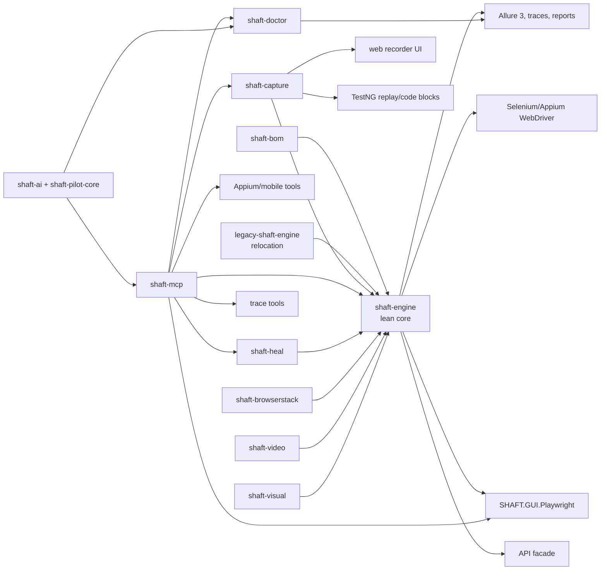
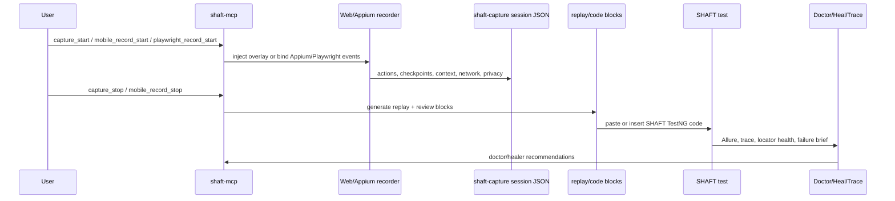

# SHAFT Modular-Era Feature Catalog

Baseline: `35d51c56289af07a4204cc52d2ee30e55be172e3` (`Shaft modularization (#2839)`)
Catalog source: current `origin/main` at `1a46183035db474e872efb5f340c863f668cfafd`
Fresh evidence captured: `2026-06-27`

## Runtime Screenshots


## Relationship Map






## Evidence Images

| Image | Source |
| --- | --- |
|  | Current reactor POMs and module descriptions. |
|  | Current `shaft-mcp` tool manifest and runtime tool families. |
|  | Current `CodegenFeatureCatalog.java` with 40 capture/codegen capabilities. |
|  | Current Playwright facade and MCP tool surface. |
|  | Current Doctor, Heal, and Trace tools. |
|  | Current API, contract, reporting, and observability APIs. |

## Feature Inventory

| Area | New feature | Evidence | Current command or code sample |
| --- | --- | --- | --- |
| Modular core | Reactor split into `shaft-engine`, optional modules, aggregate reports, BOM, and relocation POM. |  | `mvn -pl shaft-engine -am package '-DskipTests'` |
| Modular core | Lean core keeps BrowserStack, video, visual, AI, Doctor, Heal, and Capture as opt-in modules. |  | `rg "shaft-video|shaft-visual|shaft-browserstack|shaft-ai|shaft-heal" shaft-engine/pom.xml` |
| Modular core | Consumer fixture validates combined optional-module usage. |  | `mvn -f tools/modularization/consumer-fixtures/combined-modules/pom.xml test '-DskipTests'` |
| Modular core | BOM and legacy relocation preserve consumer upgrade paths. |  | `rg "shaft-bom|relocation" shaft-bom legacy-shaft-engine -g pom.xml` |
| `shaft-mcp` | MCP server integrated into reactor, release lifecycle, Docker image, Smithery config, stdio, and HTTP transport. |  | `java -cp "shaft-mcp\target\shaft-mcp-10.2.20260623.jar;shaft-mcp\target\dependency\*" com.shaft.mcp.ShaftMcpApplication --spring.profiles.active=http --server.port=8093` |
| `shaft-mcp` | Local installers for Codex, Claude, Claude Desktop, Copilot, and Copilot IntelliJ. |  | `py -3 scripts/mcp/install_shaft_mcp.py --target codex --version 10.2.20260623` |
| `shaft-mcp` | Transport validation for stdio and HTTP JSON-RPC protocol `2025-03-26`. |  | `py -3 scripts/ci/validate_shaft_mcp_transports.py` |
| MCP WebDriver | Browser and element tools for Selenium/Appium WebDriver sessions. |  | `driver_initialize -> browser_navigate -> element_click -> browser_take_screenshot -> driver_quit` |
| MCP Playwright | Playwright tools for browser, element, recording, replay, and screenshots. |  | `playwright_initialize -> playwright_browser_navigate -> playwright_record_start -> playwright_recording_code_blocks` |
| MCP semantic/natural | Semantic Playwright element tools, guide search, scenario catalog, guardrail checks, and `natural_act`. |  | `shaft_guide_search`, `test_automation_scenarios`, `test_code_guardrails_check`, `natural_act` |
| MCP mobile | Native Appium, mobile web emulation, contexts, accessibility tree, screenshots, gestures, rotation, keyboard, app backgrounding. |  | `mobile_initialize_native -> mobile_get_contexts -> mobile_take_screenshot -> mobile_tap_coordinates` |
| MCP mobile | Toolchain diagnostics for Appium, Inspector plugin, adb, emulator, sdkmanager, avdmanager, and iOS/macOS readiness. |  | `mobile_toolchain_status` |
| MCP mobile | Wrapped Appium Inspector recording plan/start/status/control/stop tools. |  | `mobile_inspector_record_prepare -> mobile_inspector_record_start -> mobile_inspector_record_stop` |
| MCP mobile | Fresh Android emulator recording through current mobile MCP tools. |  | `mobile_record_start -> mobile_tap_coordinates -> mobile_swipe_coordinates -> mobile_recording_code_blocks` |
| Android setup | SHAFT-managed Android command-line tools, SDK packages, AVD, Appium 3.5.2, UiAutomator2 7.6.2, Inspector plugin 2026.5.1. |  | `sdkmanager.bat --sdk_root=C:\Users\Mohab\android-tools 'platform-tools' 'emulator' 'platforms;android-36' 'system-images;android-36;google_apis;x86_64'` |
| Capture | Deterministic capture session model, JSON codec, storage, privacy, checkpoints, incomplete-session recovery. |  | `capture_start -> capture_checkpoint -> capture_status -> capture_stop` |
| Capture | Managed browser recorder overlay with pause, assert/verify modes, copy, clear, edit, locator picker, and readiness score. |  | `capture_start --url https://example.com --browser chrome --output target/capture/session.json` |
| Capture | TestNG generation, replay snippets, Page Object insertion, and review warnings. |  | `capture_generate_replay --session target/capture/session.json --target-source src/test/java/CheckoutTest.java` |
| Capture | Assertion mode for visibility, text, and value checkpoints. |  | `capture_checkpoint --description "cart total is visible"` |
| Capture | Fallback locator replay and live locator picker/refinement. |  | `capture_code_blocks --session target/capture/session.json --driver-variable-name driver` |
| Capture | Flow segmentation, record-at-cursor snippets, and control-flow suggestions. |  | `capture_start_codegen --url https://example.com --target-source src/test/java/CheckoutTest.java` |
| Capture | Native emulation and browser context flags: viewport, device, color scheme, geo, lang, timezone, storage, user data dir, HTTPS, HAR, proxy. |  | `capture start --url https://example.com --device "Pixel 5" --timezone Africa/Cairo --save-har target/capture/run.har` |
| Playwright | `SHAFT.GUI.Playwright` backend added beside WebDriver under the shared GUI driver facade. |  | `SHAFT.GUI.Playwright driver = new SHAFT.GUI.Playwright(); driver.browser().navigateToURL("https://example.com");` |
| Playwright | Browser, element, assertions, verifications, tracing, contract replay, and natural action executor support. |  | `driver.element().click(By.id("submit")); driver.assertThat().browser().title().contains("Example");` |
| Playwright | Visual validation and parity pack across browser actions, validations, recording metadata, and MCP code blocks. |  | `playwright_capture_code_blocks`, `playwright_replay_recording`, `playwright_doctor_suggest_fix` |
| Browser | Browser network interception builder, mock/assert/verify responses, offline mode, throttling, and resource blocking. |  | `driver.browser().interceptRequest().get().urlContains("/api/users").respond().statusCode(200).perform();` |
| Browser | API and browser auth-state bridge. |  | `driver.browser().startRecordingContract("src/test/resources/contracts/checkout.json", "/api");` |
| Browser/mobile | UI state wait timeout, touch end-scroll, image invisibility waits, Appium recursion fallback, and mobile trace enrichment. |  | `SHAFT.Properties.timeouts.set().waitForUiStateTimeout(600); driver.touch().swipeToEndOfView(TouchActions.SwipeDirection.DOWN);` |
| API | GraphQL builder facade on `SHAFT.API`. |  | `api.sendGraphQlRequest("/graphql", "query { viewer { id } }").perform();` |
| API | Request retry policies with transient defaults, custom status codes, fixed/exponential/jittered backoff, and non-idempotent opt-in. |  | `api.get("/health").withRetry(RetryPolicy.transientFailures().maxAttempts(3)).perform();` |
| API | Typed JSON response mapping to classes, records, lists, and Jackson `TypeReference`. |  | `User user = api.get("/users/1").perform().getResponseAs(User.class);` |
| API | OpenAPI coverage reporting with threshold failure at lifecycle end. |  | `SHAFT.Properties.api.set().openApiCoverageReportEnabled(true).swaggerValidationUrl("openapi.yaml");` |
| Contracts | HTTP contract recording and assert/verify replay for browser and API traffic. |  | `SHAFT.Contracts.startRecording("src/test/resources/contracts/checkout.json", "/api/checkout");` |
| Doctor | Deterministic failed-test analysis, evidence bundle parsing, root-cause categories, and local CLI. |  | `doctor analyze --input allure-results --output-dir target/shaft-doctor` |
| Doctor | Optional AI-assisted advisory flow with reviewed repair workflows and draft PR publishing guardrails. |  | `doctor propose-fix --analysis target/shaft-doctor/doctor-report.json --output-dir target/shaft-doctor` |
| Heal | Deterministic locator recovery module with explainable decisions, reports, Selenium/Appium support, and MCP healer tools. |  | `healer_run_failed_test`, `playwright_healer_run_failed_test`, `ShaftHeal.lastReport()` |
| Trace | Structured Selenium trace archive, trace-ready browser observability, actionability diagnostics, network/console/native metadata, and MCP trace tools. |  | `trace_latest -> trace_read -> trace_summarize -> doctor_analyze_trace` |
| Reporting | Failure trace viewer, diagnostics bundle, Allure failure briefs, full log attachments, and standardized HTML report UI. |  | `SHAFT.Properties.reporting.set().traceEnabled(true).traceMode("failure");` |
| Reporting | Locator health dashboard and scoring with warn/fail thresholds and healing metrics. |  | `SHAFT.Properties.reporting.set().locatorHealthEnabled(true).locatorHealthWarnBelowScore(80);` |
| Reporting | Flake profiler, evidence level profiles, Allure 3 usability/theme, console summary/progress styling. |  | `SHAFT.Properties.reporting.set().evidenceLevel("BALANCED");` |
| Reporting | Animated GIF generation optimization, visual attachment fixes, screenshot/log metadata cleanup, and lean assertion/action reporting. |  | `mvn -pl shaft-engine -am package '-DskipTests' '-Dallure.automaticallyOpen=false'` |
| Remote/grid | Remote WebDriver timeout, Selenium Grid preflight, remote session diagnostics, remote video attachment, and BrowserStack app capability handling. |  | `SHAFT.Properties.timeouts.set().waitForRemoteServerToBeUp(true);` |
| CLI/terminal | Reusable SSH terminal sessions, verbose streaming, SFTP upload/download, SSH port forwarding, env vars, keep-alive packets, and command log redaction. |  | `SHAFT.CLI.remoteTerminal(host, 22, user, keyFolder, keyName, true);` |
| Optional modules | `shaft-browserstack`, `shaft-video`, and `shaft-visual` publish as opt-in artifacts. |  | `mvn -pl shaft-browserstack,shaft-video,shaft-visual -am package '-DskipTests'` |
| AI/Pilot | Provider-neutral `shaft-pilot-core`, optional `shaft-ai`, deterministic artifacts, trust-gated natural actions, and provider conformance. |  | `natural_act`, `doctor_suggest_fix`, `playwright_doctor_suggest_fix` |
| Release/devex | Release guards, modular upgrader coverage, MCP runtime path fixes, MCP generated-code guardrails, docs consolidation, and graph/memory assets. |  | `py -3 scripts/ci/validate_agent_setup.py` |

## Fresh Capture Commands

```powershell
# Built current remote/main code used by the MCP server.
mvn -pl shaft-mcp -am package '-DskipTests' '-Dallure.automaticallyOpen=false' '-Dallure.open=false'
mvn -pl shaft-mcp dependency:copy-dependencies '-DincludeScope=runtime' '-Dallure.automaticallyOpen=false' '-Dallure.open=false'

# Started the current shaft-mcp HTTP server from the merged build.
java -cp "shaft-mcp\target\shaft-mcp-10.2.20260623.jar;shaft-mcp\target\dependency\*" com.shaft.mcp.ShaftMcpApplication --spring.profiles.active=http --server.port=8093
```

```powershell
# Installed Android SDK pieces used for the fresh emulator screenshot.
C:\Users\Mohab\android-tools\cmdline-tools\latest\bin\sdkmanager.bat --sdk_root=C:\Users\Mohab\android-tools `
  'platform-tools' 'emulator' 'platforms;android-36' 'system-images;android-36;google_apis;x86_64'

# Appium tool cache versions used by current SHAFT internal defaults.
appium@3.5.2
appium-uiautomator2-driver@7.6.2
appium-inspector-plugin@2026.5.1
```

```text
# Fresh Android recorder path used for android-recorder-working.png.
mobile_initialize_native(appiumServerUrl="http://127.0.0.1:4723", platformName="Android", deviceName="emulator-5554")
mobile_record_start(outputPath="target/shaft-evidence/mobile-mcp-android-updated.json")
mobile_tap_coordinates(x=540, y=360)
mobile_swipe_coordinates(startX=540, startY=1900, endX=540, endY=700, durationMillis=700)
mobile_tap_coordinates(x=500, y=1450)
mobile_take_screenshot(outputPath="shaft-engine/src/main/resources/modular-era-feature-catalog/android-emulator-device.png")
mobile_record_status() -> actionCount=3
mobile_recording_code_blocks(recordingPath="target/shaft-evidence/mobile-mcp-android-updated.json")

SHAFT fluent replay excerpt from the recorded actions:
driver.element().touch().tapByCoordinates(540, 360);
driver.element().touch().swipeByCoordinates(540, 1900, 540, 700, 700);
driver.element().touch().tapByCoordinates(500, 1450);
```

```text
# Web recorder path used for web-recorder.png.
Load current shaft-capture-recorder.js into a local fixture page.
Type email, select plan, type notes, toggle terms, submit.
Capture overlay state: RISKY | 8 events | Step 8 needs a follow-up assertion after form submission.
Generated replay syntax: driver.element().click(SHAFT.GUI.Locator.inputField("Username"));
```

## Current API Samples

```java
SHAFT.GUI.Playwright driver = new SHAFT.GUI.Playwright();
driver.browser().navigateToURL("https://example.com");
driver.element().click(By.id("submit"));
driver.assertThat().browser().title().contains("Example");
driver.quit();
```

```java
driver.browser()
      .interceptRequest()
      .get()
      .urlContains("/api/users")
      .respond()
      .statusCode(200)
      .jsonBody("{\"ok\":true}")
      .perform();
driver.browser().throttleNetwork(250, 64, 32);
driver.browser().blockNetworkResources("*.png", "*.jpg");
```

```java
SHAFT.Contracts.startRecording("src/test/resources/contracts/checkout.json", "/api/checkout");
api.post("/api/checkout").setRequestBody(order).perform();
SHAFT.Contracts.stopRecording();

SHAFT.Contracts.startAssertMode("src/test/resources/contracts/checkout.json");
api.post("/api/checkout").setRequestBody(order).perform();
SHAFT.Contracts.stopValidation();
```

```java
api.sendGraphQlRequest("/graphql", "query { viewer { id } }").perform();

api.get("/health")
   .withRetry(RetryPolicy.transientFailures().maxAttempts(3))
   .perform();

User user = api.get("/users/1").perform().getResponseAs(User.class);
```

```java
SHAFT.Properties.reporting.set()
        .evidenceLevel("BALANCED")
        .locatorHealthEnabled(true)
        .locatorHealthWarnBelowScore(80)
        .traceEnabled(true)
        .traceMode("failure");
```
