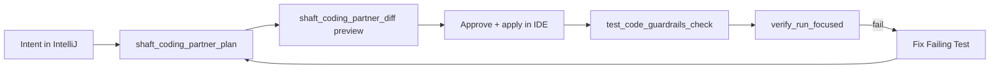
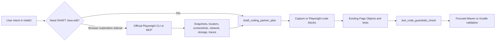
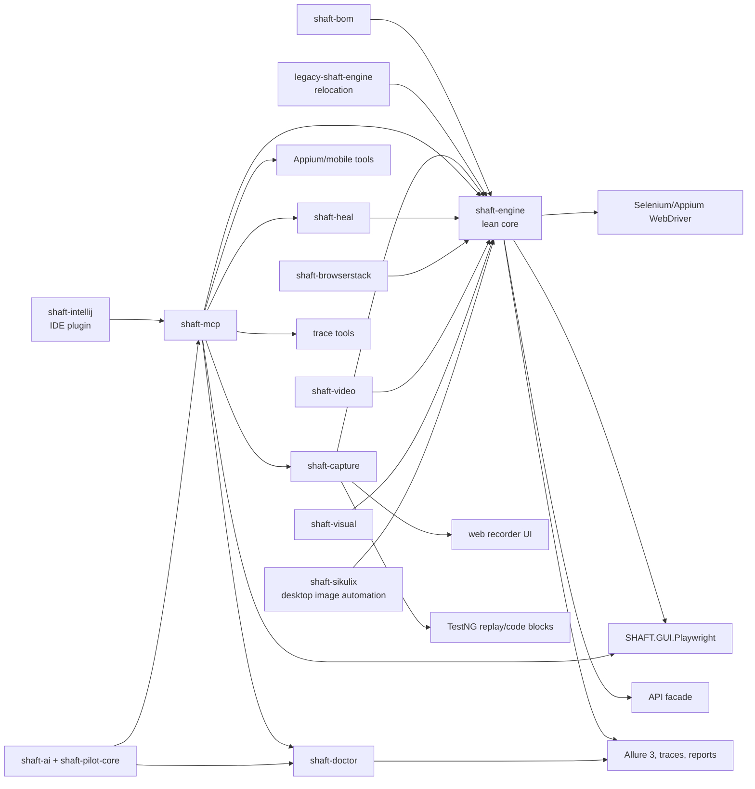
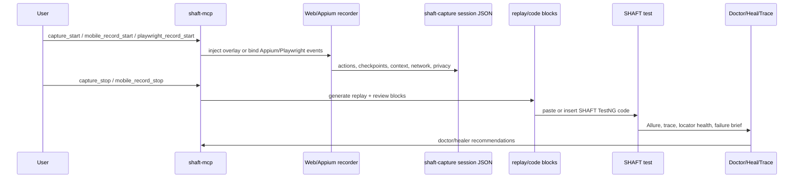
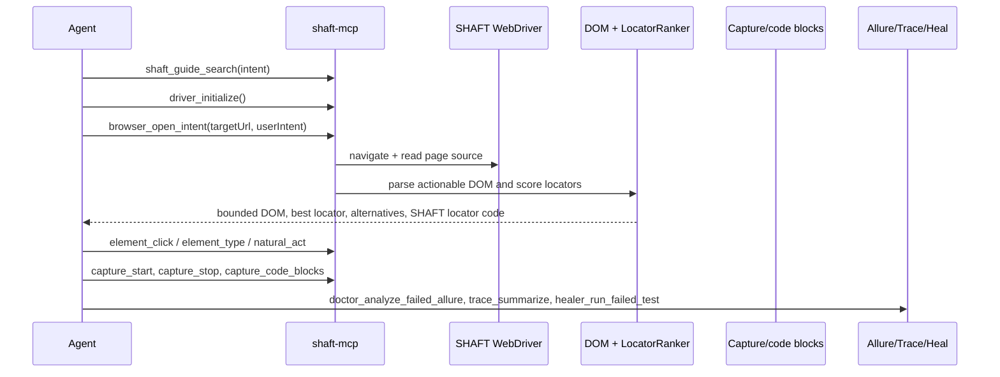
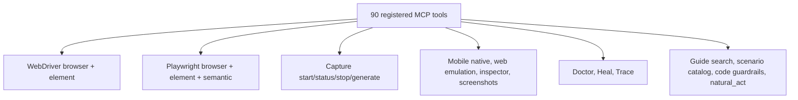

# SHAFT Modular-Era Feature Catalog

SHAFT is now a modular Java 25 automation framework with a lean core, opt-in power modules, and evidence-first tooling for browser, mobile, API, Playwright, MCP, IntelliJ IDEA, SikuliX desktop image automation, capture, reporting, diagnosis, and healing.

This catalog is written for framework users who want to know what they can adopt
now, and which command or API gets them started.

For the release-by-release history behind these capabilities, see the
[GitHub releases](https://github.com/ShaftHQ/SHAFT_ENGINE/releases). For
installation, configuration, and full API reference, see the
[user guide](https://shafthq.github.io/docs/start/overview).

Screenshots in this catalog are real repository evidence under
`shaft-engine/src/main/resources/modular-era-feature-catalog/`, shown beside the
feature each one proves.

## Start Here

| If you need to... | Start with... | Why it matters |
| --- | --- | --- |
| Upgrade without pulling every optional integration into the core artifact. | [Modular adoption](#modular-adoption) | `shaft-engine` stays lean while BrowserStack, visual, video, AI, Doctor, Heal, and Capture remain available as opt-in modules. |
| Let an agent inspect pages, choose locators, record flows, and review generated code. | [MCP and agent workflows](#mcp-and-agent-workflows) | `shaft-mcp` exposes WebDriver, Playwright, mobile, capture, Doctor, Heal, Trace, guide search, and guardrail tools through one automation surface. |
| Use SHAFT workflows inside IntelliJ IDEA. | [IntelliJ IDEA plugin](#intellij-idea-plugin) | The stable plugin is the front door for coding-partner work: Assistant and Guided collect intent, current source, selected text, and evidence before MCP plans reuse and verification. |
| Turn exploratory browser or mobile sessions into maintainable Java tests. | [Capture and code generation](#capture-and-code-generation) | Recorder sessions preserve actions, checkpoints, locators, context, privacy, and replay snippets. |
| Make Android/Appium setup and recording less coordinate-driven. | [Mobile automation](#mobile-automation) | Toolchain diagnostics and locator-first Inspector recording show the exact device, locator, and fallback state. |
| Debug failed tests from evidence instead of guessing. | [Doctor, Heal, Trace, and reporting](#doctor-heal-trace-and-reporting) | Failure briefs, traces, locator health, healing decisions, and report UI give a shorter path from failure to fix. |
| Configure browser, mobile, reporting, healing, AI, or test-run behavior. | [Properties](#properties) | One source-derived table for typed properties, defaults, and bundled property files. |

## What Changed

| Area | What you can adopt now | Proof |
| --- | --- | --- |
| Lean modular core | Adopt the core engine first, then add BrowserStack, visual, video, SikuliX desktop image automation, AI, Doctor, Heal, Capture, or MCP only when a project needs them. | `module-map.png` |
| MCP automation surface | Drive WebDriver, Playwright, mobile, recording, coding-partner planning, guide search, generated-code review, evidence manifests, and failure triage through one local server. | `mcp-tools.png` |
| IntelliJ IDEA plugin | First-run setup is a four-step click-through (pick agent, copy command, run in terminal, check setup). Assistant and Guided then plan repository-aware work from intent, current source, selected code, and evidence before codegen starts. | `intellij-plugin-mcp-setup.png`, `intellij-plugin-assistant.png` |
| Recorder-to-code workflow | Capture real user actions, preserve edited step intent and checkpoints, plan reuse with `shaft_coding_partner_plan`, then generate TestNG replay snippets, review blocks, patch previews, evidence manifests, and Page Object insertions. | `web-recorder.png`, `capture-catalog.png` |
| Locator-first mobile recording | Resolve Appium Inspector pointer gestures through the accessibility tree, then generate ranked locator inventories, Page Object drafts, and record-at-target snippets before using coordinate fallback. | `android-recorder-working.png`, `android-recorder-locator-details.png` |
| Evidence-led failure work | Combine Allure failure briefs, traces, locator health, healing reports, and optional reviewed AI advice. | `doctor-heal-trace.png`, `api-reporting.png` |
| SikuliX desktop automation | `shaft-sikulix` owns the `com.sikulix:sikulixapi` dependency, keeping image-based desktop flows out of the lean engine artifact. | `module-map.png` |

Release-by-release detail, including the issue numbers behind each change, lives
in the [GitHub releases](https://github.com/ShaftHQ/SHAFT_ENGINE/releases).

## Generated-Code Locator Policy

Every SHAFT code generator — `capture_target_candidates`, `capture_pick_locator`,
`test_plan_explore`, `capture_code_blocks`, and `capture_generate_replay` — picks
locators in strict tier order:

1. A unique, stable, author-written id: `hasAnyTagName().hasId(...)`.
2. An ARIA-role locator: `hasRole(...)`.
3. A self-verified, non-absolute `By.xpath(...)`, and only when the element has
   neither of the above.

Anything else is refused rather than emitted. Generators never produce
`SHAFT.GUI.Locator.xpath(...)`, the raw `id`/`name`/`cssSelector`/`className`/
`tagName(...)` factories, or a Smart Locator (`inputField`/`clickableField`).

## Coding Partner Workflow

The recorder/codegen handoff is a review loop, not a one-shot generator: plan the
working set and user steps, reuse the recommended Java owner and insertion
anchor, avoid duplicate locators/actions/classes, inspect the patch preview,
collect evidence, then verify locally.

The public entry point is IntelliJ, not raw MCP: Assistant `/partner` and Guided
`Plan coding partner` gather the IDE context, then MCP returns the reuse plan,
reviewed code blocks, and a focused verification command.


```mermaid
flowchart LR
    Intent[Intent in IntelliJ] --> Plan[shaft_coding_partner_plan]
    Plan --> Diff[shaft_coding_partner_diff preview]
    Diff --> Apply[Approve + apply in IDE]
    Apply --> Guard[test_code_guardrails_check]
    Guard --> Verify[verify_run_focused]
    Verify -->|fail| Triage[Fix Failing Test]
    Triage --> Plan
```

| Step | Tool | What you get |
| --- | --- | --- |
| Plan | `shaft_coding_partner_plan` | `workingSetSummary`, a `stepPlan`, `reuseMatches` versus `missingCodeItems`, plus `recommendedTargetSourcePath` and `recommendedInsertionAnchor`, so agents extend existing owners instead of creating new page objects. |
| Preview | `shaft_coding_partner_diff` | A unified diff against an existing Java target and anchor, without writing files. |
| Guard | `test_code_guardrails_check` | Runs SHAFT guardrails over generated code before it is applied. |
| Verify | `verify_run_focused` | Runs the plan's smallest Maven verification command headlessly and returns a bounded pass/fail summary. |
| Triage | `Fix Failing Test` | Routes Allure/trace evidence and locator source back into the plan, closing the analyze, plan, verify loop. |

The Assistant shows five core commands by default — `/record-web`,
`/record-mobile`, `/codegen`, `/doctor`, and `/upgrade`. Everything else,
including `/verify` and `/skills`, sits behind Expert mode. Natural-language
intents work in both modes.

## Modular Adoption

Use the new reactor split when you want SHAFT as a framework base, not a monolith. `shaft-engine` remains the center. Optional modules publish independently, the BOM keeps dependency alignment boring, and `legacy-shaft-engine` preserves the relocation path for existing consumers.

| Capability | What changed | Try it |
| --- | --- | --- |
| Lean core | `shaft-engine` contains the core WebDriver/Appium, API, and reporting surfaces without forcing every optional integration into the same artifact. | `mvn -pl shaft-engine -am package '-DskipTests'` |
| Optional modules | BrowserStack, video, visual, SikuliX, AI, Doctor, Heal, and Capture are opt-in modules. | `mvn -pl shaft-browserstack,shaft-video,shaft-visual,shaft-sikulix -am package '-DskipTests'` |
| Desktop image automation | `shaft-sikulix` owns the `com.sikulix:sikulixapi` dependency and keeps image-based desktop automation out of the lean engine artifact. | `mvn -f tools/modularization/consumer-fixtures/sikulix/pom.xml test '-DskipTests'` |
| Upgrade path | `shaft-bom` and `legacy-shaft-engine` keep dependency alignment and relocation explicit. | `rg "shaft-bom|relocation" shaft-bom legacy-shaft-engine -g pom.xml` |
| Consumer fixture | A combined-module fixture validates that optional modules can be consumed together. | `mvn -f tools/modularization/consumer-fixtures/combined-modules/pom.xml test '-DskipTests'` |


## Properties

The property surface is easiest to use from a small project file. Read a value through `SHAFT.Properties`; override it in `src/main/resources/properties/custom.properties` or with a system property.

```java
SHAFT.Properties.web.targetBrowserName();
SHAFT.Properties.web.set().targetBrowserName("firefox").headlessExecution(true);
```

```properties
targetBrowserName=firefox
headlessExecution=true
```

The typed interfaces are the complete `SHAFT.Properties` catalog. The `Default` column uses the bundled file when that file supplies the key, otherwise the interface `@DefaultValue`. `(blank)` means an empty string. Credential-shaped defaults are intentionally redacted; provide them through secure project configuration.

| Interface | What it controls |
| --- | --- |
| `API` | Swagger/OpenAPI validation, contract redaction lists, and coverage thresholds. |
| `Allure` | Allure generation, history, archive, theme, language, and grouping. |
| `BrowserStack` | BrowserStack desktop and native-mobile execution capabilities. |
| `Capture` | Optional API request/response capture limits and URL filters. |
| `Cucumber` | Cucumber execution, filtering, glue, plugins, and snippets. |
| `Flags` | Engine-wide execution switches for waits, retries, scrolling, clicks, and telemetry. |
| `Healenium` | Optional Healenium recovery service and score settings. |
| `Healing` | Optional SHAFT Heal strategy, confidence, evidence, history, visual, and AI controls. |
| `Internal` | Engine metadata and managed Allure/Appium/Android tool versions. |
| `Jira` | Jira/Xray reporting, authorization, and Allure link patterns. |
| `LambdaTest` | LambdaTest remote browser/mobile execution capabilities. |
| `Log4j` | Log4j appenders, layouts, logger names, and thresholds. |
| `Mobile` | Appium device, application, browser, Flutter, and native-session settings. |
| `NaturalActions` | Deterministic and optional provider-assisted natural-language GUI actions. |
| `Paths` | Project, artifact, download, cache, and service directories. |
| `Pattern` | Test-data column prefixes and Allure issue-link patterns. |
| `Performance` | Lighthouse and browser/API performance budgets. |
| `Pilot` | Optional AI provider, consent, budget, redaction, and endpoint controls. |
| `Platform` | Local/remote execution, operating system, proxies, BiDi, and preflight. |
| `Playwright` | Playwright browser, connection, timeout, artifact, download, and tracing settings. |
| `Reporting` | Evidence, diagnostics, traces, locator health, flake profiling, and report output. |
| `TestNG` | Parallel execution, verbosity, ordering, data-provider threads, and suite timeout. |
| `Timeouts` | Browser, UI, API, shell, SSH, Docker, database, and remote-server timeouts. |
| `Tinkey` | Google Tink keyset and KMS settings. |
| `Visuals` | Screenshots, visual thresholds, GIF/video capture, snapshots, and watermarking. |
| `Web` | Browser, headless, window, page-load, readiness, storage-state, and mobile emulation settings. |

### Complete typed property table

| Interface | Property | Type | Default |
| --- | --- | --- | --- |
| `Allure` | `allure.automaticallyOpen` | `boolean` | `true` |
| `Allure` | `allure.accumulateHistory` | `boolean` | `true` |
| `Allure` | `allure.accumulateReports` | `boolean` | `true` |
| `Allure` | `allure.cleanResultsDirectory` | `boolean` | `true` |
| `Allure` | `allure.generateArchive` | `boolean` | `false` |
| `Allure` | `allure.generateReport` | `boolean` | `true` |
| `Allure` | `allure.customLogo` | `String` | `https://github.com/ShaftHQ/SHAFT_ENGINE/blob/main/shaft-engine/src/main/resources/images/shaft_report_logo.png?raw=true` |
| `Allure` | `allure.customTitle` | `String` | `SHAFT-powered test report` |
| `Allure` | `allure.theme` | `String` | `auto` |
| `Allure` | `allure.forceConfiguredCliVersion` | `boolean` | `true` |
| `Allure` | `allure.realtimeMonitoring` | `boolean` | `false` |
| `Allure` | `allure.singleFile` | `boolean` | `true` |
| `Allure` | `allure.reportLanguage` | `String` | `en` |
| `Allure` | `allure.open` | `boolean` | `false` |
| `Allure` | `allure.groupBy` | `String` | `package,testClass` |
| `API` | `swagger.validation.enabled` | `boolean` | `false` |
| `API` | `swagger.validation.url` | `String` | `(blank)` |
| `API` | `openapi.coverage.report.enabled` | `boolean` | `false` |
| `API` | `openapi.coverage.threshold` | `int` | `0` |
| `API` | `shaft.contract.sensitiveKeys` | `String` | `authorization,cookie,set-cookie,password,passwd,secret,token,api-key,apikey,access-key,accesskey` |
| `API` | `shaft.contract.volatileKeys` | `String` | `requestId,traceId,spanId,sessionId,nonce,timestamp,createdAt,updatedAt,expiresAt,date,etag` |
| `BrowserStack` | `browserStack.userName` | `String` | `[redacted]` |
| `BrowserStack` | `browserStack.accessKey` | `String` | `[redacted]` |
| `BrowserStack` | `browserStack.platformVersion` | `String` | `(blank)` |
| `BrowserStack` | `browserStack.deviceName` | `String` | `(blank)` |
| `BrowserStack` | `browserStack.appUrl` | `String` | `(blank)` |
| `BrowserStack` | `browserStack.customID` | `String` | `(blank)` |
| `BrowserStack` | `browserStack.appName` | `String` | `(blank)` |
| `BrowserStack` | `browserStack.appRelativeFilePath` | `String` | `(blank)` |
| `BrowserStack` | `browserStack.osVersion` | `String` | `(blank)` |
| `BrowserStack` | `browserStack.browserVersion` | `String` | `(blank)` |
| `BrowserStack` | `browserStack.local` | `boolean` | `false` |
| `BrowserStack` | `browserStack.seleniumVersion` | `String` | `4.40.0` |
| `BrowserStack` | `browserStack.acceptInsecureCerts` | `boolean` | `true` |
| `BrowserStack` | `browserStack.debug` | `boolean` | `false` |
| `BrowserStack` | `browserStack.networkLogs` | `boolean` | `false` |
| `BrowserStack` | `browserStack.geoLocation` | `String` | `(blank)` |
| `BrowserStack` | `browserStack.appiumVersion` | `String` | `3.1.0` |
| `BrowserStack` | `browserStack.buildName` | `String` | `(blank)` |
| `BrowserStack` | `browserStack.projectName` | `String` | `(blank)` |
| `BrowserStack` | `browserStack.parallelsPerPlatform` | `int` | `1` |
| `BrowserStack` | `browserStack.browserstackAutomation` | `boolean` | `true` |
| `BrowserStack` | `browserStack.platformsList` | `String` | `(blank)` |
| `BrowserStack` | `browserStack.customBrowserStackYmlPath` | `String` | `(blank)` |
| `Capture` | `capture.api.enabled` | `boolean` | `false` |
| `Capture` | `capture.api.maxBodyBytes` | `int` | `1048576` |
| `Capture` | `capture.api.includeAssets` | `boolean` | `false` |
| `Capture` | `capture.api.firstPartyOnly` | `boolean` | `true` |
| `Capture` | `capture.api.storeSecretsLocally` | `boolean` | `false` |
| `Capture` | `capture.api.maxTransactions` | `int` | `500` |
| `Capture` | `capture.api.urlIncludeGlobs` | `String` | `(blank)` |
| `Capture` | `capture.api.urlExcludeGlobs` | `String` | `(blank)` |
| `Cucumber` | `cucumber.ansi-colors.disabled` | `boolean` | `false` |
| `Cucumber` | `cucumber.execution.dry-run` | `boolean` | `false` |
| `Cucumber` | `cucumber.execution.limit` | `String` | `(blank)` |
| `Cucumber` | `cucumber.execution.order` | `String` | `lexical` |
| `Cucumber` | `cucumber.execution.strict` | `boolean` | `true` |
| `Cucumber` | `cucumber.execution.wip` | `boolean` | `false` |
| `Cucumber` | `cucumber.features` | `String` | `src/test/resources` |
| `Cucumber` | `cucumber.filter.name` | `String` | `(blank)` |
| `Cucumber` | `cucumber.filter.tags` | `String` | `(blank)` |
| `Cucumber` | `cucumber.glue` | `String` | `customCucumberSteps, com.shaft.cucumber` |
| `Cucumber` | `cucumber.plugin` | `String` | `pretty, json:allure-results/cucumber.json, html:allure-results/cucumberReport.html, com.shaft.listeners.CucumberTestRunnerListener` |
| `Cucumber` | `cucumber.object-factory` | `String` | `(blank)` |
| `Cucumber` | `cucumber.snippet-type` | `String` | `underscore` |
| `Cucumber` | `cucumber.publish.quiet` | `boolean` | `true` |
| `Flags` | `automaticallyAddRecommendedChromeOptions` | `boolean` | `false` |
| `Flags` | `retryMaximumNumberOfAttempts` | `int` | `0` |
| `Flags` | `forceCaptureSupportingEvidenceOnRetry` | `boolean` | `true` |
| `Flags` | `autoMaximizeBrowserWindow` | `boolean` | `true` |
| `Flags` | `forceCheckForElementVisibility` | `boolean` | `true` |
| `Flags` | `forceCheckElementLocatorIsUnique` | `boolean` | `true` |
| `Flags` | `forceCheckTextWasTypedCorrectly` | `boolean` | `false` |
| `Flags` | `scrollingMode` | `String` | `javascript` |
| `Flags` | `clearBeforeTypingMode` | `String` | `native` |
| `Flags` | `forceCheckNavigationWasSuccessful` | `boolean` | `false` |
| `Flags` | `respectBuiltInWaitsInNativeMode` | `boolean` | `true` |
| `Flags` | `forceCheckStatusOfRemoteServer` | `boolean` | `false` |
| `Flags` | `clickUsingJavascriptWhenWebDriverClickFails` | `boolean` | `false` |
| `Flags` | `autoCloseDriverInstance` | `boolean` | `true` |
| `Flags` | `automaticallyAssertResponseStatusCode` | `boolean` | `true` |
| `Flags` | `maximumPerformanceMode` | `int` | `0` |
| `Flags` | `skipTestsWithLinkedIssues` | `boolean` | `false` |
| `Flags` | `attemptToClickBeforeTyping` | `boolean` | `false` |
| `Flags` | `disableCache` | `boolean` | `false` |
| `Flags` | `enableTrueNativeMode` | `boolean` | `false` |
| `Flags` | `handleNonSelectDropDown` | `boolean` | `true` |
| `Flags` | `validateSwipeToElement` | `boolean` | `false` |
| `Flags` | `disableSslCertificateCheck` | `boolean` | `false` |
| `Flags` | `telemetry.enabled` | `boolean` | `true` |
| `Healenium` | `recovery-tries` | `int` | `1` |
| `Healenium` | `score-cap` | `String` | `0.5` |
| `Healenium` | `heal-enabled` | `boolean` | `false` |
| `Healenium` | `serverHost` | `String` | `localhost` |
| `Healenium` | `serverPort` | `int` | `7878` |
| `Healenium` | `imitatePort` | `int` | `8000` |
| `Healing` | `healing.strategy` | `String` | `disabled` |
| `Healing` | `healing.minimumConfidence` | `double` | `0.75` |
| `Healing` | `healing.minimumTrustPercentage` | `int` | `-1` |
| `Healing` | `healing.ambiguityMargin` | `double` | `0.10` |
| `Healing` | `healing.evidenceCategories` | `String` | `accessibility,label,test-id,stable-id-name,semantic,dom-fingerprint,native-state,ancestor-context,history` |
| `Healing` | `healing.testIdAttributes` | `String` | `data-testid,data-test,data-qa` |
| `Healing` | `healing.history.enabled` | `boolean` | `true` |
| `Healing` | `healing.history.path` | `String` | `target/shaft-heal/history.json` |
| `Healing` | `healing.history.maxEntries` | `int` | `500` |
| `Healing` | `healing.history.retentionDays` | `int` | `30` |
| `Healing` | `healing.visual.enabled` | `boolean` | `false` |
| `Healing` | `healing.ai.enabled` | `boolean` | `false` |
| `Healing` | `healing.ai.trigger` | `String` | `ambiguous` |
| `Healing` | `healing.sourcePatch.enabled` | `boolean` | `false` |
| `Healing` | `healing.ladder.budgetSeconds` | `int` | `0` |
| `Internal` | `shaftEngineVersion` | `String` | `10.3.20260806` |
| `Internal` | `watermarkImagePath` | `String` | `https://raw.githubusercontent.com/ShaftHQ/SHAFT_ENGINE/main/shaft-engine/src/main/resources/images/shaft_white_bg.png` |
| `Internal` | `allure3Version` | `String` | `3.14.3` |
| `Internal` | `nodeLtsVersion` | `String` | `24.18.1` |
| `Internal` | `appiumServerVersion` | `String` | `3.6.0` |
| `Internal` | `appiumInspectorPluginVersion` | `String` | `2026.7.1` |
| `Internal` | `appiumUiAutomator2DriverVersion` | `String` | `8.2.2` |
| `Internal` | `appiumXcuitestDriverVersion` | `String` | `12.1.4` |
| `Internal` | `androidCommandLineToolsVersion` | `String` | `15859902` |
| `Internal` | `androidEmulatorApiLevel` | `int` | `36` |
| `Internal` | `androidEmulatorDeviceProfile` | `String` | `pixel_8` |
| `Internal` | `androidEmulatorImageTag` | `String` | `google_apis` |
| `Internal` | `androidEmulatorRamMb` | `int` | `4096` |
| `Internal` | `androidEmulatorCores` | `int` | `2` |
| `Internal` | `ga4MeasurementId` | `String` | `G-4L9L79WZBV` |
| `Internal` | `ga4ApiSecret` | `String` | `[redacted]` |
| `Jira` | `jiraInteraction` | `boolean` | `false` |
| `Jira` | `jiraUrl` | `String` | `https://` |
| `Jira` | `projectKey` | `String` | `(blank)` |
| `Jira` | `authorization` | `String` | `:` |
| `Jira` | `authType` | `String` | `basic` |
| `Jira` | `reportTestCasesExecution` | `boolean` | `false` |
| `Jira` | `reportPath` | `String` | `target/surefire-reports/testng-results.xml` |
| `Jira` | `ExecutionName` | `String` | `(blank)` |
| `Jira` | `ExecutionDescription` | `String` | `(blank)` |
| `Jira` | `ReportBugs` | `boolean` | `false` |
| `Jira` | `assignee` | `String` | `(blank)` |
| `Jira` | `allure.link.tms.pattern` | `String` | `https:///{}` |
| `Jira` | `allure.link.custom.pattern` | `String` | `{}` |
| `LambdaTest` | `LambdaTest.username` | `String` | `(blank)` |
| `LambdaTest` | `LambdaTest.accessKey` | `String` | `(blank)` |
| `LambdaTest` | `LambdaTest.platformVersion` | `String` | `(blank)` |
| `LambdaTest` | `LambdaTest.deviceName` | `String` | `(blank)` |
| `LambdaTest` | `LambdaTest.appUrl` | `String` | `(blank)` |
| `LambdaTest` | `LambdaTest.appProfiling` | `boolean` | `false` |
| `LambdaTest` | `LambdaTest.osVersion` | `String` | `(blank)` |
| `LambdaTest` | `LambdaTest.visual` | `boolean` | `false` |
| `LambdaTest` | `LambdaTest.video` | `boolean` | `false` |
| `LambdaTest` | `LambdaTest.appName` | `String` | `(blank)` |
| `LambdaTest` | `LambdaTest.appRelativeFilePath` | `String` | `(blank)` |
| `LambdaTest` | `LambdaTest.resolution` | `String` | `(blank)` |
| `LambdaTest` | `LambdaTest.headless` | `boolean` | `false` |
| `LambdaTest` | `LambdaTest.timezone` | `String` | `(blank)` |
| `LambdaTest` | `LambdaTest.project` | `String` | `shaft-engine` |
| `LambdaTest` | `LambdaTest.build` | `String` | `Build Name` |
| `LambdaTest` | `LambdaTest.tunnel` | `boolean` | `false` |
| `LambdaTest` | `LambdaTest.tunnelName` | `String` | `false` |
| `LambdaTest` | `LambdaTest.buildName` | `String` | `(blank)` |
| `LambdaTest` | `LambdaTest.selenium_version` | `String` | `(blank)` |
| `LambdaTest` | `LambdaTest.driver_version` | `String` | `(blank)` |
| `LambdaTest` | `LambdaTest.w3c` | `boolean` | `true` |
| `LambdaTest` | `LambdaTest.browserVersion` | `String` | `(blank)` |
| `LambdaTest` | `LambdaTest.geoLocation` | `String` | `(blank)` |
| `LambdaTest` | `LambdaTest.debug` | `boolean` | `false` |
| `LambdaTest` | `LambdaTest.acceptInsecureCerts` | `boolean` | `true` |
| `LambdaTest` | `LambdaTest.networkLogs` | `boolean` | `false` |
| `LambdaTest` | `LambdaTest.appiumVersion` | `String` | `3.0.2` |
| `LambdaTest` | `LambdaTest.autoGrantPermissions` | `boolean` | `true` |
| `LambdaTest` | `LambdaTest.autoAcceptAlerts` | `boolean` | `true` |
| `LambdaTest` | `LambdaTest.isRealMobile` | `boolean` | `true` |
| `LambdaTest` | `LambdaTest.console` | `boolean` | `false` |
| `LambdaTest` | `LambdaTest.customID` | `String` | `(blank)` |
| `Log4j` | `name` | `String` | `PropertiesConfig` |
| `Log4j` | `appender.console.type` | `String` | `Console` |
| `Log4j` | `appender.console.name` | `String` | `STDOUT` |
| `Log4j` | `appender.console.layout.type` | `String` | `PatternLayout` |
| `Log4j` | `appender.console.layout.disableAnsi` | `boolean` | `false` |
| `Log4j` | `appender.console.layout.noConsoleNoAnsi` | `boolean` | `false` |
| `Log4j` | `appender.console.layout.charset` | `String` | `UTF-8` |
| `Log4j` | `appender.console.layout.pattern` | `String` | `%highlight{[%p]}{FATAL=red blink, ERROR=red bold, WARN=yellow bold, INFO=fg_#0060a8 bold, DEBUG=fg_#43b02a bold, TRACE=black} %style{%d{HH:mm:ss}}{bright_black} %style{\\u2502}{bright_black} %m%n` |
| `Log4j` | `appender.console.filter.threshold.type` | `String` | `ThresholdFilter` |
| `Log4j` | `appender.console.filter.threshold.level` | `String` | `info` |
| `Log4j` | `appender.file.type` | `String` | `RollingFile` |
| `Log4j` | `appender.file.name` | `String` | `LOGFILE` |
| `Log4j` | `appender.file.fileName` | `String` | `${logFilePath}` |
| `Log4j` | `appender.file.layout.type` | `String` | `PatternLayout` |
| `Log4j` | `appender.file.layout.pattern` | `String` | `[%-5level] %d{yyyy-MM-dd HH:mm:ss.SSS} [%t] %c{1} - %msg%n` |
| `Log4j` | `appender.file.layout.charset` | `String` | `UTF-8` |
| `Log4j` | `appender.file.filter.threshold.type` | `String` | `ThresholdFilter` |
| `Log4j` | `appender.file.filter.threshold.level` | `String` | `debug` |
| `Log4j` | `rootLogger` | `String` | `info, ASYNC_STDOUT, ASYNC_LOGFILE, ASYNC_REPORT_PORTAL` |
| `Log4j` | `logger.app.name` | `String` | `org.apache.http.impl.client` |
| `Log4j` | `logger.app.level` | `String` | `WARN` |
| `Mobile` | `platformName` | `String` | `(blank)` |
| `Mobile` | `mobile_platformVersion` | `String` | `(blank)` |
| `Mobile` | `mobile_deviceName` | `String` | `(blank)` |
| `Mobile` | `mobile_udid` | `String` | `(blank)` |
| `Mobile` | `browserName` | `String` | `(blank)` |
| `Mobile` | `MobileBrowserVersion` | `String` | `(blank)` |
| `Mobile` | `mobile_app` | `String` | `(blank)` |
| `Mobile` | `mobile_appPackage` | `String` | `(blank)` |
| `Mobile` | `mobile_appActivity` | `String` | `(blank)` |
| `Mobile` | `mobile_bundleId` | `String` | `(blank)` |
| `Mobile` | `mobile_flutterElementWaitTimeout` | `int` | `0` |
| `Mobile` | `mobile_flutterServerLaunchTimeout` | `int` | `0` |
| `Mobile` | `mobile_flutterSystemPort` | `int` | `0` |
| `Mobile` | `mobile_flutterEnableMockCamera` | `boolean` | `false` |
| `NaturalActions` | `naturalActions.enabled` | `boolean` | `false` |
| `NaturalActions` | `naturalActions.minimumTrustPercentage` | `int` | `85` |
| `NaturalActions` | `naturalActions.planner` | `String` | `deterministic` |
| `NaturalActions` | `naturalActions.aiFallback.enabled` | `boolean` | `false` |
| `NaturalActions` | `naturalActions.aiFallback.threshold` | `double` | `0` |
| `NaturalActions` | `naturalActions.allowedActions` | `String` | `browser,element,touch` |
| `Paths` | `propertiesFolderPath` | `String` | `src/main/resources/properties/` |
| `Paths` | `defaultPropertiesFolderPath` | `String` | `src/main/resources/properties/default` |
| `Paths` | `aiAgentWorkspaceRoot` | `String` | `(blank)` |
| `Paths` | `dynamicObjectRepositoryPath` | `String` | `src/main/resources/dynamicObjectRepository/` |
| `Paths` | `ariaSnapshotFolderPath` | `String` | `src/test/resources/aria/` |
| `Paths` | `testDataFolderPath` | `String` | `src/test/resources/testDataFiles/` |
| `Paths` | `downloadsFolderPath` | `String` | `target/downloadedFiles` |
| `Paths` | `allureResultsFolderPath` | `String` | `allure-results/` |
| `Paths` | `extentReportsFolderPath` | `String` | `extent-reports/` |
| `Paths` | `executionSummaryReportFolderPath` | `String` | `execution-summary/` |
| `Paths` | `PerformanceReportFolderPath` | `String` | `performanceReport/` |
| `Paths` | `video.folder` | `String` | `allure-results/videos` |
| `Paths` | `applitoolsApiKey` | `String` | `(blank)` |
| `Paths` | `servicesFolderPath` | `String` | `src/test/resources/META-INF/services/` |
| `Paths` | `authCacheFolderPath` | `String` | `target/auth-cache/` |
| `Paths` | `mobileSessionCacheFolderPath` | `String` | `target/mobile-session-cache/` |
| `Pattern` | `testDataColumnNamePrefix` | `String` | `Data` |
| `Pattern` | `allure.link.issue.pattern` | `String` | `(blank)` |
| `Performance` | `lightHouseExecution` | `boolean` | `false` |
| `Performance` | `lightHouseExecution.port` | `int` | `8888` |
| `Performance` | `apiEndpointPerformanceBudgets` | `String` | `(blank)` |
| `Performance` | `failOnApiPerformanceBudgetViolation` | `boolean` | `false` |
| `Performance` | `browserActionPerformanceBudgets` | `String` | `(blank)` |
| `Performance` | `pageLoadPerformanceBudgets` | `String` | `(blank)` |
| `Performance` | `failOnBrowserPerformanceBudgetViolation` | `boolean` | `false` |
| `Pilot` | `pilot.ai.enabled` | `boolean` | `false` |
| `Pilot` | `pilot.ai.provider` | `String` | `none` |
| `Pilot` | `pilot.ai.consent.local` | `boolean` | `false` |
| `Pilot` | `pilot.ai.consent.onPrem` | `boolean` | `false` |
| `Pilot` | `pilot.ai.consent.remote` | `boolean` | `false` |
| `Pilot` | `pilot.ai.allowedEvidenceCategories` | `String` | `(blank)` |
| `Pilot` | `pilot.ai.telemetry.enabled` | `boolean` | `false` |
| `Pilot` | `pilot.ai.timeoutSeconds` | `int` | `300` |
| `Pilot` | `pilot.ai.maxRequestBytes` | `int` | `1048576` |
| `Pilot` | `pilot.ai.maxInputTokens` | `int` | `16000` |
| `Pilot` | `pilot.ai.maxOutputTokens` | `int` | `8000` |
| `Pilot` | `pilot.ai.maxCostUsd` | `String` | `0` |
| `Pilot` | `pilot.ai.retryMaxAttempts` | `int` | `2` |
| `Pilot` | `pilot.ai.maxConcurrency` | `int` | `2` |
| `Pilot` | `pilot.ai.circuitBreaker.failureThreshold` | `int` | `3` |
| `Pilot` | `pilot.ai.circuitBreaker.cooldownSeconds` | `int` | `60` |
| `Pilot` | `pilot.ai.redaction.selectors` | `String` | `input[type=password],[autocomplete=current-password],[autocomplete=new-password]` |
| `Pilot` | `pilot.ai.redaction.attributes` | `String` | `authorization,cookie,set-cookie,password,passwd,secret,token,api-key,apikey,access-key` |
| `Pilot` | `pilot.ai.redaction.patterns` | `String` | `(blank)` |
| `Pilot` | `pilot.ai.openai.endpoint` | `String` | `https://api.openai.com/v1/responses` |
| `Pilot` | `pilot.ai.openai.model` | `String` | `(blank)` |
| `Pilot` | `pilot.ai.openai.apiKeyEnvironmentVariable` | `String` | `OPENAI_API_KEY` |
| `Pilot` | `pilot.ai.openai.processingLocation` | `String` | `remote` |
| `Pilot` | `pilot.ai.anthropic.endpoint` | `String` | `https://api.anthropic.com/v1/messages` |
| `Pilot` | `pilot.ai.anthropic.model` | `String` | `(blank)` |
| `Pilot` | `pilot.ai.anthropic.apiKeyEnvironmentVariable` | `String` | `ANTHROPIC_API_KEY` |
| `Pilot` | `pilot.ai.anthropic.processingLocation` | `String` | `remote` |
| `Pilot` | `pilot.ai.anthropic.version` | `String` | `2023-06-01` |
| `Pilot` | `pilot.ai.gemini.endpoint` | `String` | `https://generativelanguage.googleapis.com/v1beta/models` |
| `Pilot` | `pilot.ai.gemini.model` | `String` | `gemini-3.5-flash` |
| `Pilot` | `pilot.ai.gemini.apiKeyEnvironmentVariable` | `String` | `GEMINI_API_KEY` |
| `Pilot` | `pilot.ai.gemini.processingLocation` | `String` | `remote` |
| `Pilot` | `pilot.ai.github.endpoint` | `String` | `https://models.github.ai/inference/chat/completions` |
| `Pilot` | `pilot.ai.github.model` | `String` | `(blank)` |
| `Pilot` | `pilot.ai.github.apiKeyEnvironmentVariable` | `String` | `GITHUB_TOKEN` |
| `Pilot` | `pilot.ai.github.processingLocation` | `String` | `remote` |
| `Pilot` | `pilot.ai.ollama.endpoint` | `String` | `http://127.0.0.1:11434/api/chat` |
| `Pilot` | `pilot.ai.ollama.model` | `String` | `(blank)` |
| `Pilot` | `pilot.ai.ollama.processingLocation` | `String` | `local` |
| `Pilot` | `pilot.ai.ollama.apiKeyEnvironmentVariable` | `String` | `(blank)` |
| `Pilot` | `pilot.ai.ollama.apiKeyHeader` | `String` | `Authorization` |
| `Pilot` | `pilot.ai.ollama.apiKeyPrefix` | `String` | `Bearer ` |
| `Platform` | `SHAFT.CrossBrowserMode` | `String` | `off` |
| `Platform` | `executionAddress` | `String` | `local` |
| `Platform` | `targetOperatingSystem` | `String` | `Linux` |
| `Platform` | `com.SHAFT.proxySettings` | `String` | `(blank)` |
| `Platform` | `driverProxySettings` | `boolean` | `true` |
| `Platform` | `jvmProxySettings` | `boolean` | `true` |
| `Platform` | `enableBiDi` | `boolean` | `true` |
| `Platform` | `remotePreflightEnabled` | `boolean` | `false` |
| `Platform` | `remoteAdaptiveSessionThrottling` | `boolean` | `false` |
| `Platform` | `remotePreflightFailFast` | `boolean` | `false` |
| `Platform` | `remotePreflightTimeoutSeconds` | `int` | `5` |
| `Playwright` | `playwright.browserName` | `String` | `(blank)` |
| `Playwright` | `playwright.deviceName` | `String` | `(blank)` |
| `Playwright` | `playwright.connectionMode` | `String` | `local` |
| `Playwright` | `playwright.endpoint` | `String` | `(blank)` |
| `Playwright` | `playwright.channel` | `String` | `(blank)` |
| `Playwright` | `playwright.slowMo` | `int` | `0` |
| `Playwright` | `playwright.launchTimeoutMilliseconds` | `int` | `30000` |
| `Playwright` | `playwright.defaultTimeoutMilliseconds` | `int` | `30000` |
| `Playwright` | `playwright.navigationTimeoutMilliseconds` | `int` | `30000` |
| `Playwright` | `playwright.artifactsDirectory` | `String` | `target/playwright-artifacts` |
| `Playwright` | `playwright.downloadsDirectory` | `String` | `(blank)` |
| `Playwright` | `playwright.acceptDownloads` | `boolean` | `true` |
| `Playwright` | `playwright.tracing.enabled` | `boolean` | `false` |
| `Playwright` | `playwright.tracing.onRetryOnly` | `boolean` | `true` |
| `Playwright` | `playwright.tracing.screenshots` | `boolean` | `true` |
| `Playwright` | `playwright.tracing.snapshots` | `boolean` | `true` |
| `Playwright` | `playwright.tracing.sources` | `boolean` | `true` |
| `Reporting` | `captureElementName` | `boolean` | `true` |
| `Reporting` | `captureWebDriverLogs` | `boolean` | `false` |
| `Reporting` | `alwaysLogDiscreetly` | `boolean` | `false` |
| `Reporting` | `debugMode` | `boolean` | `false` |
| `Reporting` | `openLighthouseReportWhileExecution` | `boolean` | `false` |
| `Reporting` | `cleanSummaryReportsDirectoryBeforeExecution` | `boolean` | `true` |
| `Reporting` | `openExecutionSummaryReportAfterExecution` | `boolean` | `false` |
| `Reporting` | `disableLogging` | `boolean` | `false` |
| `Reporting` | `attachFullLog` | `boolean` | `false` |
| `Reporting` | `evidenceLevel` | `String` | `FAILURE_ONLY` |
| `Reporting` | `locatorHealthReportEnabled` | `boolean` | `false` |
| `Reporting` | `slowLocatorThresholdMillis` | `int` | `750` |
| `Reporting` | `failOnLocatorHealthWarnings` | `boolean` | `false` |
| `Reporting` | `shaft.locatorHealth.enabled` | `boolean` | `false` |
| `Reporting` | `shaft.locatorHealth.warnBelowScore` | `int` | `70` |
| `Reporting` | `shaft.locatorHealth.attachDashboard` | `boolean` | `true` |
| `Reporting` | `shaft.locatorHealth.failBelowScore` | `int` | `-1` |
| `Reporting` | `shaft.diagnostics.enabled` | `boolean` | `true` |
| `Reporting` | `shaft.diagnostics.maxArtifactMb` | `int` | `50` |
| `Reporting` | `shaft.trace.enabled` | `boolean` | `true` |
| `Reporting` | `shaft.trace.mode` | `String` | `auto` |
| `Reporting` | `shaft.trace.retainFailedAttempts` | `boolean` | `true` |
| `Reporting` | `shaft.trace.includeCodeContext` | `boolean` | `true` |
| `Reporting` | `shaft.trace.includeFullPageSnapshots` | `boolean` | `true` |
| `Reporting` | `shaft.trace.includeDomSnapshots` | `boolean` | `true` |
| `Reporting` | `shaft.trace.includeScreenshots` | `boolean` | `true` |
| `Reporting` | `shaft.trace.includeNativePageSource` | `boolean` | `true` |
| `Reporting` | `shaft.trace.includeNetwork` | `boolean` | `true` |
| `Reporting` | `shaft.trace.includeConsole` | `boolean` | `true` |
| `Reporting` | `shaft.trace.maxArtifactMb` | `int` | `50` |
| `Reporting` | `shaft.flakeProfiler.enabled` | `boolean` | `false` |
| `Reporting` | `shaft.flakeProfiler.attachPerTest` | `boolean` | `true` |
| `Reporting` | `shaft.flakeProfiler.failOnSevereFlakeRisk` | `boolean` | `false` |
| `Reporting` | `shaft.flakeProfiler.slowActionThresholdMs` | `int` | `2000` |
| `TestNG` | `setParallel` | `String` | `NONE` |
| `TestNG` | `setParallelMode` | `String` | `STATIC` |
| `TestNG` | `setThreadCount` | `double` | `1` |
| `TestNG` | `setVerbose` | `Integer` | `0` |
| `TestNG` | `setPreserveOrder` | `boolean` | `false` |
| `TestNG` | `setGroupByInstances` | `boolean` | `false` |
| `TestNG` | `setDataProviderThreadCount` | `int` | `1` |
| `TestNG` | `testSuiteTimeout` | `long` | `1440` |
| `Timeouts` | `waitForLazyLoading` | `Boolean` | `true` |
| `Timeouts` | `browserNavigationTimeout` | `int` | `30` |
| `Timeouts` | `pageLoadTimeout` | `int` | `30` |
| `Timeouts` | `scriptExecutionTimeout` | `int` | `30` |
| `Timeouts` | `waitForLazyLoadingTimeout` | `int` | `30` |
| `Timeouts` | `lazyLoadingNetworkIdleInitialObservationMillis` | `int` | `200` |
| `Timeouts` | `lazyLoadingNetworkIdleQuietWindowMillis` | `int` | `500` |
| `Timeouts` | `lazyLoadingPollingIntervalMillis` | `int` | `200` |
| `Timeouts` | `lazyLoadingDomStabilityQuietWindowMillis` | `int` | `0` |
| `Timeouts` | `lazyLoadingScrollSweepMaxSteps` | `int` | `20` |
| `Timeouts` | `defaultElementIdentificationTimeout` | `double` | `10` |
| `Timeouts` | `waitForUiStateTimeout` | `int` | `600` |
| `Timeouts` | `apiSocketTimeout` | `int` | `30` |
| `Timeouts` | `apiConnectionTimeout` | `int` | `30` |
| `Timeouts` | `apiConnectionManagerTimeout` | `int` | `30` |
| `Timeouts` | `shellSessionTimeout` | `long` | `30` |
| `Timeouts` | `sshServerAliveInterval` | `int` | `60` |
| `Timeouts` | `dockerCommandTimeout` | `int` | `30` |
| `Timeouts` | `databaseLoginTimeout` | `int` | `30` |
| `Timeouts` | `databaseNetworkTimeout` | `int` | `30` |
| `Timeouts` | `databaseQueryTimeout` | `int` | `30` |
| `Timeouts` | `waitForRemoteServerToBeUp` | `Boolean` | `false` |
| `Timeouts` | `timeoutForRemoteServerToBeUp` | `int` | `1` |
| `Timeouts` | `remoteServerInstanceCreationTimeout` | `int` | `5` |
| `Timeouts` | `remoteServerConnectionAttemptTimeout` | `int` | `120` |
| `Tinkey` | `tinkey.keysetFilename` | `String` | `(blank)` |
| `Tinkey` | `tinkey.kms.serverType` | `String` | `(blank)` |
| `Tinkey` | `tinkey.kms.credentialPath` | `String` | `(blank)` |
| `Tinkey` | `tinkey.kms.masterKeyUri` | `String` | `(blank)` |
| `Visuals` | `visualMatchingThreshold` | `double` | `0.90` |
| `Visuals` | `screenshotParams_scalingFactor` | `double` | `1.0` |
| `Visuals` | `screenshotParams_whenToTakeAScreenshot` | `String` | `ValidationPointsOnly` |
| `Visuals` | `screenshotParams_screenshotType` | `String` | `fullPage` |
| `Visuals` | `screenshotParams_highlightElements` | `boolean` | `true` |
| `Visuals` | `screenshotParams_highlightMethod` | `String` | `AI` |
| `Visuals` | `screenshotParams_skippedElementsFromScreenshot` | `String` | `(blank)` |
| `Visuals` | `screenshotParams_watermark` | `boolean` | `true` |
| `Visuals` | `screenshotParams_watermarkOpacity` | `float` | `0.2` |
| `Visuals` | `createAnimatedGif` | `boolean` | `false` |
| `Visuals` | `animatedGif_frameDelay` | `int` | `500` |
| `Visuals` | `videoParams_recordVideo` | `boolean` | `false` |
| `Visuals` | `videoParams_scope` | `String` | `DriverSession` |
| `Visuals` | `whenToTakePageSourceSnapshot` | `String` | `Never` |
| `Visuals` | `shaft.updateSnapshots` | `boolean` | `false` |
| `Web` | `targetBrowserName` | `String` | `chrome` |
| `Web` | `forceBrowserDownload` | `boolean` | `false` |
| `Web` | `headlessExecution` | `boolean` | `false` |
| `Web` | `incognitoMode` | `boolean` | `false` |
| `Web` | `isMobileEmulation` | `boolean` | `false` |
| `Web` | `mobileEmulation.isCustomDevice` | `boolean` | `false` |
| `Web` | `mobileEmulation.deviceName` | `String` | `(blank)` |
| `Web` | `mobileEmulation.width` | `int` | `(blank)` |
| `Web` | `mobileEmulation.height` | `int` | `(blank)` |
| `Web` | `mobileEmulation.pixelRatio` | `double` | `1.0` |
| `Web` | `mobileEmulation.userAgent` | `String` | `(blank)` |
| `Web` | `baseURL` | `String` | `(blank)` |
| `Web` | `browserWindowWidth` | `int` | `1920` |
| `Web` | `browserWindowHeight` | `int` | `1080` |
| `Web` | `pageLoadStrategy` | `String` | `none` |
| `Web` | `readinessState` | `String` | `none` |
| `Web` | `storageStatePath` | `String` | `(blank)` |

### Bundled default files

These files are copied or loaded as the project-level defaults. They also contain third-party settings that do not have a typed `SHAFT.Properties` interface.

| File | Use |
| --- | --- |
| [`default/custom.properties`](shaft-engine/src/main/resources/properties/default/custom.properties) | Starter overrides for execution address/OS, browser/headless mode, retries, healing, natural actions, and API capture. |
| [`default/TestNG.properties`](shaft-engine/src/main/resources/properties/default/TestNG.properties) | TestNG parallel mode, thread counts, verbosity, ordering, and suite timeout. |
| [`default/cucumber.properties`](shaft-engine/src/main/resources/properties/default/cucumber.properties) | Cucumber execution, filtering, glue, plugins, and publish settings. |
| [`default/customWebdriverCapabilities.properties`](shaft-engine/src/main/resources/properties/default/customWebdriverCapabilities.properties) | Extra `capabilities.*` values passed to WebDriver/Appium. |
| [`default/junit-platform.properties`](shaft-engine/src/main/resources/properties/default/junit-platform.properties) | JUnit parallel execution and extension autodetection. |
| [`default/log4j2.properties`](shaft-engine/src/main/resources/properties/default/log4j2.properties) | Console/file/ReportPortal appenders, patterns, and log thresholds. |
| [`default/reportportal.properties`](shaft-engine/src/main/resources/properties/default/reportportal.properties) | ReportPortal endpoint, project, launch, enablement, and API-key settings. Supply credentials yourself. |

File-only namespaces such as `capabilities.*`, `junit.*`, `rp.*`, `appender.*`, and `logger.*` stay in their owning files; the typed table above covers every key exposed by the property interfaces.

## MCP and Agent Workflows

`shaft-mcp` turns SHAFT into an agent-friendly local automation server. Framework users get direct tools for browser sessions, Playwright sessions, mobile devices, recorder sessions, coding-partner planning, guide search, scenario discovery, generated-code guardrails, trace reading, Doctor analysis, and Heal workflows.

### Assistant browser control

IntelliJ Assistant chat routes browser-control requests to sequenced SHAFT MCP
tools. WebDriver is the default for natural prompts such as
`open https://example.com and inspect the sign in link`: the generated sequence
calls `driver_initialize` before `browser_open_intent`, keeps DOM output
bounded, and returns locator candidates with evidence. Playwright is used only
when a prompt asks for it explicitly.

Browser-control requests can inspect DOM, title, URL, screenshots, navigation,
window state, and session cleanup. Screenshot requests write workspace evidence
files and omit base64 by default.

### Workflows

| Workflow | What it gives users | Entry point |
| --- | --- | --- |
| Install and run | Local installers for Codex, Claude, Claude Desktop, Copilot, Copilot IntelliJ, plus installer defaults that the IntelliJ plugin can use to find the generated stdio argfile automatically. The Marketplace plugin itself does not run installer scripts. | `py -3 scripts/mcp/install_shaft_mcp.py --client intellij-plugin --json` |
| URL intent orientation | Open a URL, bound the DOM, rank actionable elements, return SHAFT locator code, and suggest the next MCP tools. | `driver_initialize -> browser_open_intent(targetUrl, userIntent, 200000, 10)` |
| Coding partner plan | Summarize the current IntelliJ/user intent, rank existing Java targets, return a structured `stepPlan`, recommend a target source/anchor, list missing code, suggest MCP proof calls, and return a focused verification command. | `shaft_coding_partner_plan(repositoryPath=".", intent="login", currentSourcePath="src/test/java/...")` |
| Locator inspection | Reuse `shaft-capture` `LocatorRanker` scoring for role, accessible name, label, test id, id, name, CSS, and XPath alternatives. | `bestLocator.strategy=ROLE; shaftLocatorCode=SHAFT.GUI.Locator.hasRole(Role.BUTTON).hasText("Sign in").build()` |
| Capture review blocks | Return setup prerequisites, assertion suggestions, locator alternatives, action sequences, locator-confidence queues, validation back-links, and control-flow review notes as additive MCP code blocks after generation. | `capture_code_blocks`, `capture_record_at_target_code_blocks` |
| Semantic actions | Combine guide search, scenario catalog, guardrail checks, and `natural_act` without leaving the MCP session. | `shaft_guide_search`, `test_automation_scenarios`, `test_code_guardrails_check`, `natural_act` |
| Playwright MCP and CLI parity | Official Playwright MCP/CLI can be used as a delegated exploration sidecar for accessibility snapshots, browser commands, network/storage/devtools, codegen, and Test Agent planning; SHAFT converts the proven behavior into Java Page Objects, Capture sessions, Doctor/Heal evidence, and `SHAFT.GUI.Playwright` or WebDriver code. | `test_automation_scenarios(area="playwright")`, `capture_codegen_features`, `capture generate --backend playwright` |

```text
driver_initialize(browserName="chrome", headless=true)
browser_open_intent(
  targetUrl="https://example.com/login",
  userIntent="click sign in",
  maxCharacters=200000,
  maxElements=10
)

orientation.elements[0].bestLocator.strategy=ROLE
orientation.elements[0].shaftLocatorCode=SHAFT.GUI.Locator.hasRole(Role.BUTTON).hasText("Sign in").build()
nextTools=[browser_get_page_dom, browser_take_screenshot, shaft_guide_search, element_click, natural_act, capture_start, capture_code_blocks, test_code_guardrails_check]
```


```mermaid
flowchart LR
    Intent[User intent in IntelliJ] --> Route{Need SHAFT Java edit?}
    Route -->|Yes| Plan[shaft_coding_partner_plan]
    Route -->|Browser exploration sidecar| PW[Official Playwright CLI or MCP]
    PW --> Evidence[Snapshots, locators, screenshots, network, storage, traces]
    Evidence --> Plan
    Plan --> Capture[Capture or Playwright code blocks]
    Capture --> POM[Existing Page Objects and tests]
    POM --> Guardrails[test_code_guardrails_check]
    Guardrails --> Verify[Focused Maven or Gradle validation]
```


## IntelliJ IDEA Plugin

`shaft-intellij` is the stable IntelliJ IDEA plugin (`io.github.shafthq.shaft`, `10.3.20260806`). It is the public front door for coding-partner work: start in Assistant or Guided, let MCP plan reuse, review generated code blocks, and run the focused verification command. It is intentionally thin: first-run setup defaults to Codex CLI, walks through `Pick agent`, `Copy command`, `Run in terminal`, and `Check setup`, then uses installer defaults to find and persist the local SHAFT MCP launch command automatically before revealing `Start chatting`. The plugin does not download or execute installer scripts at runtime. Settings remain available later for Local/Cloud routing, API keys, and custom local MCP commands.

| Surface | What users get | Entry point |
| --- | --- | --- |
| Tool window | Right-side SHAFT assistant panel with dedicated workflow tabs for Assistant, Guided, Recorder, Inspector, Triage, Evidence Tools, Projects, and Advanced Tools. | `Tools -> SHAFT -> Open SHAFT` |
| First-run setup | If a tested MCP command has passed setup, the tool window opens the Assistant directly. Otherwise, setup opens with `Connect SHAFT Assistant`, defaults to Codex CLI, and shows a simple stepper: `1 Pick agent`, `2 Copy command`, `3 Run in terminal`, `4 Check setup`, then `Ready`. Users never see or paste the managed stdio command; `Check setup` discovers it from the installer output paths, verifies the selected local agent, and reveals `Start chatting` on success. Retry actions stay enabled after failures, with categorized diagnostics that avoid exposing the managed command. | `Tools -> SHAFT -> Open SHAFT` |
| Settings and providers | Retest MCP, change Local/Cloud routing, select the cloud provider/model, store or clear OpenAI, Anthropic, Gemini, and GitHub keys, and opt in to a project-wide Test Execution override (browser/headless) written to `custom.properties`. Only the selected cloud provider key is passed to MCP. | `Settings -> SHAFT` |
| First-run setup: Connect agent | Once SHAFT MCP verifies but the selected agent CLI's readiness check hasn't succeeded, a `Connect agent` button next to `Start without an agent` retries just the agent check from the Ready step -- no need to scroll back through earlier steps and rerun the whole probe. | `Tools -> SHAFT -> Open SHAFT` |
| Guided workflows | Pick starter templates for browser capture to Page Objects, failed Allure analysis, Selenium-to-SHAFT conversion, confirmed new SHAFT projects, and locator inspection without editing JSON first; the recorder action now says `Review code` because it returns reviewed SHAFT code blocks. Browser (Chrome/Edge) and Headless are always-visible primary controls, not buried behind Advanced options, with a visible hint when a team `.shaft/recorder-policy.json` locks Headless. | `Guided` tab |
| Recorder | A curated Quick Start (Target URL, Browser, Headless, Output path, Start/Stop/Check status/Review code) for WebDriver recording drives `capture_start`/`capture_stop`/`capture_status`/`capture_code_blocks` directly; every other Recorder tool (target discovery, record-at-target patch preview, backend comparison, evidence packs, checkpoints, replay generation, Playwright replay, mobile replay) stays one click away behind "Advanced: all Recorder tools (raw JSON)". | `Recorder` tab |
| Project tools | Create a SHAFT project after confirmation, preview an upgrade, or apply an approved upgrade through MCP. | `Projects` tab |
| Triage | Prepare failed Allure analysis, trace analysis, Doctor fix suggestions, Healer runs, and locator proposal requests. | `Triage` tab |
| Evidence and healing | Run failed-test analysis, trace lookup, trace analysis, and healer templates from the IDE. | `Evidence Tools` tab |
| Mobile Inspector | Check mobile tooling, prepare Inspector recording, inspect status, read accessibility trees, and take mobile screenshots. | `Inspector` tab |
| Agent helpers | Switch the Assistant composer between Ask, Plan, and guarded Agent prompts through local Codex, Claude Code, or Copilot CLI; Ask/Plan can route to OpenAI, Anthropic, Gemini, or GitHub Models with a stored key; Cloud Agent is demoted to Plan because provider chat cannot mutate the local workspace; project chats persist rendered messages without raw payloads; code writing and conversion prompts are scoped to the current editor file; the compact `Codex CLI` label exposes `Agent: Local / Codex / CLI` as a tooltip; the command picker shows summaries/examples and the context button exposes `@` and `#` workflow/project context without filling empty chats with starter text; action chrome stays hidden until useful; tool-call milestones and run outcomes render as their own chat bubbles instead of a separate timeline (issue #3695); Assistant status text is exposed to assistive technologies. | `Assistant` tab |
| Record at target | Open the side panel, prefill `capture_record_at_target_code_blocks` from the Java caret context, then review code blocks, inspect the patch preview, apply intentionally, and verify. | `Recorder` tab |
| Editor action | Start from the current Java caret context through the `Record SHAFT Flow Here` action in Tools or the editor popup menu; it now uses `recordings/intellij-capture.json` instead of a placeholder session path. | `Record SHAFT Flow Here` |
| Run-configuration overrides | A "SHAFT" tab on IntelliJ's native TestNG/JUnit run-configuration editor: opt in per run, then override `targetBrowserName`, `headlessExecution`, and extra `-D` VM args for that one run without touching `custom.properties`. Untouched by default, so every existing run configuration keeps inheriting the project file. | `Run/Debug Configurations -> SHAFT` |
| SHAFT Tests discovery tree | A real package/class/@Test-method tree, discovered from PSI project-wide, so tests that have never run are still visible -- not just ones with recorded history. Recorded pass/fail/last-run-time layers on as a decoration where a matching run exists; nodes with no match show as "not yet run" instead of being hidden. Refresh re-scans and reloads; Clear resets only the run-history decorations, the discovered structure stays. | `SHAFT Tests` tab |

The plugin rides as a right-side IntelliJ panel, similar to assistant tools such as GitHub Copilot. The Assistant keeps Ask/Plan/Agent mode switching in the bottom composer, gates source mutation behind the local Agent approval checkbox, restores project chat sessions without persisting raw MCP payloads, scrolls newly sent prompts into view before long-running responses finish, uses compact JetBrains-style icons for dense controls including Copy all, Clear, and Rerun, turns the submit control into an animated spinner with hover-to-cancel while running, changes Cancel into Kill after the first cancellation request so a second click terminates the active process immediately, clears the running state when a local Agent result arrives, keeps code blocks visually distinct from chat bubbles with a light editor-style palette in light mode and a dark surface in dark mode, anchors Send at the bottom-right with Ctrl+Enter, Command+Enter, and Ctrl+click shortcuts, lets Escape cancel a running request from the Assistant view, keeps empty chats focused on the composer, renders command summaries/examples in the picker, exposes `@workflow` and `#project` context through a dedicated context button, and exposes the selected local agent as compact text such as `Codex CLI` with `Agent: Local / Codex / CLI` in the tooltip. Tool-call milestones, streamed progress updates, and terminal run outcomes (Completed/Failed/Cancelled/Killed) render as their own chat bubbles in the transcript rather than a separate "Run timeline" list (issue #3695); action chrome (Copy, Clear, Rerun, Cancel) still stays hidden until a prompt, tool run, approval, completion, cancellation, or failure gives it useful state. The Advanced Tools and Recorder tabs still show exact JSON arguments, validate them before run, require the same verified MCP setup state as the Assistant, and write formatted outputs to an output pane.

Assistant command examples:

```text
/codegen recordings/intellij-capture.json
/record-web https://example.com
review recording recordings/intellij-capture.json
/record-mobile inspector Android recordings/inspector.json
/doctor target/allure-results
/guide locators
/guardrails driver.element().click(locator);
/browser open https://example.com sign in
/project upgrade .
```

<table>
  <tr>
    <td width="50%"></td>
    <td width="50%"></td>
  </tr>
  <tr>
    <td width="50%"></td>
    <td width="50%"></td>
  </tr>
  <tr>
    <td width="50%"></td>
    <td width="50%"></td>
  </tr>
  <tr>
    <td width="50%"></td>
    <td width="50%"></td>
  </tr>
  <tr>
    <td width="50%"></td>
    <td width="50%"></td>
  </tr>
  <tr>
    <td width="50%"></td>
    <td width="50%"></td>
  </tr>
  <tr>
    <td width="50%"></td>
    <td width="50%"></td>
  </tr>
  <tr>
    <td width="50%"></td>
    <td width="50%"></td>
  </tr>
  <tr>
    <td width="50%"></td>
    <td width="50%"></td>
  </tr>
  <tr>
    <td width="50%"></td>
    <td width="50%"></td>
  </tr>
  <tr>
    <td colspan="2">Screenshots show the 860 px right-side panel, 360 px narrow Assistant and setup views, first-run MCP installer/default/success/error states, the empty Assistant composer, live assistant output with agent-milestone chat bubbles, Guided starter templates, command hint affordance, and SHAFT settings panel captured on the current plugin branch in standard IntelliJ light and dark themes.</td>
  </tr>
</table>

## Capture and Code Generation

Capture is now the bridge between exploratory testing and maintainable Java. It records actions, checkpoints, browser context, privacy choices, network details, locator alternatives, replay metadata, and code-generation warnings in a deterministic session model.

| Capability | Better user outcome | Entry point |
| --- | --- | --- |
| Managed web recorder | Pause, assert, verify, edit, delete, reorder, add visible assertions from captured targets, pick locators, and see readiness score while recording. | `capture_start --url https://example.com --browser chrome --output target/capture/session.json --session-goal "record checkout"` |
| TestNG replay | Generate replay snippets, intent-derived class/method names, source review headers, Page Object insertions, and review warnings from the captured session. | `capture_generate_replay --session target/capture/session.json --target-source src/test/java/CheckoutTest.java` |
| Assertions | Record browser and element verification events from in-panel dialogs; checkpoint notes do not replace generated SHAFT assertion-builder calls. | `capture_checkpoint --description "cart total is visible"` |
| Locator refinement | Keep fallback locator replay, live locator picker/refinement, compact generated fallback helpers, and ranked locator alternatives in the generated review blocks. | `capture_code_blocks --session target/capture/session.json --driver-variable-name driver` |
| Review workbench | Review blockers, assertions, locator decisions, Page Object draft, copyable commands, code-block summary, and control-flow suggestions before reading or saving source. | `target/shaft-capture/capture-workbench.html` |
| Record at cursor | Generate code blocks for automated and user-performed flows, including record-at-target snippets. | `capture_record_at_target_code_blocks` |
| Browser context | Capture viewport, device, color scheme, geolocation, language, timezone, storage, HTTPS, HAR, proxy, and user data directory options. | `capture start --url https://example.com --device "Pixel 5" --timezone Africa/Cairo --save-har target/capture/run.har` |

```text
Load current shaft-capture-recorder.js into a local fixture page.
Type email, select plan, type notes, toggle terms, submit.
Capture overlay state: RISKY | 8 events | Step 8 needs a follow-up assertion after form submission.
Step inspector: edit, delete, move up/down, or add a visible assertion from the captured target.
Generated replay syntax: driver.element().click(SHAFT.GUI.Locator.hasRole(Role.TEXTBOX).hasAttribute("name", "Username").build());
```

<table>
  <tr>
    <td width="50%"></td>
    <td width="50%"></td>
  </tr>
</table>

## Mobile Automation

Mobile support now covers Appium sessions, mobile web emulation, accessibility trees, screenshots, contexts, rotation, keyboard control, app backgrounding, toolchain diagnostics, and Inspector-based recording. The key improvement is locator-first recording: pointer gestures are resolved through the Appium accessibility source before coordinate fallback is used.

| Capability | Better user outcome | Entry point |
| --- | --- | --- |
| Native Appium sessions | Initialize native sessions, inspect accessibility, and tap by stable locators. | `mobile_initialize_native -> mobile_get_accessibility_tree -> mobile_tap(ACCESSIBILITY_ID, "login")` |
| Toolchain diagnostics | Check Appium, Inspector plugin, adb, emulator, sdkmanager, avdmanager, and iOS/macOS readiness from one tool. | `mobile_toolchain_status` |
| Inspector recording | Prepare, start, inspect status, control, stop, and generate code from wrapped Appium Inspector recording. | `mobile_inspector_record_prepare -> mobile_inspector_record_start -> mobile_inspector_record_stop` |
| Locator-first replay | Convert a tap into `ACCESSIBILITY_ID` and a swipe target into `ID` when the accessibility tree supports it. | `capture_code_blocks --session target/shaft-evidence/mobile-inspector-locators.json --backend mobile` |
| Mobile Page Object handoff | Return replay, ranked locator inventory, action sequence, Page Object draft, and focused insertion snippets for existing mobile POM classes. | `capture_code_blocks -> capture_record_at_target_code_blocks` |

```text
mobile_initialize_native(appiumServerUrl="http://127.0.0.1:4723", platformName="Android", deviceName="emulator-5554")
mobile_inspector_record_start(...)
GET /session/{id}/source -> current Appium accessibility XML
POST /session/{id}/actions -> pointer tap inside content-desc="login"
POST /session/{id}/actions -> pointer swipe inside resource-id="com.example:id/list"
mobile_record_status() -> actionCount=2

Recorded action evidence:
tap -> locatorStrategy=ACCESSIBILITY_ID, locatorValue=login
swipeByOffset -> locatorStrategy=ID, locatorValue=com.example:id/list, xOffset=0, yOffset=200

SHAFT fluent replay excerpt:
driver.element().touch().tap(SHAFT.GUI.Locator.accessibilityId("login"));
driver.element().touch().swipeByOffset(SHAFT.GUI.Locator.id("com.example:id/list"), 0, 200);

Generated mobile handoff blocks:
mobile-replay-method
mobile-pom-locator-inventory
mobile-pom-action-sequence
mobile-page-object-draft
mobile-target-locator-fields
mobile-target-action-snippet
```

Coordinate fallback stays warning-only when no stable locator can be resolved:

```text
"Coordinate fallback used because no stable locator could be resolved from the accessibility tree; this will probably fail when executed on a different device, screen size, orientation, or app state."
```

<table>
  <tr>
    <td width="50%"></td>
    <td width="50%"></td>
  </tr>
  <tr>
    <td width="50%"></td>
    <td width="50%"></td>
  </tr>
</table>

## Web, Playwright, API, and Contracts

The modular era keeps classic WebDriver/Appium flows, adds a first-class Playwright facade, and expands browser/API test composition. Users can mix browser network interception, API retry and mapping helpers, GraphQL, OpenAPI coverage, and contract recording without changing framework style.

| Surface | What changed | Example |
| --- | --- | --- |
| Playwright facade | `SHAFT.GUI.Playwright` sits beside WebDriver under the shared GUI driver concept. | `SHAFT.GUI.Playwright driver = new SHAFT.GUI.Playwright();` |
| Playwright parity | Browser actions, element actions, assertions, verifications, tracing, contract replay, natural action executor, screenshots, and Doctor hooks. | `playwright_capture_code_blocks`, `playwright_replay_recording`, `playwright_doctor_suggest_fix` |
| Capture CLI backend selection | The same persisted Capture session can now generate WebDriver or SHAFT Playwright replay from local CLI use. | `capture generate --session recordings/example.json --backend playwright` |
| Browser network control | Intercept, mock, assert, verify, throttle, block resources, bridge API/browser auth state, and record contracts. | `driver.browser().interceptRequest().get().urlContains("/api/users")` |
| API facade | GraphQL builder, retry policies, typed JSON mapping to classes/records/lists, and OpenAPI coverage thresholds. | `api.get("/health").withRetry(RetryPolicy.transientFailures().maxAttempts(3))` |
| Browser/mobile polish | UI state wait timeout, touch end-scroll, image invisibility waits, Appium recursion fallback, and mobile trace enrichment. | `SHAFT.Properties.timeouts.set().waitForUiStateTimeout(600);` |
| CLI and grid | SSH terminal sessions, SFTP, port forwarding, redaction, remote WebDriver timeout, Selenium Grid preflight, remote video, and BrowserStack app capability handling. | `SHAFT.CLI.remoteTerminal(host, 22, user, keyFolder, keyName, true);` |

```java
SHAFT.GUI.Playwright driver = new SHAFT.GUI.Playwright();
driver.browser().navigateToURL("https://example.com");
driver.element().click(By.id("submit"));
driver.assertThat().browser().title().contains("Example");
driver.quit();
```

```java
driver.browser()
      .interceptRequest()
      .get()
      .urlContains("/api/users")
      .respond()
      .statusCode(200)
      .jsonBody("{\"ok\":true}");
driver.browser().throttleNetwork(250, 64, 32);
driver.browser().blockNetworkResources("*.png", "*.jpg");
```

```java
SHAFT.Contracts.startRecording("src/test/resources/contracts/checkout.json", "/api/checkout");
api.post("/api/checkout").setRequestBody(order);
SHAFT.Contracts.stopRecording();

SHAFT.Contracts.startAssertMode("src/test/resources/contracts/checkout.json");
api.post("/api/checkout").setRequestBody(order);
SHAFT.Contracts.stopValidation();
```

```java
api.sendGraphQlRequest("/graphql", "query { viewer { id } }");

api.get("/health")
   .withRetry(RetryPolicy.transientFailures().maxAttempts(3));

var userRequest = api.get("/users/1");
```

<table>
  <tr>
    <td width="50%"></td>
    <td width="50%"></td>
  </tr>
</table>

## Doctor, Heal, Trace, and Reporting

Failure work is now a connected workflow instead of a pile of screenshots. Doctor analyzes failure evidence, Trace exposes structured browser and network context, Heal recovers locators with explainable reports, and reporting surfaces locator health, flake profiling, Allure 3 usability, evidence profiles, failure trace viewer, diagnostics bundles, and standardized HTML output.

| Tooling | What it helps with | Entry point |
| --- | --- | --- |
| Doctor | Deterministic failed-test analysis, evidence bundle parsing, root-cause categories, and a local CLI. | `doctor analyze --input allure-results --output-dir target/shaft-doctor` |
| MCP triage | Combine Allure briefs, SHAFT traces, stacktrace context, locator health, and flakiness categories before repairs. | `doctor_analyze_failed_allure -> trace_summarize -> doctor_analyze_trace -> healer_run_failed_test` |
| Reviewed repair advice | Optional AI-assisted advisory flow with repair workflow and draft PR guardrails. | `doctor propose-fix --analysis target/shaft-doctor/doctor-report.json --output-dir target/shaft-doctor` |
| Heal | Deterministic locator recovery for Selenium/Appium with explainable decisions, reports, and MCP healer tools. | `healer_run_failed_test`, `playwright_healer_run_failed_test`, `ShaftHeal.lastReport()` |
| Trace | Structured Selenium trace archive with actionability diagnostics, network, console, native metadata, and MCP trace tools. | `trace_latest -> trace_read -> trace_summarize -> doctor_analyze_trace` |
| Reporting | Failure trace viewer, diagnostics bundle, Allure failure briefs, full log attachments, locator health, flake profiler, evidence profiles, and lean assertion/action reporting. | `SHAFT.Properties.reporting.set().traceEnabled(true).traceMode("failure");` |

```java
SHAFT.Properties.reporting.set()
        .evidenceLevel("BALANCED")
        .locatorHealthEnabled(true)
        .locatorHealthWarnBelowScore(80)
        .traceEnabled(true)
        .traceMode("failure");
```

<table>
  <tr>
    <td width="50%"></td>
    <td width="50%"></td>
  </tr>
</table>

## Relationship Map


```mermaid
flowchart LR
    Core[shaft-engine<br/>lean core] --> WebDriver[Selenium/Appium WebDriver]
    Core --> Playwright[SHAFT.GUI.Playwright]
    Core --> API[API facade]
    Core --> Reporting[Allure 3, traces, reports]

    BOM[shaft-bom] --> Core
    Legacy[legacy-shaft-engine<br/>relocation] --> Core

    Capture[shaft-capture] --> Core
    Capture --> Recorder[web recorder UI]
    Capture --> Codegen[TestNG replay/code blocks]

    MCP[shaft-mcp] --> Core
    MCP --> Capture
    MCP --> Playwright
    MCP --> Mobile[Appium/mobile tools]
    MCP --> Doctor
    MCP --> Heal
    MCP --> Trace[trace tools]
    IntelliJ[shaft-intellij<br/>IDE plugin] --> MCP

    Doctor[shaft-doctor] --> Reporting
    Heal[shaft-heal] --> Core
    AI[shaft-ai + shaft-pilot-core] --> Doctor
    AI --> MCP

    BrowserStack[shaft-browserstack] --> Core
    Video[shaft-video] --> Core
    Visual[shaft-visual] --> Core
    SikuliX[shaft-sikulix<br/>desktop image automation] --> Core
```

<details>
<summary>Recorder-to-test evidence flow</summary>


```mermaid
sequenceDiagram
    participant User
    participant MCP as shaft-mcp
    participant Recorder as Web/Appium recorder
    participant Capture as shaft-capture session JSON
    participant Codegen as replay/code blocks
    participant Test as SHAFT test
    participant Trace as Doctor/Heal/Trace

    User->>MCP: capture_start / mobile_record_start / playwright_record_start
    MCP->>Recorder: inject overlay or bind Appium/Playwright events
    Recorder->>Capture: actions, checkpoints, context, network, privacy
    User->>MCP: capture_stop / mobile_record_stop
    MCP->>Codegen: generate replay + review blocks
    Codegen->>Test: paste or insert SHAFT TestNG code
    Test->>Trace: Allure, trace, locator health, failure brief
    Trace->>MCP: doctor/healer recommendations
```

</details>

<details>
<summary>Agent URL-intent workflow</summary>


```mermaid
sequenceDiagram
    participant Agent
    participant MCP as shaft-mcp
    participant Browser as SHAFT WebDriver
    participant DOM as DOM + LocatorRanker
    participant Codegen as Capture/code blocks
    participant Failure as Allure/Trace/Heal

    Agent->>MCP: shaft_guide_search(intent)
    Agent->>MCP: driver_initialize()
    Agent->>MCP: browser_open_intent(targetUrl, userIntent)
    MCP->>Browser: navigate + read page source
    MCP->>DOM: parse actionable DOM and score locators
    DOM-->>Agent: bounded DOM, best locator, alternatives, SHAFT locator code
    Agent->>MCP: element_click / element_type / natural_act
    Agent->>MCP: capture_start, capture_stop, capture_code_blocks
    Agent->>Failure: doctor_analyze_failed_allure, trace_summarize, healer_run_failed_test
```

</details>

<details>
<summary>MCP tool family map</summary>


```mermaid
flowchart TB
    A[90 registered MCP tools] --> B[WebDriver browser + element]
    A --> C[Playwright browser + element + semantic]
    A --> D[Capture start/status/stop/generate]
    A --> E[Mobile native, web emulation, inspector, screenshots]
    A --> F[Doctor, Heal, Trace]
    A --> G[Guide search, scenario catalog, code guardrails, natural_act]
```

</details>
